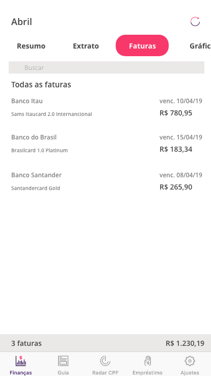

| Data | Versão | Descrição | Autor |
|--|--|--|--|
| 09/04/2019 | 1.0 | Adicionado observações | Leonardo dos Santos |
| 09/04/2019 | 1.1 | Adicionado prototipos | Alan Lima |
| 10/04/2019 | 1.2 | Atualizado descrições dos protótipos | Alan Lima |
| 16/04/2019 | 1.3 | Melhorando descrições de observações | Leonardo dos Santos |

## Introdução
    
O processo de prototipação tem o objetivo de facilitar o entendimento dos requisitos, apresentando conceitos e funcionalidades do aplicativo. Fazendo novas proposta para então solucionar problemas na qual o usuário pode se encontrar garantindo o alinhamento entre equipe e usuário.

## Informações
    
Através de aplicações de técnicas foram levantadas requisitos que estão atuando no aplicativo, e que podem ser melhorados. Foi utilizada a técnica de prototipação e também a simulação de experiência de usuário no qual foram feitos testes com pessoas que não são usuários do Guiabolso. Portanto, com base nas análise feitas com usuários e também com equipe de desenvolvimento, foram debatidas melhorias e padronizações, no qual o sistema atualmente não apresenta.

## Requisitos
    
#### Visão do usuário
    
Enquanto estava navegando pelo aplicativo um dos usuário sentiu a necessidade de visualização das faturas do cartão de crédito, pois desta forma seria mais adequado para poder fazer o planejamento de metas. Portanto com esta funcionalidade o usuário poderá ter mais controle de suas finanças.
Também conclui-se que o aplicativo apresenta uma grande variedade de funcionalidades, nas quais boa parte o usuário teve de acessar para conhecer. Portanto, em primeira visão, os usuários sentiram dificuldades para compreender quais são as principais funções do aplicativo.
Devido existir diferença entre o aplicativo no sistema Android e no IOS, não foi houve um padrão das dificuldades apresentadas pelos usuários. Entretanto, para o usuário Android foram apresentadas uma maior dificuldade para concluir o fluxo das principais funcionalidades do aplicativo. Portanto, concluímos que o aplicativo no sistema IOS é o mais adequado para o usuário, por tornar as informações mais evidentes para o usuário.
Concluímos também, que adultos entre 18 e 40 anos de idade têm mais facilidade em utilizar o aplicativo. devido ao hábito de utilizar o aparelho telefônico com o objeto de controle financeiro e afins, diferentemente do restante do público, que está mais habituado a resolver quaisquer problema financeiro pessoalmente em suas agências bancárias ou propriamente estabelecendo planejamentos de forma manual. Menores de 18 anos, apesar de ter facilidade em utilizar tecnologia, não são considerados um público ativo para a pesquisa, pois não possuem renda e autonomia, portanto, sendo estes dependentes.

#### Visão da equipe
    
Apesar da aba do radar CPF informar de forma simples as empresas que consultaram o CPF do usuário, sentiu-se a necessidade de informar o score e também as empresas que sujaram o CPF do mesmo. Ao navegar pela aba Guia foi observado que havia a necessidade de fracionamento das informações contidas nesta aba, pois há uma grande quantidade de informações para o usuário, tornando cansativo a leitura das informações. 

Também foi observado que há uma grande diferença no design do aplicativo de acordo com o sistema operacional do hardware, IOS, Android e também no próprio computador existe uma grande diversidade de informações que embora seja as mesma, apresentam rotas ou posições distintas, não seguindo um padrão. Contudo tornando a experiência do usuário inconsistente, não sendo algo que siga um padrão.
Apesar da grande variedade do aplicativo em questões de acompanhamento, sentiu-se a necessidade de haver um diálogo entre app e usuário, no sentido de que, deveria haver mais notificações para o usuário dos financiamentos dele. Por exemplo: Se o usuário estabelecer uma meta X para gastos com combustível, o aplicativo poder informar ele quando ele estourar aquele limite, seja no próprio aplicativo, ou por meio de terceiros, como mensagem de texto, email ou propriamente Whatsapp.

## Protótipo

Todos os protótipos que serão listados abaixo foram projetados com auxílio do [Adobe XD](https://www.adobe.com/br/products/xd.html).
Uma ótima ferramenta para desenvolvimento de protótipos de alta fidelidade.

### Notificações

> Um dos pontos que foi observado ao analisar o aplicativo do Guiabolso foi sua pouca comunicação com o usuário por meio de notificações. E está prática é de fundamental importância para manter o engajamento dos usuários com o app. Pensando nisso foram desenvolvidas algumas notificações para o Guiabolso enviar em diferentes situações.

--- 

### Faturas

> Uma aba que se encontra ausente no app é a de Faturas. Portanto foi sugerido adicioná-la ao protótipo como uma melhoria para facilitar e tornar mais prático para o usuário acessar todas as faturas de suas contas cadastradas de uma só vez, de maneira simples e objetiva. A tela contêm as faturas do mês atual, além da data de vencimento de cada uma, e o total de todas. Dessa forma, fica fácil para o usuário saber quanto terá que desembolçar para manter suas contas em dia.

---

### Radar CPF

> O app ja possui uma sessão destinada a consultar o CPF da pessoa caso seja autorizado. Porém, foi pensado em complementos para estas telas. O primeiro deles foi o Score, que faz menção a pontuação de crédito do usuário. Esta pontuação é usada como marcador de perfil da pessoa, indicando a porcentagem de risco de atraso de pagamento em um conta num período de 12 meses. Foi criada uma tela, baseada no Serasa para explicar este item como maiores detalhes. Outra atualização diz respeito aos maiores detalhes das instituições financeiras que sujaram o nome do usuário (caso seu nome esteja sujo). Desta forma lhe seram disponibilizados informações de telefone e endereço para facilitar a comunicação da pessoa com estes estabelecimentos.

---

### Guias

> Por último, mas não menos importante, a aba de guias. Esta sessão ja está presente no Guiabolso, porém todas as suas informações se encontram em um so lugar, sem separação por categorias. Portanto, a marcação de categorias foi sugerida nesta parte do protótipo, afim de filtrar as informações que o usuário realmente quer saber no momento.

## Referências

1. SEQ18RRANO, Maurício; SERRANO, Milene. Requisitos - Aula 07. 1º/2019. 50 slides. Material apresentado para a disciplina de Requisitos de Software no curso de Engenharia de Software da UnB, FGA.

2. carlos, Introdução a prototipação e apresentação do Axure RP 6.5. Material [open acess] disponivel em: [Devmedia](https://www.devmedia.com.br/introducao-a-prototipacao-e-apresentacao-do-axure-rp-6-5/27978), 2013.

