## Introdução

Questionário é uma técnica inflexível de elicitação de requisitos, pois impossibilita análises subjetivas, mas é bastante útil porque é capaz de ser aplicada a várias pessoas. Neste trabalho, um questionário foi desenvolvido a fim de elicitar e priorizar requisitos do aplictivo Guiabolso.

## Questionário

O questionário faz a classificação de dois grupos: participantes que não são usuários do Guiabolso e participantes que são usuários. Para o primeiro grupo, que é o maior entre os dois, as perguntas foram feitas com o objetivo de identificar os hábitos financeiros dos participantes para avaliar se o Guiabolso atende esses hábitos. Para o segundo grupo as perguntas foram feitas com objetivo de avaliar a utilidade das funcionalidades do aplicativo e também sua eficiência.
O questionário foi divulgado em grupos da faculdade e de familiares dos integrantes do grupo e até o momento, 51 pessoas responderam.

A próximas perguntas foram direcionadas aos usuários do Guiabolso

[ 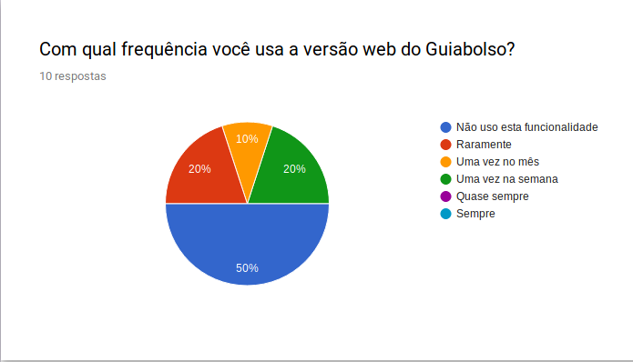 ](./../img/pergunta/pergunta_7.png)
[ 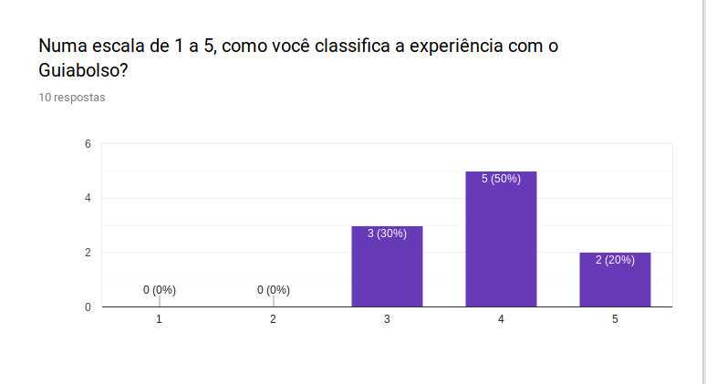 ](./../img/pergunta/pergunta_8.png)

[ 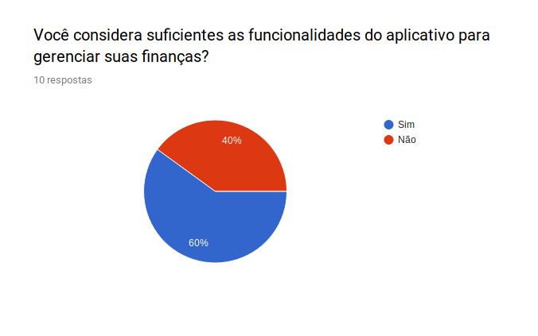 ](./../img/pergunta/pergunta_10.png)

A próximas perguntas foram direcionadas aos não usuários do Guiabolso

[ 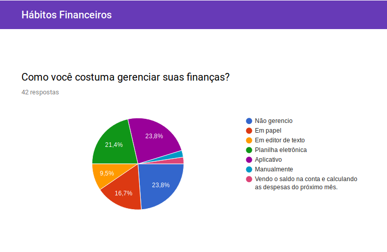 ](./../img/pergunta/pergunta_12.png)

[ 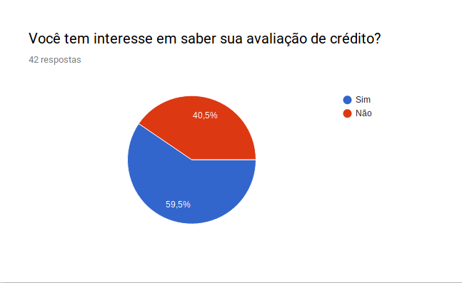 ](./../img/pergunta/pergunta_16.png)

[ 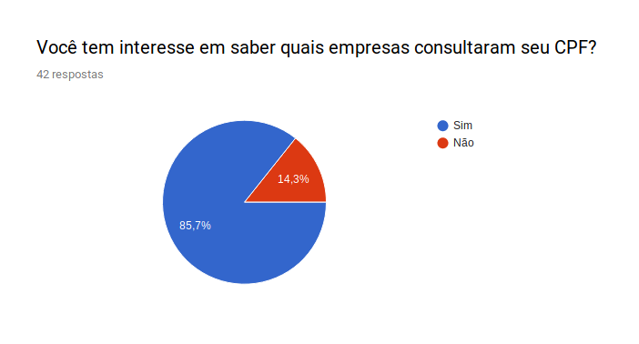 ](./../img/pergunta/pergunta_18.png)

[ 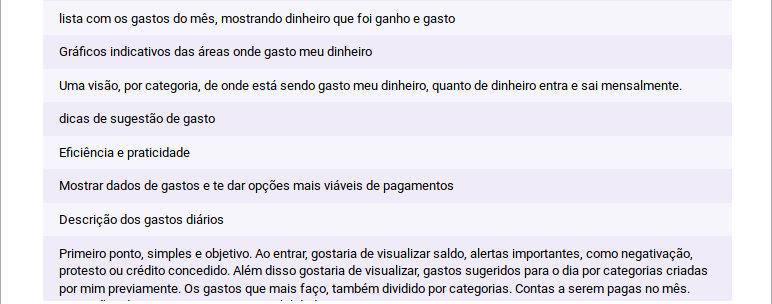 ](./../img/pergunta/pergunta_20_2.png)

[ 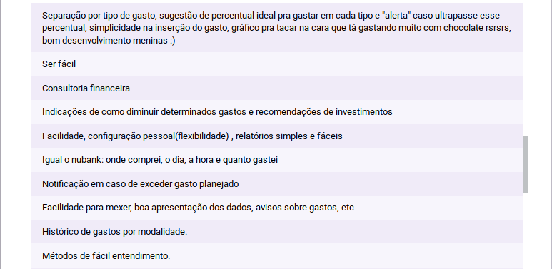 ](./../img/pergunta/pergunta_20_4.png)
[ 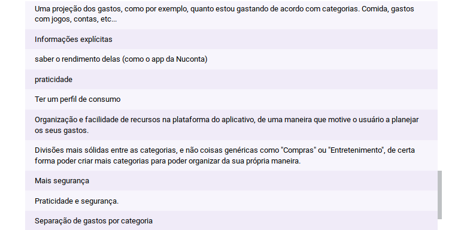 ](./../img/pergunta/pergunta_20_5.png)

## Análise

Com os resultados do questionário pode-se tirar algumas conclusões, como que a funcionalidade do aplicativo de contratação de empréstimo não é usada pela maioria dos usuários e provavelmente não seria muito usada também pelos não usuários, já que a maioria nunca realizou um empréstimo. Então, vale repensar se é necessário uma aba de dedicação exclusiva para empréstimo, poderia ser adicionada outra funcionalidade nela como, por exemplo,
a visualização da avaliação de crédito, que é de interesse da maioria dos participantes, ou a consulta da situação do CPF ou sugestões para investimentos.

O aplicativo também deve oferecer uma visualização de extrato melhor que as que os aplicativos dos bancos oferecem que geralmente não é categorizado nem dispõe de gráficos.  

Além disso, pode-se concluir também que algumas funcionalidades devem ser mantidas mesmo que não sejam usadas sempre, porque são funcionalidades que despertam o interesse da maiorias pessoas que não usam o aplicativo, como a consulta ao CPF, a avaliação de crédito e aba Guia, cujas frequências de uso pode ser justificada pela baixa variabilidade dessas informações.

## Requisitos Elicitados

### MoSCOW

| Código | Descrição | Prioridade |
|--|--|--|
| Q01 | Permitir adição manual de transações | Should have |
| Q02 | Oferecer uma consultoria financeira através de dicas e avisos | Should have|
| Q03 | Ter a funcionalidade de consulta ao CPF  | Could have |
| Q04 | Ter uma aba para simulação e contratação de empréstimos | Would have |
| Q05 | Ter uma versão web | Could have |
| Q06 | Rapidez e facilidade no uso | Must have |
| Q07 | Visualização gráfica de gastos por categoria | Should have |
| Q08 | Ter um extrato bem organizado e categorizado | Must have |
| Q09 | Ter uma avaliação de crédito | Should have |
| Q10 | Exibir diferença entre renda e gastos | Must have |
| Q11 | Ter uma aba que trate de investimentos | Could have |
| Q12 | Mostrar quais empresas consultaram o CPF do usuário | Could have |
| Q13 | Ter alertas importantes, como negativação, protesto ou crédito concedido| Should have |
| Q14 | Ter alcance de metas, como carro, casa, roupa, celular | Would have |
| Q15 | Ter uma sugestão de gastos para o dia por categorias criadas previamente pelo usuário | Would have |
| Q16 | Ter perfis de usuário, por exemplo, bom administrador, bom investidor | Could have |
| Q17 | Inserir limites de gastos por categoria | Could have |
| Q18 | Notificar quando o gasto for excedido | Should have |
| Q19 | Ter um tutorial de primeiro uso | Should have |

### First Things First

| ID | Benefício relativo | Penalidade Relativa | Valor total | Valor % | Custo relativo | Custo | Risco relativo | Risco % | Priorida de |
|--|--|--|--|--|--|--|--|--|--|
| Q01 | 9 | 8 | 26 | 10.5% | 3 | 3.5% | 2 | 2.7% | 2.16 |
| Q02 | 9 | 5 | 23 | 9.3% | 9 | 10.6%% | 8 | 10.7% | 0.58 |
| Q03 | 8 | 4 | 20 | 8.1% | 7 | 8.3% | 3 | 4% | 0.79 |
| Q04 | 6 | 3 | 15 | 6.1% | 8 | 9.4% | 8 | 10.7% | 0.41 |
| Q05 | 6 | 4 | 16 | 6.5% | 6 | 7.1% | 5 | 6.7% | 0.62 |
| Q06 | 9 | 8 | 26 | 10.5% | 9 | 10.6% | 8 |10.7% | 0.66 |
| Q07 | 9 | 8 | 26 | 10.5% | 8 | 9.4% | 7 | 9.3% | 0.75 |
| Q11 | 7 | 3 | 17 | 6.9% | 8 | 9.4% | 7 | 9.3% | 0.49 |
| Q14 | 8 | 4 | 20 | 8.1% | 6 | 7.1% | 6 | 8% | 0.73 |
| Q15 | 6 | 2 | 14 | 5.7% | 7 | 8.2% | 8 | 10.7% | 0.42 |
| Q16 | 7 | 4 | 18 | 7.3% | 9 | 10.6% | 8 | 10.7% | 0.46 |
| Q19 | 9 | 8 | 26 | 10.5% | 5 | 5.9% | 5 | 6.7% | 1.14 |
| Totais | 93 | 61 | 247 | 100 | 85 | 100 | 75 | 100 |  

Obs: Benefício relativo tem peso **2**, Penalidade Relativa e Custo relativo peso **1** e Risco relativo peso **0,5**
## Referências
SEQ18RRANO, Maurício; SERRANO, Milene. Requisitos - Aula 07. 1º/2019. 50 slides. Material apresentado para a disciplina de Requisitos de Software no curso de Engenharia de Software da UnB, FGA.

| **Q** | **Questionário**  |
|--|--|
| **Versão**| Atual: 1.2 (10/04/19)   Anterior: [1.1](#versao-1-1) e [1.0](#versao-1) | 
| **Descrição** | Questionário sobre os hábitos financeiros do público alvo| 
|**Autor**| [Sara Silva](https://github.com/silvasara) 

# Versões Anteriores
## Versão 1.1
### Introdução

Questionário é uma técnica inflexível de elicitação de requisitos, pois impossibilita análises subjetivas, mas é bastante útil porque é capaz de ser aplicada a várias pessoas.
Questionário é uma técnica inflexível de elicitação de requisitos, pois impossibilita análises subjetivas, mas é bastante útil porque é capaz de ser aplicada a várias pessoas. Neste trabalho, um questionário foi desenvolvido a fim de elicitar e priorizar requisitos do aplictivo Guiabolso.

### Questionário

O questionário faz a classificação de dois grupos: participantes que não são usuários do Guiabolso e participantes que são usuários. Até o momento, 51 pessoas responderam o questionário.
O questionário faz a classificação de dois grupos: participantes que não são usuários do Guiabolso e participantes que são usuários. Para o primeiro grupo, que é o maior entre os dois, as perguntas foram feitas com o objetivo de identificar os hábitos financeiros dos participantes para avaliar se o Guiabolso atende esses hábitos. Para o segundo grupo as perguntas foram feitas com objetivo de avaliar a utilidade das funcionalidades do aplicativo e também sua eficiência.
O questionário foi divulgado em grupos da faculdade e de familiares dos integrantes do grupo, até o momento, 51 pessoas responderam. 

@@ -38,31 +39,67 @@ A próximas perguntas foram direcionadas aos não usuários do Guiabolso

### Análise

Com os resultados do questionário pode-se tirar algumas conclusões, como que a funcionalidade do aplicativo de contratação de empréstimo não é usada pela maioria dos usuários e provavelmente não seria muito usada também pelos não usuários, já que a maioria nunca realizou um empréstimo. Então, vale repensar se é necessário uma aba de dedicação exclusiva para empréstimo, poderia ser adicionada outra funcionalidade nela como, por exemplo, 
a visualização da avaliação de crédito, que é de interesse da maioria dos participantes, ou a consulta da situação do CPF ou sugestões para investimentos.

O aplicativo também deve oferecer uma visualização de extrato melhor que as que os aplicativos dos bancos oferecem que geralmente não é categorizado nem dispõe de gráficos.  

Além disso, pode-se concluir também que algumas funcionalidades devem ser mantidas mesmo que não sejam usadas sempre, porque são funcionalidades que despertam o interesse da maiorias pessoas que não usam o aplicativo, como a consulta ao CPF, a avaliação de crédito e aba Guia, cujas frequências de uso pode ser justificada pela baixa variabilidade dessas informações.

### Requisitos Elicitados

#### MoSCOW

| Código | Descrição | Prioridade |
|--|--|--|
| Q01 | Permitir adição manual de transações | Should have |
| Q02 | Ter a funcionalidade de consulta ao CPF  | Must have |
| Q03 | Ter uma aba para simulação e contratação de empréstimos | Would have |
| Q04 | Ter uma versão web | Could have |
| Q05 | Rapidez e facilidade no uso | Must have |
| Q06 | Ter um tutorial de primeiro uso | Should have |
| Q07 | Ter uma aba que trate de investimentos | Could have |
| Q08 | Ter uma forma de consultoria financeira | Should have |
| Q09 | Ter uma avaliação de crédito | Must have |
| Q10 | Mostrar quais empresas consultaram o CPF do usuário | Must have |
| Q10 | Ter um extrato bem organizado e categorizado | Must have |
| Q02 | Oferecer uma consultoria financeira através de dicas e avisos | Should have|
| Q03 | Ter a funcionalidade de consulta ao CPF  | Could have |
| Q04 | Ter uma aba para simulação e contratação de empréstimos | Would have |
| Q05 | Ter uma versão web | Could have |
| Q06 | Rapidez e facilidade no uso | Must have |
| Q07 | Visualização gráfica de gastos por categoria | Should have |
| Q08 | Ter uma forma de consultoria financeira | Must have |
| Q09 | Ter um extrato bem organizado e categorizado | Must have |
| Q10 | Ter uma avaliação de crédito | Should have |
| Q11 | Exibir diferença entre renda e gastos | Must have |
| Q12 | Ter alertas importantes, como negativação, protesto ou crédito concedido| Could have |
| Q13 | Ter alcance de metas, como carro, casa, roupa, celular | Would have |
| Q14 | Ter uma sugestão de gastos para o dia por categorias criadas previamente pelo usuário | Would have |
| Q15 | Ter perfis de usuário, por exemplo, bom administrador, bom investidor | Could have |
| Q16 | Inserir limites de gastos por categoria | Could have |
| Q17 | Notificar quando o gasto for excedido | Should have |
| Q18 | Visualização gráfica de gastos por categoria | Should have |
| Q12 | Ter uma aba que trate de investimentos | Could have |
| Q13 | Mostrar quais empresas consultaram o CPF do usuário | Could have |
| Q14 | Ter alertas importantes, como negativação, protesto ou crédito concedido| Should have |
| Q15 | Ter alcance de metas, como carro, casa, roupa, celular | Would have |
| Q16 | Ter uma sugestão de gastos para o dia por categorias criadas previamente pelo usuário | Would have |
| Q17 | Ter perfis de usuário, por exemplo, bom administrador, bom investidor | Could have |
| Q18 | Inserir limites de gastos por categoria | Could have |
| Q19 | Notificar quando o gasto for excedido | Should have |
| Q20 | Ter um tutorial de primeiro uso | Should have |

#### First Things First 

| Funcionalidades | Benefício relativo | Penalidade Relativa | Valor total | Valor % | Custo relativo | Custo | Risco relativo | Risco % | Priorida    de |
|--|--|--|--|--|--|--|--|--|--|
| Q01 | 8 | 3 | 19 | 15.4% | 8 | 16.6% | 3 | 10% | 0.403 |
| Q02 | 1 | 1 | 3 | 2.4% | 2 | 4.1% | 1 | 3.3% | 0.243 |
| Q03 | 1 | 1 | 3 | 2.4% | 1 | 2% | 1 | 3.3% | 0.424 |
| Q04 | 4 | 5 | 13 | 10.5% | 2 | 4.1% | 1 | 3.3% | 1.065 |
| Q05 | 1 | 1 | 3 | 2.4% | 1 | 2% | 1 | 3.3% | 0.424 |
| Q06 | 6 | 2 | 14 | 11.3% | 9 | 18.7% | 3 | 10% | 0.266 |
| Q07 | 7 | 3 | 17 | 13.8% | 9 | 18.7% | 7 | 23.3% | 0.281 |
| Q08 | 6 | 3 | 15 | 12.1% | 3 | 6.2% | 1 | 3.3% | 0.861 |
| Q09 | 5 | 1 | 11 | 8.9% | 1 | 2% | 1 | 3.3% | 1.575 |
| Q10 | 3 | 6 | 12 | 9.7% | 2 | 4.1% | 1 | 3.3% | 0.877 |
| Q11 | 4 | 2 | 10 | 8.1% | 1 | 2% | 1 | 3.3% | 1.433 |
| Q12 | 1 | 1 | 3 | 2.4% | 9 | 18.7% | 9 | 30% | 0.045 |
| Q13 | 1 | 1 | 3 | 2.4% | 9 | 18.7% | 9 | 30% | 0.045 |
| Q14 | 1 | 1 | 3 | 2.4% | 9 | 18.7% | 9 | 30% | 0.045 |
| Q15 | 1 | 1 | 3 | 2.4% | 9 | 18.7% | 9 | 30% | 0.045 |
| Q16 | 1 | 1 | 3 | 2.4% | 9 | 18.7% | 9 | 30% | 0.045 |
| Q17 | 1 | 1 | 3 | 2.4% | 9 | 18.7% | 9 | 30% | 0.045 |
| Q18 | 1 | 1 | 3 | 2.4% | 9 | 18.7% | 9 | 30% | 0.045 |
| Q19 | 1 | 1 | 3 | 2.4% | 9 | 18.7% | 9 | 30% | 0.045 |
| Q20 | 1 | 1 | 3 | 2.4% | 9 | 18.7% | 9 | 30% | 0.045 |
| Totais | 47 | 29 | 123 | 100 | 48 | 100 | 30 | 100 |  

### Referências
SEQ18RRANO, Maurício; SERRANO, Milene. Requisitos - Aula 07. 1º/2019. 50 slides. Material apresentado para a disciplina de Requisitos de Software no curso de Engenharia de Software da UnB, FGA.

| **Q** | **Questionário**  |
|--|--|
| **Versão**| Atual: 1.1 (09/04/19)   Anterior: [1.0](#versao-1) | 
| **Descrição** | Questionário sobre os hábitos financeiros do público alvo| 
|**Autor**| [Sara Silva](https://github.com/silvasara)

## Versão 1
### Introdução

Questionário é uma técnica inflexível de elicitação de requisitos, pois impossibilita análises subjetivas, mas é bastante útil porque é capaz de ser aplicada a várias pessoas.

### Questionário

O questionário faz a classificação de dois grupos: participantes que não são usuários do Guiabolso e participantes que são usuários. Até o momento, 51 pessoas responderam o questionário.

A próximas perguntas foram direcionadas aos usuários do Guiabolso

[ 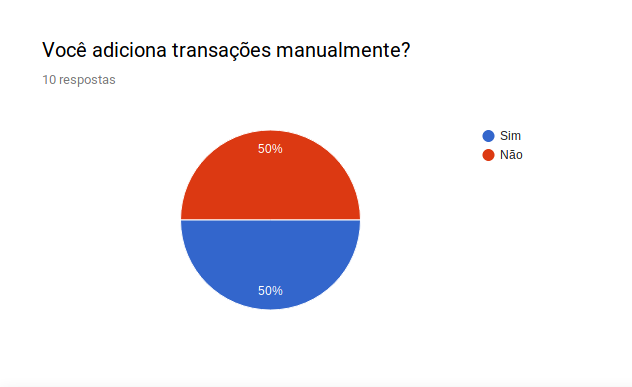 ](./../img/pergunta_3.png)
[ 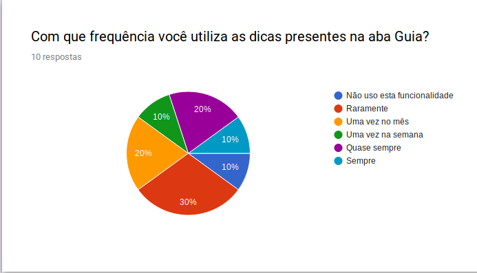 ](./../img/pergunta_4.png)
[ 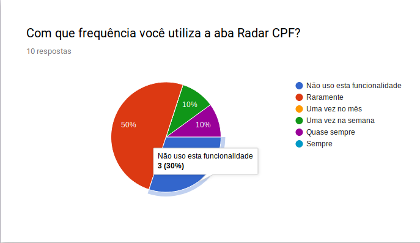 ](./../img/pergunta_5.png)

[ 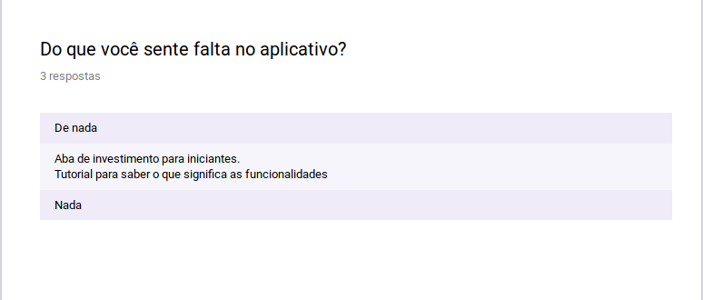 ](./../img/pergunta_11.png)

A próximas perguntas foram direcionadas aos não usuários do Guiabolso

[ 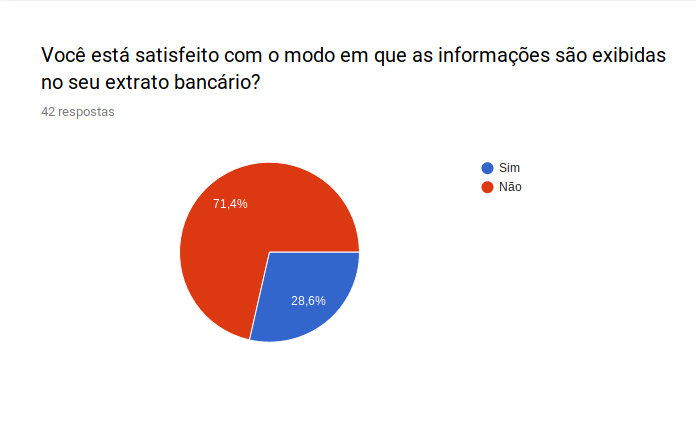 ](./../img/pergunta_14.png)

[ 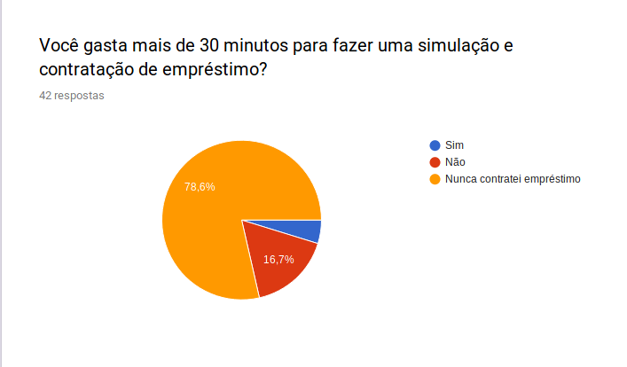 ](./../img/pergunta_19.png)
[ 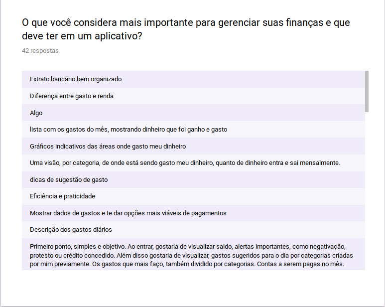 ](./../img/pergunta_20.png)

| **Q** | **Questionário**  |
|--|--|
| **Versão**| Atual: 1.0 (07/04/19)   Anterior: - | 
| **Descrição** | Questionário sobre os hábitos financeiros do público alvo| 
|**Autor**| [Sara Silva](https://github.com/silvasara) e [Shayane Alcântara](https://github.com/shayanealcantara)