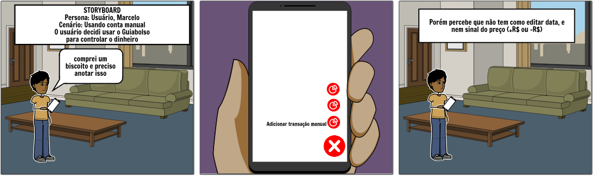

## Introdução

Elicitar utilizando o método storytelling trabalha a ideia de adquirir conhecimento por meio de histórias sejam elas contadas por um grupo de pessoas ou até mesmo uma organização. A equipe realizou alguns storytellings sendo um com um pai de um dos membros da equipe que recentemente começou a utilizar o app Guiabolso e os outros com membros da equipe. Todos abordam experiências de utilização do app. Abaixo esta um relatório das narrativas.

## Storytelling 1 - Interesse do usuario

### Rastreabilidade

| **ST1** | **Interesse do usuario**  |
|--|--|
| **Versão**| Atual: 1.0 (07/04/2019)   Anterior: - | 
| **Descrição** | Esse storytelling foi feito para observar como um usuário novo interage com o app, e suas dificuldades. |
| **Descrição do narrador** | Adailton Martins, usuário recente do Guiabolso|
| **Link da narração** |-|
|**Autor**|[Lucas Machado](https://github.com/lmmLucasMachado) |

| Nome | papel | Observação |
|--|--|--|
| Adailton Martins | Narração | Usuário app |
| Lucas Machado | Relatório | Membro da equipe |

## Resumo da Narração

O usuário começou a utilizar o app Guiabolso recentemente pelo fato de um colega te-lo recomendado para poder melhor observar como o seu dinheiro esta sendo gasto, logo no primeiro mês escavando o app viu uma frase que lhe chamou atenção, a frase era "Você tem na poupança X valor. Mas será que esse é o melhor lugar pra esse dinheiro?", rapidamente ele clicou nessa frase e foi guiado a uma aba que lhe permitiu ter uma ideia melhor de como a poupança funciona e como seu dinheiro estava sendo mau investido. No fim disto o usuário foi convencido de que deveria tirar parte do seu dinheiro deste local, porem sentiu falta de alguma sugestão por parte do app.

## Requisitos Elicitados

| ID | Descrição | Prioridade |
|--|--|--|
| ST01 | O app na parte de guia deve exibir os cards pela ordem de relevância  | could have |
| ST02 | O app sugerir formas para melhor gerir o seu dinheiro | must have |
| ST03 | O app deve mostrar notificações de quando se ultrapassa uma meta estabelecida pelo usuario | could have |

## Storytelling 2 - Utilizando a aba Guia

### Rastreabilidade

| **ST2** | **Utilizando a aba Guia**  |
|--|--|
| **Versão**| Atual: 1.0 (09/04/2019)   Anterior: - | 
| **Descrição** | Esse storytelling foi feito para saber a experiência de um usuário com a aba guia do aplicativo, e assim, levantar requisitos. |
| **Descrição do narrador** | Lucas Machado, estudante, é usuário do Guiabolso há algumas semanas, e busca economizar com as compras com alimento. |
| **Link da narração** |[audio](https://www.4shared.com/mp3/wpXGMcP7da/guia_bolso_storytelling_02.html)|
|**Autor**|[Lucas Machado](https://github.com/lmmLucasMachado) | 

| Nome | papel | Observação |
|--|--|--|
| Lucas Machado | Narração | Usuário app / membro |
| Marcelo | Relatório | Membro da equipe |

## Resumo da Narração

O usuário achou interessante a ideia que lhe foi passada do app, depois de utilizar um tempo foi em busca de novas funcionalidade dentre elas acabou encontrando na aba guia uma que lhe pareceu interessante, a parte onde encontrava sugestões de bares e restaurantes que pelo próprio app era possível adquirir descontos, porém ficou frustrado  ao perceber que os locais onde ele podia ter o desconto eram longes de mais da sua localização até em estados diferentes. Ele descobriu um local onde podia colocar a cidade de onde iria receber sugestões e lá também não existia a sua cidade como opção.

## Requisitos Elicitados

| ID | Descrição | Prioridade |
|--|----|--|
| ST04 | O app deve oferecer cupons baseado na geolocalização do usuario | could have |
| ST05 | Os cupons para bares e restaurantes com uma localização superior a x km não deveriam ser mostrados | could have |
| ST06 | Para as cidades que não possuem cupons de descontos esta opção não deveria ser mostrada a menos que sejam cupons online  | could have |

## Sorytelling 3 - Utilizando conta manual

### Rastreabilidade

| **ST3** | **Utilizando conta manual**  |
|--|--|
| **Versão**| Atual: 1.0 (10/04/2019)   Anterior: - | 
| **Descrição** | Esse storytelling foi feito para saber mais sobre o controle das finanças manuais de um usuário, e assim, levantar requisitos com base nisso. |
| **Descrição do narrador** | Marcelo, estudante, é usuário do Guiabolso há cerca de 3 semanas, e usa diariamente para registrar os gastos. |
| **Link da narração** |[audio](https://www.4shared.com/music/aov68X6Wda/guia_bolso_storytelling_03.html)|
|**Autor**| [Marcelo Araújo](https://github.com/santosm46)| 

| Nome | papel | Observação |
|--|--|--|
| Marcelo | Narração | Usuário app / membro |
| Lucas Machado | Relatório | Membro da equipe |
| Demais membros | Ouvinte | Membro da equipe |

## Resumo da Narração

O usuário optou por, além de usar seu cartão com o app, também fazer o uso
da opção de conta manual, pois faz compras com dinheiro regularmente. Depois de usar o app por algum tempo, observou que ao adicionar uma transação manual e salvar,
ao tentar depois editar o valor da transação de positivo para negativo, não havia como, e também
tentou alterar a data da transação e não conseguiu.
Outra dificuldade foi ao escolher a categoria, pois tendo feito uma compra de um alimento, procurou a categoria comida e não acho, e acabou categorizando como Mercado.

## Requisitos Elicitados

| ID | Descrição | Prioridade |
|--|--|--|
| ST07 | O app deve oferecer a possibilidade de alterar as informações de sinal do valor, e data da transação manual | should  have |
| ST08 | Ao escolher a categoria que não existe, ser mostrado categorias parecidas | could have |

Foi montado um storyboard sobre conta manual com base no storytelling 3

## First Things First

| ID | Benefício relativo | Penalidade Relativa | Valor total | Valor % | Custo relativo | Custo % | Risco relativo | Risco % | Prioridade |
|--|--|--|--|--|--|--|--|--|--|
| ST01 | 6 | 1 | 13 | 15.5 | 1 | 8.3 | 1 | 5.9 | 1,001 |
| ST02 | 6 | 2 | 14 | 16.7 | 3 | 25.1 | 3 | 17.6 | 1,003 |
| ST03 | 4 | 2 | 10 | 11.9 | 1 | 8.3 | 2 | 11.8 | 1,004 |
| ST04 | 3 | 1 | 7 | 8.3 | 2 | 16.7 | 4 | 23.5 | 0.996 |
| ST05 | 4 | 2 | 10 | 11.9 | 2 | 16.7 | 3 | 17.6 | 1,001 |
| ST06 | 5 | 1 | 11 | 13.1 | 1 | 8.3 | 2 | 11.8 | 0.998 |
| ST07 | 5 | 2 | 12 | 14.3 | 1 | 8.3 | 1 | 5.9 | 1,000 |
| ST08 | 3 | 1 | 7 | 8.3 | 1 | 8.3 | 1 | 5.9 | 0.999 |
| Totais | 36 | 12 | 84 | 100 | 12 | 100 | 17 | 100 |  |

## Referências

SEQ18RRANO, Maurício; SERRANO, Milene. Requisitos - Aula 07. 1º/2019. 50 slides. Material apresentado para a disciplina de Requisitos de Software no curso de Engenharia de Software da UnB, FGA.
