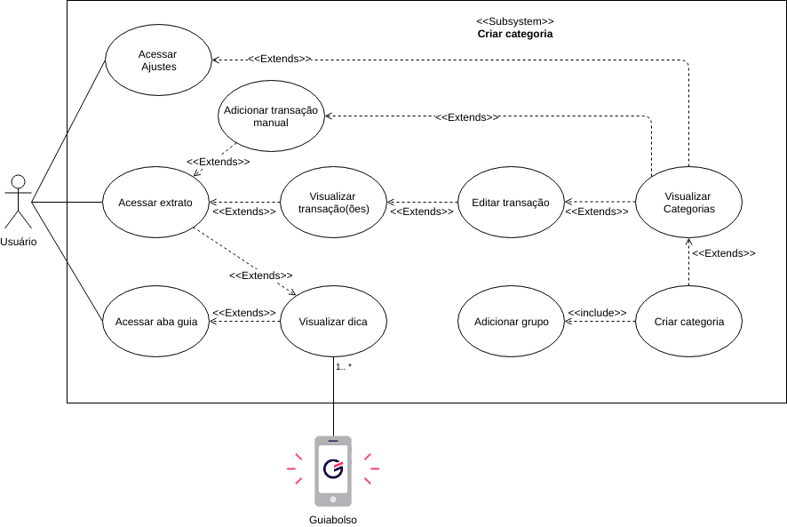

## Introdução 

Também chamados de diagramas comportamentais, na notação da UML, os casos de uso são usados para descrever um conjunto de ações (uses cases - casos de uso) que um sistema ou um conjunto de sistemas (subject - sujeito) deve desempenhar em colaboração com um ou mais indivíduos externos ao sistema (actors - atores). Cada caso de uso deverá prover algum resultado observável e de valor para os atores ou outros interessados do sistema.

## Casos de uso & especificação

### UC6 - Adicionar transação manual

| **UC6** | **Adicionar transação manual**|
|--|--|
| **Versão**| Atual: 1.0 (27/04)   Anterior: --|
| **Descrição** | Adicionar uma transação manualmente |
|**Ator(es)** | > Usuário;   > Guiabolso;   > Instituições financeiras |
| **Pré condições** | Usuário possuir uma conta bancária e/ou cartão de crédito; |
| **Fluxo principal** | > Usuário acessa o Guiabolso;   > Usuário entra na aba "Finanças";   > Usuário clica no botão "+" e em "Adicionar transação manual";    > Usuário preenche os dados solicitados;   > Usuário clica em "criar transação". |
| **Fluxos alternativos** | **FA1 - Ajustes:**   > Usuário acessa o Guiabolso;   > Usuário entra na aba "Ajustes";   > Usuário clica em "Contas e cartões", em seguida clica no botão "+" e por fim em "Adicionar transação manual" ou escolhe uma conta de sua preferência e, no extrato da conta selecionada, faz o mesmo fluxo;    > Usuário preenche os dados solicitados;   > Usuário clica em "criar transação".     **FA2 - Aba Guia:**   > Usuário acessa o Guiabolso;   > Usuário entra na aba "Guia";   > Usuário clica em alguma dica de comparação de gastos e é redirecionado para o extrato;    > Usuário clica no botão "+" e depois em "Adicionar transação manual";    > Usuário preenche os dados solicitados;   > Usuário clica em "criar transação".|
| **Fluxos de exceção** | **FE1 - Nome da transação nao preenchido:**   > Sistema apresenta mensagem de erro pedindo para o usuário preencher o nome da transação;    **FE2 - Valor da transação não preenchido:**   > Sistema apresenta mensagem de erro pedindo para o usuário preencher o valor da transação;     **FE3 - Conta não selecionada**   > Sistema apresenta mensagem de erro pedindo para o usuário inserir uma conta (o usuário pode colocar uma conta já previamente cadastrada ou inserir uma nova conta manual);     **FE4 - Categoria não selecionada:**   > O sistema apresenta uma mensagem de erro pedindo para que o usuário escolha a categoria da transação (ele pode escolher entre as categorias pré-definidas ou inserir uma nova categoria); |
| **Pós condições** | A transação é inserida no extrato do usuário |
| **Rastreabilidade** | Cenário [C2](../cenarios/#c2-adicionar-transacao-com-conta-manual) & Richpicture [RP06](../../pre-rastreabilidade/richpicture/#rp06-financeiro-aba) |

### UC7 - Criar categoria

| **UC7** | **Criar categoria**|
|--|--|
| **Versão**| Atual: 1.0 (27/04)   Anterior: --|
| **Descrição** | Fluxo(s) de como o usuário pode inserir uma nova categoria para as transações |
|**Ator(es)** | > Usuário;   > Guiabolso; |
| **Pré condições** | Não há |
| **Fluxo principal** | > Usuário acessa o Guiabolso;   > Usuário entra na aba "Ajustes";   > Usuário clica em "Categorias" e vislualiza as categorias existentes;    > Usuário clica em "Criar nova categoria";   > Usuário preenche os dados solicitados e clica em "Salvar".   |
| **Fluxos alternativos** | **FA1 - Extrato (editar transação):**   > Usuário acessa o Guiabolso;   > Usuário visualiza o seu extrato;   > Usuário visualiza suas transações e clica em uma qualquer;    > Usuário edita a transação selecionada e clica na categoria dela;   > Usuário clica em "criar nova categoria";   > Usuário insere o nome e o grupo da nova categoria e clica em "Salvar";     **FA2 - Extrato (adicionar transação manualmente):**   > Usuário acessa o Guiabolso;   > Usuário visualiza o seu extrato;   > Usuário clica no botão "+" e em "Adicionar transação manual";    > Usuário seleciona o campo "Categoria";   > Usuário clica em "criar nova categoria";   > Usuário insere o nome e o grupo da nova categoria e clica em "Salvar";     **FA3 - Aba Guia:**   > > Usuário acessa o Guiabolso;   > Usuário entra na aba "Guia";   > Usuário clica em alguma dica de comparação de gastos e é redirecionado para o extrato;   > O restante segue um dos FA1 ou FA2 acima. |
| **Fluxos de exceção** | **FE1 - Nome da categoria nao preenchido:**   > Sistema apresenta mensagem de erro pedindo para o usuário preencher o nome da categoria;    **FE2 - Grupo da categoria não selecionado:**   > Sistema apresenta mensagem de erro pedindo para o usuário escolher um grupo para a categoria;|
| **Pós condições** | A nova categoria é criada |
| **Rastreabilidade** | Cenário [C9](../cenarios/#c9-criar-categoria) &  Richpicture [RP02](../../pre-rastreabilidade/richpicture/#rp02-usabilidade) |

### UC8 - Editar transação

| **UC8** | **Editar transação**|
|--|--|
| **Versão**| Atual: 1.0 (27/04)   Anterior: --|
| **Descrição** | Fluxo(s) de como o usuário pode editar uma transação |
|**Ator(es)** | > Usuário;   > Guiabolso; |
| **Pré condições** | > Existir uma transação;   > Usuário possuir uma conta bancária automática e/ou manual  |
| **Fluxo principal** | > Usuário acessa o Guiabolso;   > Usuário entra na aba "Finanças";   > Usuário clica em "últimas transações" e visualiza seu extrato;    > Usuário clica em uma transação que deseja editar;   > Usuário edita a transação.   |
| **Fluxos alternativos** | **FA1 - Aba guia:**    > Usuário acessa o Guiabolso;   > Usuário entra na aba "Guia";   > Usuário seleciona um card comparando gastos;   > Usuário visualiza seu extrato;    > Usuário clica em uma transação que deseja editar;   > Usuário edita a transação.     **FA2 - Ajustes:**    > Usuário acessa o Guiabolso;   > Usuário entra na aba "Ajustes";   Usuário clica em "Contas e cartões"  > Usuário seleciona uma conta de preferência;   > Usuário visualiza seu extrato da conta anteriormente selecionada;    > Usuário clica em uma transação que deseja editar;   > Usuário edita a transação. |
| **Fluxos de exceção** | Não há|
| **Pós condições** | > A transação é editada;   > A transação passa a ser ignorada ou não;   > A transação passa a ser dividida em 2 ou mais categorias (ou não);   > A transação passa a ter um comentário ou não. |
| **Rastreabilidade** | Cenário [C18](../cenarios/#c18-editar-transacao) |

## Versões anteriores