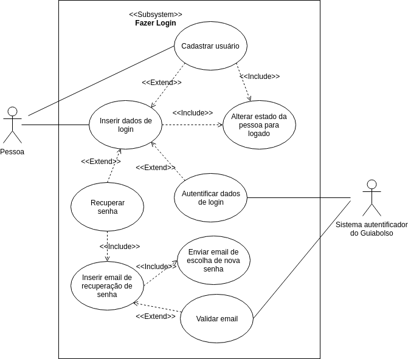
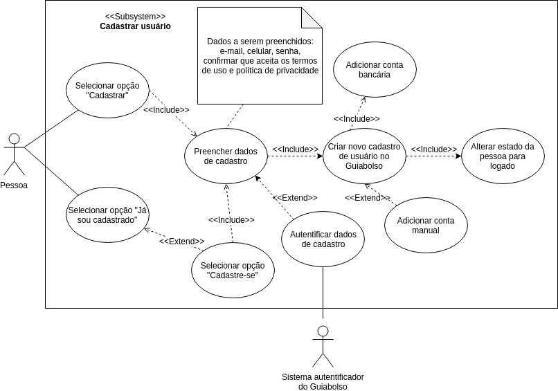
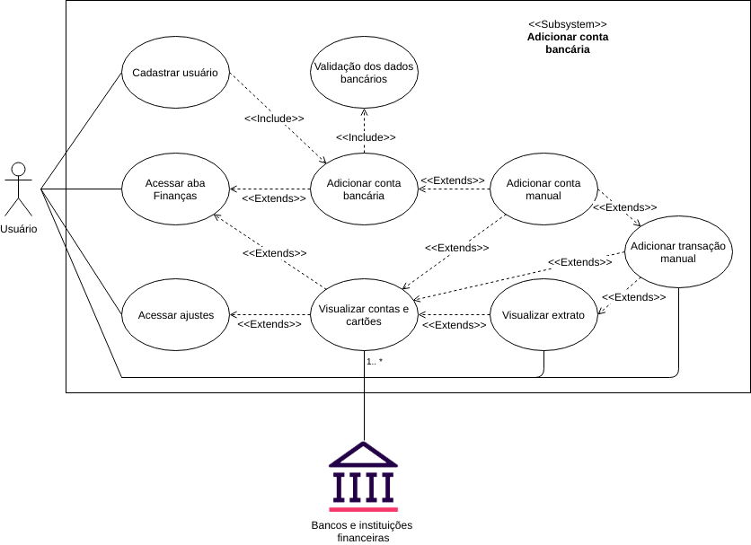
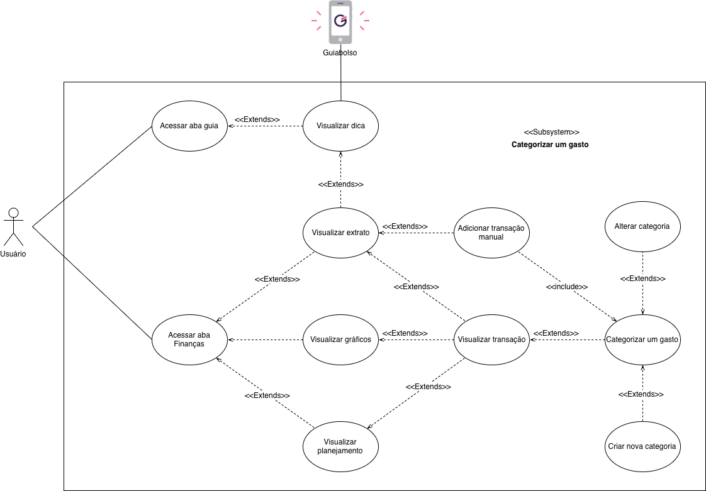

## Introdução 

Também chamados de diagramas comportamentais, na notação da UML, os casos de uso são usados para descrever um conjunto de ações (uses cases - casos de uso) que um sistema ou um conjunto de sistemas (subject - sujeito) deve desempenhar em colaboração com um ou mais indivíduos externos ao sistema (actors - atores). Cada caso de uso deverá prover algum resultado observável e de valor para os atores ou outros interessados do sistema.

## Casos de uso & especificação

### UC1 - Fazer Login

| **UC1** | **Fazer Login**|
|--|--|
| **Versão**| Atual: 1.0 (27/04)   Anterior: --|
| **Descrição** | Fazer login no Guiabolso |
|**Ator(es)** | > Usuário;   > Guiabolso |
| **Pré condições** | > Usuário estar deslogado no aplicativo Guiabolso;|
| **Fluxo principal** | > Usuário acessa o Guiabolso;   > Usuário clica na opção "Já sou cadastrado";   > Usuário insere os dados de e-mail e senha e clica no botão "Partiu".    > Os dados de login são autentificados. |
| **Fluxos alternativos** | **FA1 - Cadastro:**   > Usuário acessa o Guiabolso;   > Usuário seleciona "Cadastre-se agora" ou em "Já sou cadastrado" em seguida "Cadastre-se";   > Usuário segue os passos para realizar o [cadastro](./#uc2-cadastrar-usuario);   > Usuário é logado automaticamente ao criar cadastro.|
| **Fluxos de exceção** | **FE1 - Dados de login inválido:**   > Sistema apresenta mensagem de erro pedindo para o usuário conferir se o e-mail ou senha estão errados, e preencher novamente;    **FE2 - Usuário esqueceu a senha:**   > Usuário seleciona "Recuperar senha";   > Usuário inseri e-mail de recuperação de senha;   > E-mail é validado;   > É enviado e-mail de escolha de nova senha, e o usuário cadastra nova senha;|
| **Pós condições** | Usuário fica logado no Guiabolso, e é direcionado para aba finanças|
| **Rastreabilidade** | -- |

### UC2 - Cadastrar usuário

| **UC2** | **Cadastrar usuário**|
|--|--|
| **Versão**| Atual: 1.0 (26/04)   Anterior: --|
| **Descrição** | Criar um cadastro para um usuário |
|**Ator(es)** | > Usuário;   > Guiabolso;   > Instituições financeiras |
| **Pré condições** | Usuário estar deslogado no aplicativo Guiabolso; |
| **Fluxo principal** | > Usuário seleciona opção "Cadastre-se agora";   > Usuário preenche os dados de cadastro (e-mail, celular, nova senha, confirmar que aceita os termos de uso e política de privacidade);   > Usuário seleciona botão "Cadastrar";   > Os dados de cadastro são autentificados;   > Usuário adiciona uma conta bancária, ou uma conta manual;|
| **Fluxos alternativos** | **FA1 - Botão Cadastre-se em "Já sou cadastrado":**   > Usuário acessa o Guiabolso;   > Usuário seleciona opção "Já sou cadastrado";   > Usuário seleciona botão "Cadastre-se";   > Usuário preenche os dados de cadastro (e-mail, celular, nova senha, confirmar que aceita os termos de uso e política de privacidade);   > Usuário seleciona botão "Cadastrar";   > Os dados de cadastro são autentificados;   > Usuário adiciona uma conta bancária, ou uma conta manual;|
| **Fluxos de exceção** | **FE1 - E-mail inválido ou já cadastrado:**   > Sistema apresenta mensagem de erro pedindo para o usuário preencher um e-mail existente, e que nunca foi cadastrado;    **FE2 - Telefone inserido inválido**   > Sistema apresenta mensagem de erro pedindo para o usuário inserir um número existente;     **FE3 - Senha inserida inválida**   > Sistema apresenta mensagem de erro pedindo para o usuário inserir senha com pelo menos uma letra, um número e 8 caracteres;     **FE4 - Termos de uso não aceito:**   > O sistema apresenta uma mensagem de erro pedindo para que o usuário aceite os termos de uso; |
| **Pós condições** | Usuário fica logado no Guiabolso, e é direcionado para aba finanças |
| **Rastreabilidade** | Cenário [C13](../cenarios/#c13-criar-uma-conta) & Introspecção [IS06](../../elicitacao-de-requisitos/introspeccao/#persona-2-joao) |

### UC3 - Visualizar extrato

| **UC3** | **Visualizar extrato**|
|--|--|
| **Versão**| Atual: 1.0 (27/04)   Anterior: --|
| **Descrição** | Visualisar o extrato das transações |
|**Ator(es)** | > Usuário;   > Guiabolso; |
| **Pré condições** | Usuário possuir pelo menos uma transação; |
| **Fluxo principal** | > Usuário acessa o Guiabolso;   > Usuário acessa aba "Finanças";   > Usuário seleciona card de últimas transações. |
| **Fluxos alternativos** | **FA1 - Aba Guia:**   > Usuário acessa o Guiabolso;   > Usuário acessa aba "Guia";   > Usuário seleciona algum card com comparação de gastos.     **FA2 - Aba Ajustes:**   > Usuário acessa o Guiabolso;   > Usuário acessa aba "Ajustes";   > Usuário seleciona "Contas e cartões".|
| **Fluxos de exceção** | Nenhum |
| **Pós condições** | Não há |
| **Rastreabilidade** | Cenário [C12](../cenarios/#c12-ir-para-extrato) & Richpicture [RP02](../../pre-rastreabilidade/richpicture/#rp02-usabilidade) |

### UC6 - Adicionar transação manual

| **UC6** | **Adicionar transação manual**|
|--|--|
| **Versão**| Atual: 1.0 (27/04)   Anterior: --|
| **Descrição** | Adicionar uma transação manualmente |
|**Ator(es)** | > Usuário;   > Guiabolso;   > Instituições financeiras |
| **Pré condições** | Usuário possuir uma conta bancária e/ou cartão de crédito; |
| **Fluxo principal** | > Usuário acessa o Guiabolso;   > Usuário entra na aba "Finanças";   > Usuário clica no botão "+" e em "Adicionar transação manual";    > Usuário preenche os dados solicitados;   > Usuário clica em "criar transação". |
| **Fluxos alternativos** | **FA1 - Ajustes:**   > Usuário acessa o Guiabolso;   > Usuário entra na aba "Ajustes";   > Usuário clica em "Contas e cartões", em seguida clica no botão "+" e por fim em "Adicionar transação manual" ou escolhe uma conta de sua preferência e, no extrato da conta selecionada, faz o mesmo fluxo;    > Usuário preenche os dados solicitados;   > Usuário clica em "criar transação".     **FA2 - Aba Guia:**   > Usuário acessa o Guiabolso;   > Usuário entra na aba "Guia";   > Usuário clica em alguma dica de comparação de gastos e é redirecionado para o extrato;    > Usuário clica no botão "+" e depois em "Adicionar transação manual";    > Usuário preenche os dados solicitados;   > Usuário clica em "criar transação".|
| **Fluxos de exceção** | **FE1 - Nome da transação nao preenchido:**   > Sistema apresenta mensagem de erro pedindo para o usuário preencher o nome da transação;    **FE2 - Valor da transação não preenchido:**   > Sistema apresenta mensagem de erro pedindo para o usuário preencher o valor da transação;     **FE3 - Conta não selecionada**   > Sistema apresenta mensagem de erro pedindo para o usuário inserir uma conta (o usuário pode colocar uma conta já previamente cadastrada ou inserir uma nova conta manual);     **FE4 - Categoria não selecionada:**   > O sistema apresenta uma mensagem de erro pedindo para que o usuário escolha a categoria da transação (ele pode escolher entre as categorias pré-definidas ou inserir uma nova categoria); |
| **Pós condições** | A transação é inserida no extrato do usuário |
| **Rastreabilidade** | Cenário [C2](../cenarios/#c2-adicionar-transacao-com-conta-manual) & Richpicture [RP06](../../pre-rastreabilidade/richpicture/#rp06-financeiro-aba) |

### UC7 - Criar categoria

| **UC7** | **Criar categoria**|
|--|--|
| **Versão**| Atual: 1.0 (27/04)   Anterior: --|
| **Descrição** | Fluxo(s) de como o usuário pode inserir uma nova categoria para as transações |
|**Ator(es)** | > Usuário;   > Guiabolso; |
| **Pré condições** | Não há |
| **Fluxo principal** | > Usuário acessa o Guiabolso;   > Usuário entra na aba "Ajustes";   > Usuário clica em "Categorias" e vislualiza as categorias existentes;    > Usuário clica em "Criar nova categoria";   > Usuário preenche os dados solicitados e clica em "Salvar".   |
| **Fluxos alternativos** | **FA1 - Extrato (editar transação):**   > Usuário acessa o Guiabolso;   > Usuário visualiza o seu extrato;   > Usuário visualiza suas transações e clica em uma qualquer;    > Usuário edita a transação selecionada e clica na categoria dela;   > Usuário clica em "criar nova categoria";   > Usuário insere o nome e o grupo da nova categoria e clica em "Salvar";     **FA2 - Extrato (adicionar transação manualmente):**   > Usuário acessa o Guiabolso;   > Usuário visualiza o seu extrato;   > Usuário clica no botão "+" e em "Adicionar transação manual";    > Usuário seleciona o campo "Categoria";   > Usuário clica em "criar nova categoria";   > Usuário insere o nome e o grupo da nova categoria e clica em "Salvar";     **FA3 - Aba Guia:**   > > Usuário acessa o Guiabolso;   > Usuário entra na aba "Guia";   > Usuário clica em alguma dica de comparação de gastos e é redirecionado para o extrato;   > O restante segue um dos FA1 ou FA2 acima. |
| **Fluxos de exceção** | **FE1 - Nome da categoria nao preenchido:**   > Sistema apresenta mensagem de erro pedindo para o usuário preencher o nome da categoria;    **FE2 - Grupo da categoria não selecionado:**   > Sistema apresenta mensagem de erro pedindo para o usuário escolher um grupo para a categoria;|
| **Pós condições** | A nova categoria é criada |
| **Rastreabilidade** | Cenário [C9](../cenarios/#c9-criar-categoria) &  Richpicture [RP02](../../pre-rastreabilidade/richpicture/#rp02-usabilidade) |

### UC8 - Editar transação

| **UC8** | **Editar transação**|
|--|--|
| **Versão**| Atual: 1.0 (27/04)   Anterior: --|
| **Descrição** | Fluxo(s) de como o usuário pode editar uma transação |
|**Ator(es)** | > Usuário;   > Guiabolso; |
| **Pré condições** | > Existir uma transação;   > Usuário possuir uma conta bancária automática e/ou manual  |
| **Fluxo principal** | > Usuário acessa o Guiabolso;   > Usuário entra na aba "Finanças";   > Usuário clica em "últimas transações" e visualiza seu extrato;    > Usuário clica em uma transação que deseja editar;   > Usuário edita a transação.   |
| **Fluxos alternativos** | **FA1 - Aba guia:**    > Usuário acessa o Guiabolso;   > Usuário entra na aba "Guia";   > Usuário seleciona um card comparando gastos;   > Usuário visualiza seu extrato;    > Usuário clica em uma transação que deseja editar;   > Usuário edita a transação.     **FA2 - Ajustes:**    > Usuário acessa o Guiabolso;   > Usuário entra na aba "Ajustes";   Usuário clica em "Contas e cartões"  > Usuário seleciona uma conta de preferência;   > Usuário visualiza seu extrato da conta anteriormente selecionada;    > Usuário clica em uma transação que deseja editar;   > Usuário edita a transação. |
| **Fluxos de exceção** | Não há|
| **Pós condições** | > A transação é editada;   > A transação passa a ser ignorada ou não;   > A transação passa a ser dividida em 2 ou mais categorias (ou não);   > A transação passa a ter um comentário ou não. |
| **Rastreabilidade** | Cenário [C18](../cenarios/#c18-editar-transacao) |

### UC9 - Adicionar conta (bancária e manual)

| **UC9** | **Adicionar conta (bancária e manual)**|
|--|--|
| **Versão**| Atual: 1.0 (27/04)   Anterior: --|
| **Descrição** | Fluxo(s) de como o usuário pode adicionar uma conta bancária e/ou uma conta manual (carteira, por exemplo) |
|**Ator(es)** | > Usuário;   > Guiabolso;   > Instituições financeiras & bancos |
| **Pré condições** | > Usuário possuir uma conta bancária e/ou cartão de crédito; |
| **Fluxo principal** | > Indivíduo se cadastra no Guiabolso;   > Indivíduo entra com seus dados pessoais e depois insere uma conta bancária que ele possui;   > Indivíduo preenche os dados da conta bancária escolhida;    > Indivíduo autoriza o Guiabolso a acessar os dados bancários em modo leitura;   > indivíduo se torna um usuário do Guiabolso com uma conta bancária inserida. |
| **Fluxos alternativos** | **FA1 - Indivíduo com conta manual:**    > Indivíduo se cadastra no Guiabolso;   > Indivíduo entra com seus dados pessoais e depois insere uma conta bancária;   > Como o indivíduo não possui uma conta bancária ou não quer inserir uma por motivo adversos, ele escolhe a opção "Adicionar conta manual";    > Indivíduo insere os dados solicitados (nome da conta, tipo, etc);   > indivíduo se torna um usuário do Guiabolso com uma conta manual inserida.    **FA2 - Aba Finanças:**    > Usuário acessa o Guiabolso;   > Usuário entra na aba "Finanças";   > Usuário clica no botão "+" e depois em "Adicionar conta";  > Usuário seleciona um banco/insittuição financeira ou escolhe inserir uma conta manual;   > Caso tenha optado por inserir uma conta bancária, o usuário insere corretamente os dados solicitados da conta e clica em "Sincronizar". Do contrário, ao optar por uma conta manual, o usuário insere como deseja que a conta manual seja criada e clica em "Criar conta manual".    **FA3 - Ajustes - Contas e cartões:**    > Usuário acessa o Guiabolso;   > Usuário entra na aba "Ajustes";   > Usuário seleciona a opção "Contas e cartões"   > Usuário clica no botão "+" e depois em "Adicionar conta";  > Usuário seleciona um banco/insittuição financeira ou escolhe inserir uma conta manual;   > Caso tenha optado por inserir uma conta bancária, o usuário insere corretamente os dados solicitados da conta e clica em "Sincronizar". Do contrário, ao optar por uma conta manual, o usuário insere como deseja que a conta manual seja criada e clica em "Criar conta manual";    **FA4 - Extrato:**    > Usuário acessa o Guiabolso;   > Usuário visualiza seu extrato (por meio de diversas outras possibilidades)";   > Usuário clica no botão "+" e depois em "Adicionar transação manual";  > Usuário seleciona a opção conta e depois clica no "+" no canto supeior direito;   > O usuário insere como deseja que a conta manual seja criada e clica em "Criar conta manual";|
| **Fluxos de exceção** | **FE1 - CPF inválido:**   > Sistema apresenta mensagem de erro pedindo para o usuário inserir um CPF válido;    **FE2 - Dados bancários errôneos:**   > Sistema apresenta mensagem de erro pedindo para o usuario corrigir os dados bancários da conta que está a ser inserida    **FE3 - Senha do internet Banking incorreta:**   > Sistema apresenta mensagem de erro pedindo para o usuário inserir uma senha válida, pois não conseguiu contatar o banco com a senha do internet Banking;     **FE4 - Usuário não autorizar o Guiabolso a acessar os dados financeiros em modo de visualização:**   > Sistema apresenta mensagem de erro pedindo para que o usuário autorize o Guiabolso, pois sem a autorização ele não pode fazer nenhuma sincronização;     **FE5 - Nome da conta manual não inserido:**   > Sistema apresenta mensagem de erro pedindo para que o usuário insira o nome da conta manual que ele deseja criar;     **FE6 - Tipo de conta manual não selecionado:**   > Sistema exibe mensagem de erro dizendo ao usuário para inserir o tipo de conta manual;     **FE7 - Sistema do banco indisponível:**   > Sistema exibe mensagem de erro dizendo que não foi possível entrar em contato com a instituição financeira selecionada na hora de cadastrar uma nova conta.|
| **Pós condições** | > A conta bancária é adicionada;   > A Conta manual é adicionada; |
| **Rastreabilidade** | Cenário [C24](../cenarios/#c24-adicionar-conta-manual) &  Richpictures [RP02](../../pre-rastreabilidade/richpicture/#rp02-usabilidade) e [RP06](../../pre-rastreabilidade/richpicture/#rp06-financeiro-aba) |

### UC10 - Adicionar planejamento

| **UC10** | **Adicionar planejamento**|
|--|--|
| **Versão**| Atual: 1.0 (27/04)   Anterior: --|
| **Descrição** | Fluxo(s) de como o usuário pode adicionar um planejamento de rendas ou gastos |
|**Ator(es)** | > Usuário;   > Guiabolso; |
| **Pré condições** | Não há |
| **Fluxo principal** |  > Usuário acessa o Guiabolso;   > Usuário entra na aba "Finanças";   > Usuário clica no botão "+" e depois em "Planejar";    > Usuário escolhe se deseja adicionar uma renda ou um gasto (por padrão será um gasto);   > Usuário insere o valor do planejamento e, opcionalmente, sua categoria; |
| **Fluxos alternativos** | **FA1 - Ao visualizar extrato:**    > Usuário acessa o Guiabolso;   > Usuário entra na aba "Guia;   > Usuário visualiza e seleciona algum card de comparação de gastos;    > Usuário visualizar seu extrato;   > Usuário clica no botão "+" e depois em "Planejar";    > Usuário escolhe se deseja adicionar uma renda ou um gasto (por padrão será um gasto);   > Usuário insere o valor do planejamento e, opcionalmente, sua categoria;    **FA2 - Aba Ajustes:**    > Usuário acessa o Guiabolso;   > Usuário entra na aba "Ajustes;   > Usuário seleciona a opção "Contas e cartões";   > Usuário escolhe uma conta ou cartão de preferência    > Usuário visualizar o extrato da conta slecionada anteriormente;   > Usuário clica no botão "+" e depois em "Planejar";    > Usuário escolhe se deseja adicionar uma renda ou um gasto (por padrão será um gasto);   > Usuário insere o valor do planejamento e, opcionalmente, sua categoria;|
| **Fluxos de exceção** | **FE1 - Nenhum valor inserido:**   > O sistema não apresenta erro algum, porém o planejamento simplesmente não será salvo; |
| **Pós condições** | > O planejamento de gastos é adicionando;   > O planejamento de rendas é adicionado; |
| **Rastreabilidade** | Cenário [C24](../cenarios/#c3-criar-planejamento) &  Richpictures [RP00](../../pre-rastreabilidade/richpicture/#rp00-macros) e [RP06](../../pre-rastreabilidade/richpicture/#rp06-financeiro-aba) |

### UC16 - Categorizar um gasto

| **UC16** | **Categorizar um gasto**|
|--|--|
| **Versão**| Atual: 1.0 (29/04)   Anterior: --|
| **Descrição** | Fluxo(s) de como o usuário pode adicionar uma categoria em um gasto |
|**Ator(es)** | > Usuário;   > Guiabolso; |
| **Pré condições** | > Usuário possuir alguma transação |
| **Fluxo principal** |  > Usuário acessa o Guiabolso;   > Usuário entra na aba "Finanças";   > Usuário seleciona a seção de "Extrato";    > Usuário clica em uma transação já existente;   > Usuário seleciona a opção de "Categoria";   > Usuário escolhe uma categoria já existente ou cria um nova; |
| **Fluxos alternativos** | **FA1 - Aba Guia:**    > Usuário acessa o Guiabolso;   > Usuário entra na aba "Guia";   > Usuário visualiza e seleciona algum card relacionado as suas transações;    > Usuário visualiza suas transações;   > Usuário seleciona uma transação específica;   > Usuário seleciona a opção de "Categoria";   > Usuário escolhe uma categoria já existente ou cria um nova;    **FA2 - Ao visualizar gráficos:**    > Usuário acessa o Guiabolso;   > Usuário entra na aba "Finanças;   > Usuário seleciona a seção "Gráficos";    > Usuário clica em uma transação já existente;   > Usuário seleciona a opção de "Categoria";   > Usuário escolhe uma categoria já existente ou cria um nova;    **FA3 - Ao adicionar transação manual**   > Usuário acessa o Guiabolso;   > Usuário entra na aba "Finanças";   > Usuário seleciona seção de "Extrato";   > Usuário clica no botão "+"para adicionar uma transação manual;   >Usuário clica no item "Qual a categoria?" relecionado a criação de uma nova transação;   > Usuário escolhe uma categoria já existente ou cria um nova;|
| **Fluxos de exceção** | **FE1 - Nenhuma categoria escolhida:**   > O sistema apresenta uma mensagem dizendo que é obrigatório categorizar um gasto no ato de criar uma transação manual |
| **Pós condições** | > A categoria é relacionada a transação;   > A nova categoria é adicionada a lista de categorias; |
| **Rastreabilidade** | Cenário [C18](../cenarios/#c18-editar-transacao) &  Richpicture [RP02](../../pre-rastreabilidade/richpicture/#rp02-usabilidade) |

### UC17 - Solicitar suporte

| **UC17** | **Solicitar suporte**|
|--|--|
| **Versão**| Atual: 1.0 (29/04)   Anterior: --|
| **Descrição** | Fluxo(s) de como o usuário pode solicitar suporte |
|**Ator(es)** | > Usuário;   > Guiabolso;   > Chatbot |
| **Pré condições** | Não há |
| **Fluxo principal** |  > Usuário acessa o Guiabolso;   > Usuário entra na aba "Ajustes";   > Usuário seleciona o ítem "Dúvidas";    > Usuário clica no ítem que contém a sua dúvida;   > Usuário seleciona a dúvida;   > Caso a dúvida não esteja listada, usuário aperta em "Contato";   Usuário inicia conversa com chatbot para por fim a sua dúvida |
| **Fluxos de exceção** | Não há |
| **Pós condições** | Não há |
| **Rastreabilidade** | Cenário [C18](../cenarios/#c11-solicitar-suporte) &  Richpictures [RP02](../../pre-rastreabilidade/richpicture/#rp02-usabilidade) e [RP08](../../pre-rastreabilidade/richpicture/#rp08-configuracoes)|

### UC18 - Visualizar status do nome (Limpo ou sujo)

| **UC18** | **Visualizar status do nome (Limpo ou sujo)**|
|--|--|
| **Versão**| Atual: 1.0 (29/04)   Anterior: --|
| **Descrição** | Fluxo(s) de como o usuário pode visualizar o status do nome (Limpo ou sujo) |
|**Ator(es)** | > Usuário;   > Guiabolso;   > Instituições finaceiras;   > Boa Vista (SCPC) |
| **Pré condições** | > Usuário possuir CPF;   > Usuário liberar acesso aos seus dados de CPF;   > SCPC liberar dados financeiros |
| **Fluxo principal** |  > Usuário acessa o Guiabolso;   > Usuário entra na aba "Radar CPF";   > Usuário libera acesso a seus dados financeiros do SCPC (Apenas uma vez);   > Usuário visualiza se seu nome esta limpo ou sujo;   > Caso exista, usuário visualiza instituições financeiras que consultaram seu CPF;   > Caso exista, usuário visualiza as instituições financeiras que está em débito   |
| **Fluxos alternativos** | **FA1 - Aba Guia:**    > Usuário acessa o Guiabolso;   > Usuário entra na aba "Guia";   > Usuário visualiza e seleciona algum card relacionado ao Radar CPF;   > Usuário libera acesso a seus dados financeiros do SCPC (Apenas uma vez);   > Usuário visualiza se seu nome esta limpo ou sujo;   > Caso exista, usuário visualiza instituições financeiras que consultaram seu CPF;   > Caso exista, usuário visualiza as instituições financeiras que está em débito   ||
| **Fluxos de exceção** | **FE1 - Conexão com o SCPC:**   > Não é possível visualizar o status do nome caso exista algum erro de conexão com o SCPC |
| **Pós condições** | Não há |
| **Rastreabilidade** | Cenário [C6](../cenarios/#c6-consultar-cpf) &  Richpictures [RP02](../../pre-rastreabilidade/richpicture/#rp02-usabilidade) e [RP09](../../pre-rastreabilidade/richpicture/#rp09-radar-cpf)|

## Versões anteriores