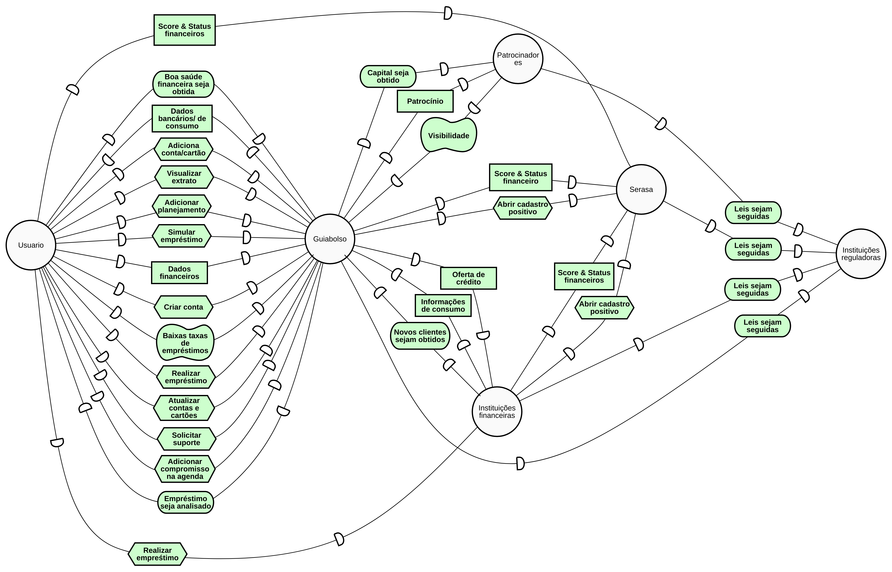
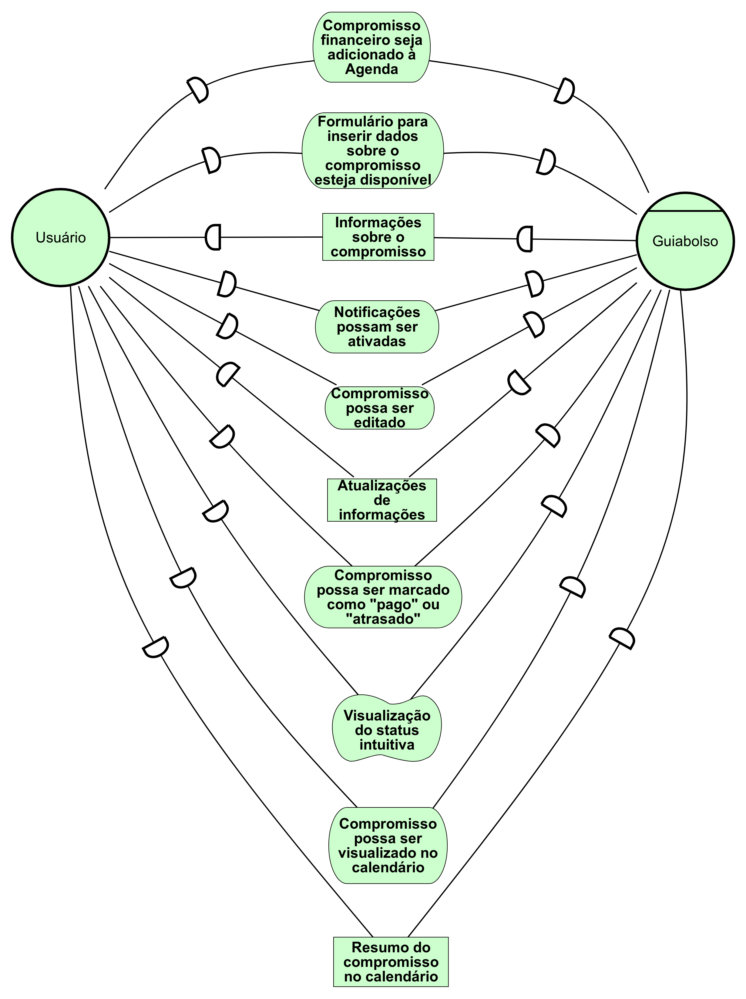
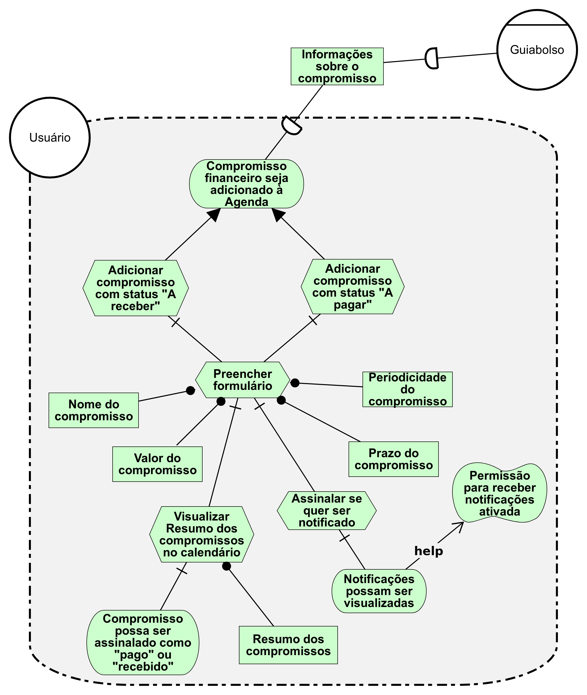
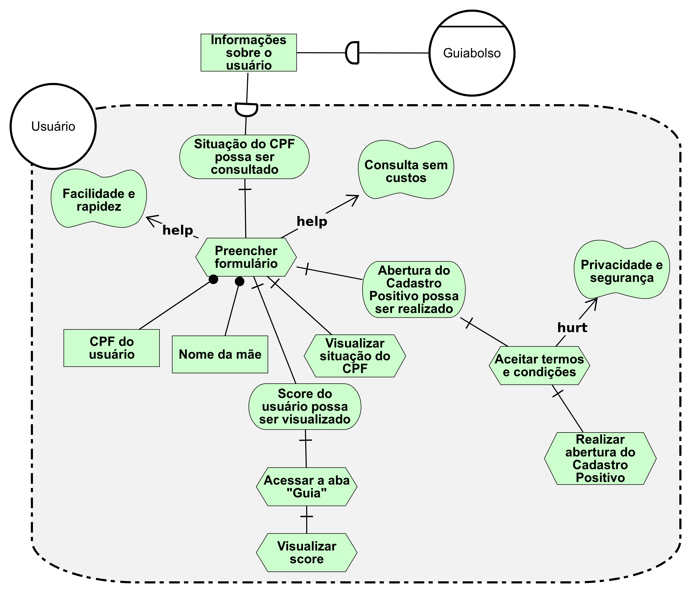
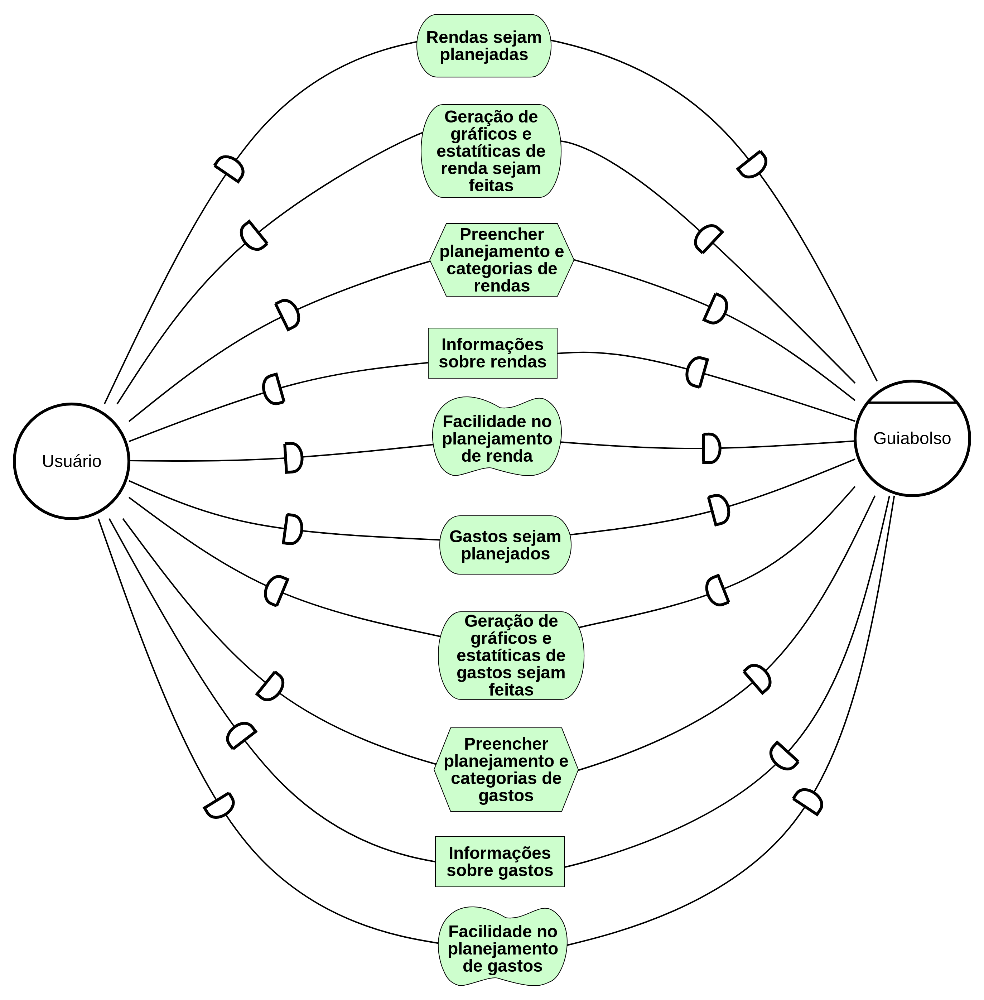
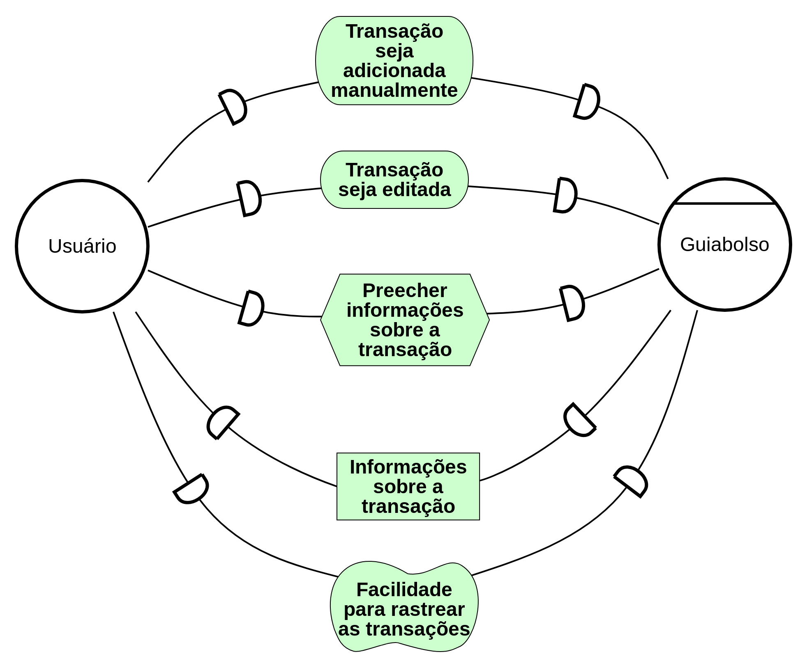
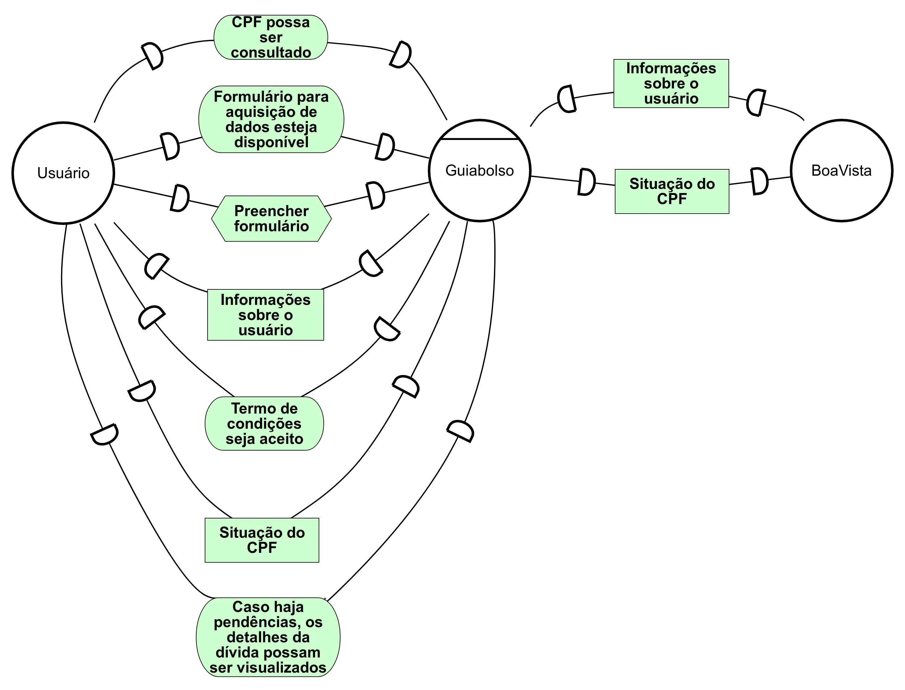
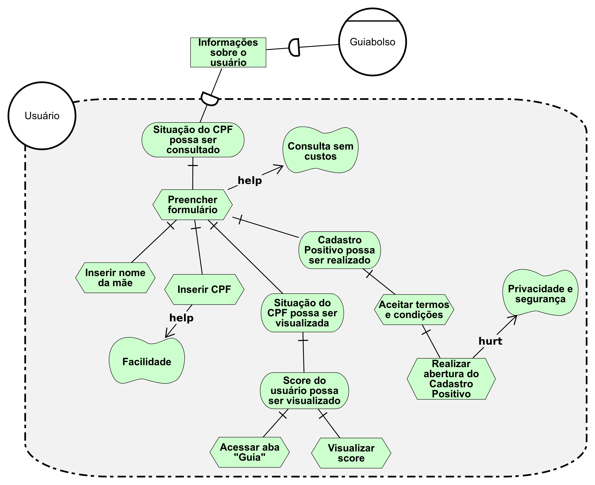
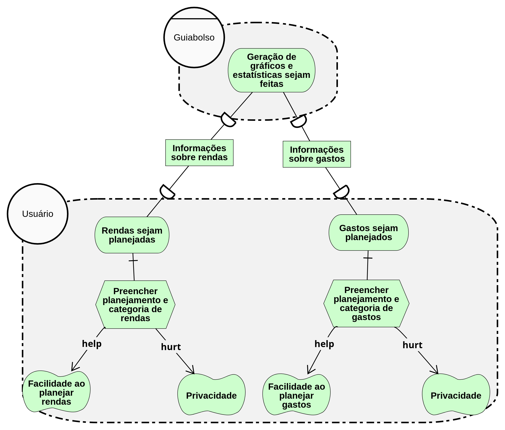

## Introdução 

O Framework i* propõe uma abordagem orientada a agentes para engenharia de requisitos, centrando-se nas características intencionais do agente. Os agentes atribuem propriedades intencionais (como metas, crenças, habilidades, compromissos) entre si e raciocinam sobre relacionamentos estratégicos. As dependências entre os agentes geram oportunidades e vulnerabilidades. Redes de dependências são analisadas usando uma abordagem de raciocínio qualitativo. Os agentes consideram configurações alternativas de dependências para avaliar seu posicionamento estratégico em um contexto social.

Para a confecção dos I* o grupo optou por utilizar a ferramenta [piStar Tool](https://www.cin.ufpe.br/~jhcp/pistar/)

Obs.: Todas as imagens podem ser ampliadas ao se clicar nelas.

## IS01 - Atores

### Strategic Dependency Model (SD)

| **IS01** | **Atores**|
|--|--|
| **Versão**| Atual: 1.0 (26/05)   Anterior: --|
| **Rastreabilidade** | [Casos de uso](../casos_de_uso) |

## IS02 - Adicionar contas e cartões

### Strategic Rationale Model (SR)

| **IS02** | **Adicionar contas e cartões**|
|--|--|
| **Versão**| Atual: 1.0 (26/05)   Anterior: --|
| **Rastreabilidade** | [Casos de uso](../casos_de_uso) |

## IS03 - Simular empréstimo

### Strategic Rationale Model (SR)

| **IS03** | **Simular empréstimo**|
|--|--|
| **Versão**| Atual: 1.1 (26/05)   Anterior: [1.0](#is03-simular-emprestimo_1) (26/05)|
| **Rastreabilidade** | [Casos de uso](../casos_de_uso) |

## IS04 - Adicionar compromisso na agenda

### Strategic Dependency Model (SD)

### Strategic Rationale Model (SR)

| **IS04** | **Adicionar compromisso na agenda**|
|--|--|
| **Versão**| Atual: 1.1 (27/05)   Anterior: [1.0](./../img/istar/agendaSD-v1.png)|
| **Rastreabilidade** | Cenário [C23](../cenarios/#c23-adicionar-na-agenda), Léxico [L36](../lexicos/#l36-agenda), Casos de uso [UC19](../casos_de_uso/#uc19-adicionar-na-agenda), Histórias de usuário [US41](../backlog/#us41-adicionar-transacao-na-agenda), [US42](../backlog/#us42-visualizar-contas-registradas-na-agenda) e [US43](../backlog/#us43-editar-contas-registradas0-na-agenda). |

## IS05 - Consultar situação do CPF

### Strategic Dependency Model (SD)

### Strategic Rationale Model (SR)

| **IS05** | **Consultar situação do CPF**|
|--|--|
| **Versão**| Atual: 1.1 (28/05)   Anterior: [1.0](./../img/istar/consultarcpfSD-v1.png)|
| **Rastreabilidade** | Cenário [C6](../cenarios/#c6-consultar-cpf) , [C4](../cenarios/#c4-realizar-abertura-do-cadastro-positivo), Léxico [L3](../lexicos/#l3-consultar-cpf), [L20](../lexicos/#l20-radar-cpf), RichPicture [RP09](../../pre-rastreabilidade/richpicture/#rp09-radar-cpf) e Casos de uso [UC13](../casos_de_uso/#uc13-visualizar-status-do-nome-limpo-ou-sujo), [UC24](../casos_de_uso/#uc24-realizar-abertura-do-cadastro-positivo).|

## IS06 - Planejamento de rendas e gastos

### Strategic Dependency Model (SD)

### Strategic Rationale Model (SR)

| **IS06** | **Planejamento de rendas e gatos**|
|--|--|
| **Versão**| Atual: 1.1 (27/05)   Anterior: [1.0](./../img/istar/planejamentoSR-v1.png)|
| **Rastreabilidade** | Léxico [L40](../lexicos/#l40-planejamento-financeiro), Caso de uso [UC10](../casos_de_uso/#uc10-adicionar-planejamento), User stories [US45](../backlog/#us45-planejar-gastos) e [US46](../backlog/#us46-planejar-renda).|

## IS07 - Dicas financeiras 

### Strategic Rationale Model (SR)

| **IS07** | **Dicas financeiras**|
|--|--|
| **Versão**| Atual: 1.0 (25/05)   Anterior: --|
| **Rastreabilidade** | Cenários [C14](../cenarios/#c14-verificar-dicas) e [C15](../cenarios/#c15-avaliar-dicas), RichPicture [RP07](../../pre-rastreabilidade/richpicture/#rp07-aba-guia), Caso de uso [UC20](../casos_de_uso/#uc20-visualizar-dicas-externas) e User story [US20](../backlog/#uc20-visualizar-dicas-externas). |

## IS08 - Transações 

### Strategic Dependency Model (SD)

| **IS08** | **Transações**|
|--|--|
| **Versão**| Atual: 1.0 (25/05)   Anterior: --|
| **Rastreabilidade** | Cenário [C18](../cenarios/#c18-editar-transacao), Lexicos [L40](../lexicos/#l40-transacao), Casos de uso [UC6](../casos_de_uso/#uc6-adicionar-transacao-manual) e [UC8](../casos_de_uso/#uc8-editar-transacao).|

## Versões anteriores

## IS04 - Adicionar compromisso na agenda

### Strategic Dependency Model (SD)

### Strategic Rationale Model (SR)

| **IS04** | **Adicionar compromisso na agenda**|
|--|--|
| **Versão**| Atual: 1.0 (25/05)   Anterior: --|
| **Rastreabilidade** | Cenário [C23](../cenarios/#c23-adicionar-na-agenda), Léxico [L36](../lexicos/#l36-agenda), Casos de uso [UC19](../casos_de_uso/#uc19-adicionar-na-agenda), Histórias de usuário [US41](../backlog/#us41-adicionar-transacao-na-agenda), [US42](../backlog/#us42-visualizar-contas-registradas-na-agenda) e [US43](../backlog/#us43-editar-contas-registradas0-na-agenda). |

## IS05 - Consultar situação do CPF

### Strategic Dependency Model (SD)

### Strategic Rationale Model (SR)

| **IS05** | **Consultar situação do CPF**|
|--|--|
| **Versão**| Atual: 1.0 (25/05)   Anterior: --|
| **Rastreabilidade** | Cenário [C6](../cenarios/#c6-consultar-cpf) , [C4](../cenarios/#c4-realizar-abertura-do-cadastro-positivo), Léxico [L3](../lexicos/#l3-consultar-cpf), [L20](../lexicos/#l20-radar-cpf), RichPicture [RP09](../../pre-rastreabilidade/richpicture/#rp09-radar-cpf) e Casos de uso [UC13](../casos_de_uso/#uc13-visualizar-status-do-nome-limpo-ou-sujo), [UC24](../casos_de_uso/#uc24-realizar-abertura-do-cadastro-positivo).|

### IS03 - Simular empréstimo

#### Strategic Rationale Model (SR)

| **IS03** | **Simular empréstimo**|
|--|--|
| **Versão**| Atual: 1.0 (26/05)   Anterior: --|
| **Rastreabilidade** | [Casos de uso](../casos_de_uso) |

## IS06 - Planejamento de rendas e gastos

### Strategic Rationale Model (SR)

| **IS06** | **Planejamento de rendas e gatos**|
|--|--|
| **Versão**| Atual: 1.0 (25/05)   Anterior: --|
| **Rastreabilidade** | Léxico [L40](../lexicos/#l40-planejamento-financeiro), Caso de uso [UC10](../casos_de_uso/#uc10-adicionar-planejamento), User stories [US45](../backlog/#us45-planejar-gastos) e [US46](../backlog/#us46-planejar-renda).|

## Referências 

 - [ i* an agent- and goal-oriented modelling framework ](http://www.cs.toronto.edu/km/istar/#Overview)
 - [ Pimentel, João and Castro, Jaelson. piStar Tool – A Pluggable Online Tool for Goal Modeling. 2018 IEEE 26th International Requirements Engineering Conference, pp. 498-499. ](https://www.cin.ufpe.br/~jhcp/pistar/)
