## Introdução 

O NFR Framework trata-se de um framework conceitual orientado a requisitos não funcionais, ele decompõe os requisitos facilitando assim a compreensão e a priorização destes requisitos alem de possíveis comflitos, por consequência pode vir a ter um grande impacto no sistema.

## NFR 00 - Geral 

[ 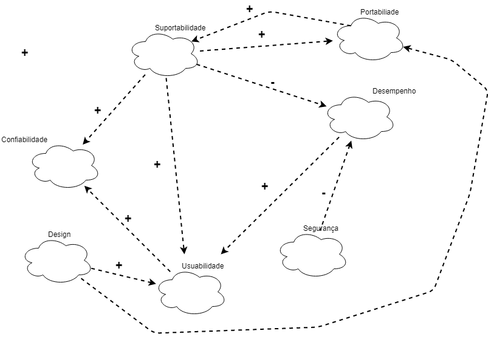](./../img/nfr/nfr_geral.png)

| **NFR01** | **Atores**|
|--|--|
| **Versão**| Atual: 1.0 (27/05)   Anterior: --|
| **Rastreabilidade** | [Especificação Suplementar](../especificacao) |

## NFR01 - Suportabilidade

[ 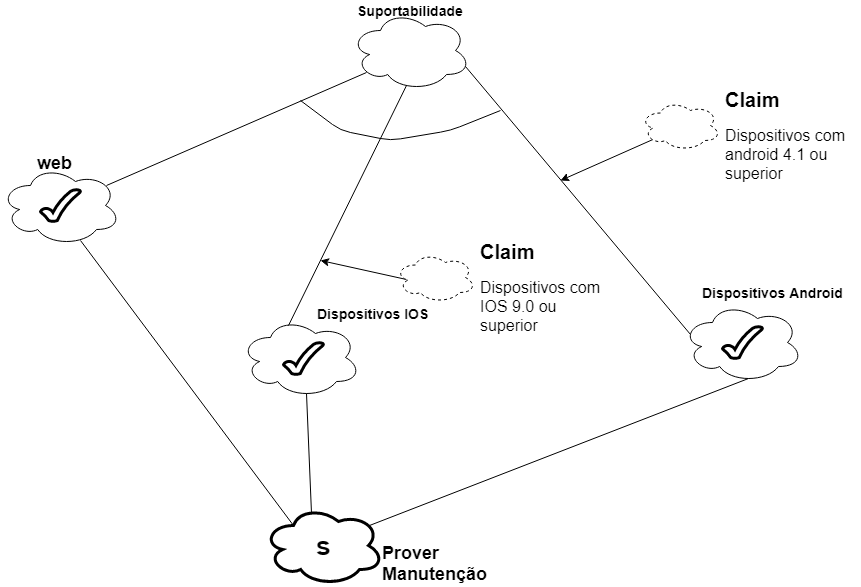](./../img/nfr/nfr_suportabilidade_v1.png)

| **NFR01** | **Atores**|
|--|--|
| **Versão**| Atual: 1.0 (27/05)   Anterior: --|
| **Rastreabilidade** | [Especificação Suplementar](../especificacao) |

[ 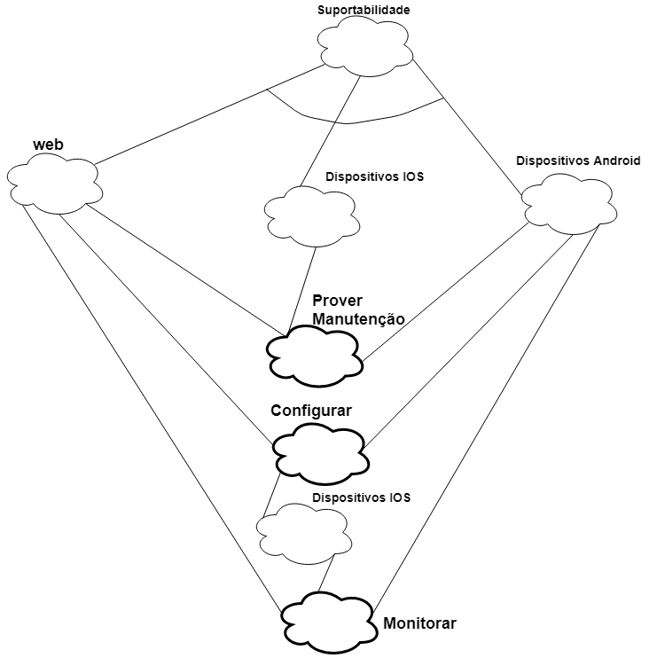](./../img/nfr/nfr_suportabilidade_v2.png)

### Análise do NFR de suportabilidade

| **NFR01** | **Atores**|
|--|--|
| **Versão**| Atual: 2.0 (28/05)   Anterior: 1.0|
| **Rastreabilidade** | [Especificação Suplementar](../especificacao) |

## NFR02 - Portabilidade

[ 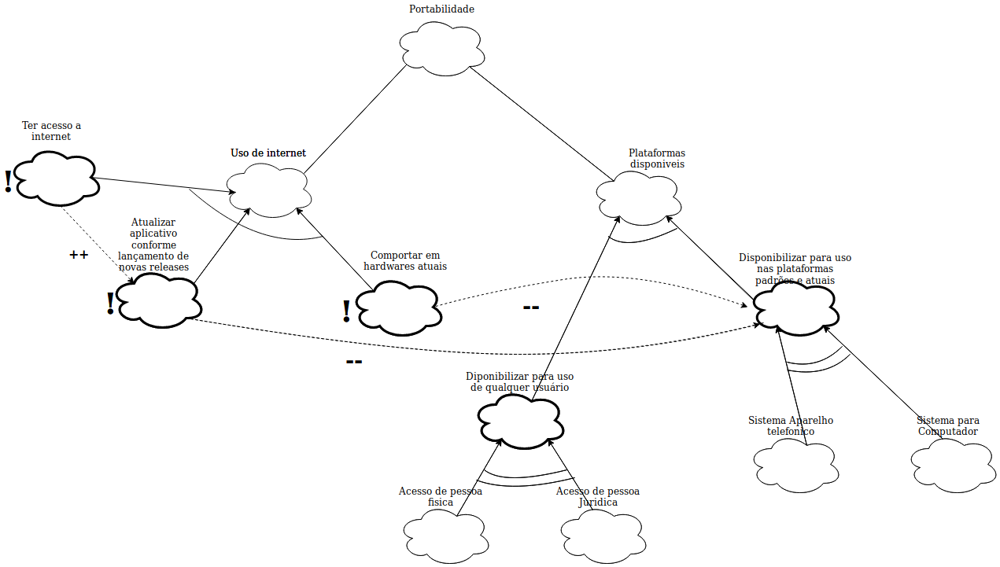](./../img/nfr/nfr_portabilidade.png)

| **NFR02** | **Atores**|
|--|--|
| **Versão**| 1.0 (29/05)   Anterior: --|
| **Rastreabilidade** | [Especificação Suplementar](../especificacao) |

### Análise do NFR de portabilidade
[ 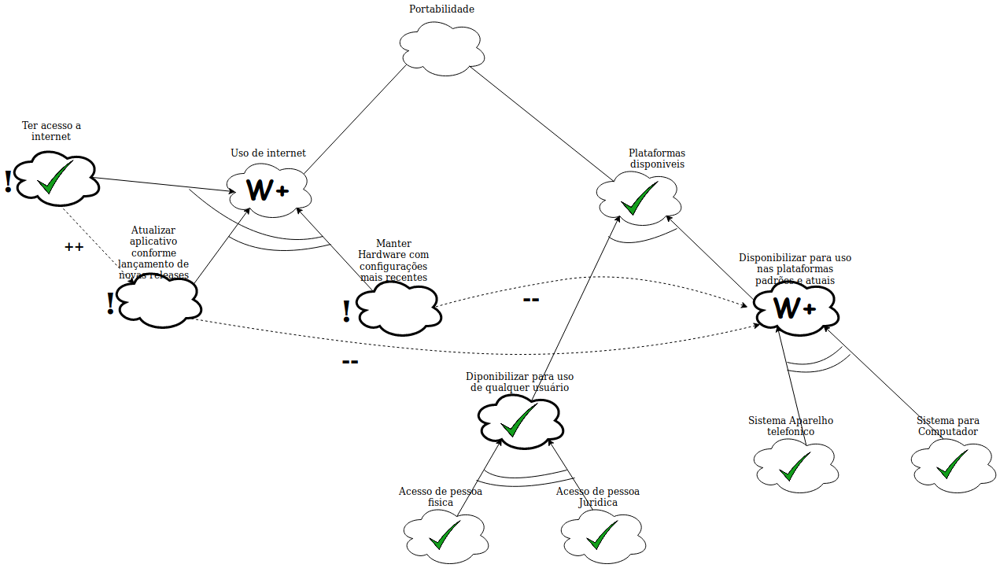](./../img/nfr/nfr_portabilidade_analise.png)

| **NFR02** | **Atores**|
|--|--|
| **Versão**| Atual: 1.0 (29/05)   Anterior: --|
| **Rastreabilidade** | [Especificaçã
o Suplementar](../especificacao)   [NFR01 - Análise](#analize-do-nfr-de-suportabilidade) |

## NFR03 - Desempenho

| **NFR03** | **Atores**|
|--|--|
| **Versão**| Atual: 1.0 (27/05)   Anterior: 1.0|
| **Rastreabilidade** | [Especificação Suplementar](../especificacao) |

[ 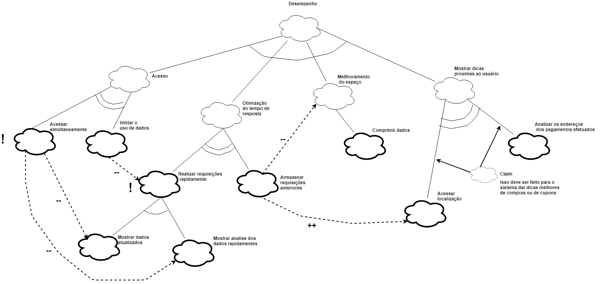](./../img/nfr/nfr_desenpenho_v2.png)

### Análise do NFR de desempenho

[ 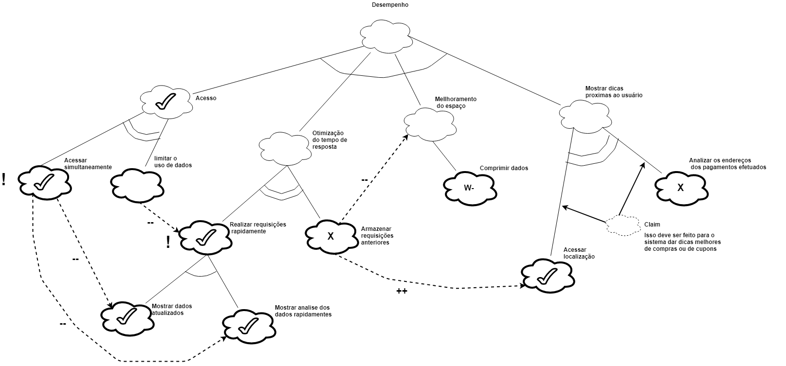](./../img/nfr/nfr_desenpenho_v2_fb.png)

| **NFR03** | **Atores**|
|--|--|
| **Versão**| Atual: 2.0 (28/05)   Anterior: 1.0|
| **Rastreabilidade** | [Especificação Suplementar](../especificacao) |

## NFR04 - Design

| **NFR04** | **Atores**|
|--|--|
| **Versão**| 1.0 (27/05)   Anterior: --|
| **Rastreabilidade** | [Especificação Suplementar](../especificacao) |

### Análise do NFR de Design

[ 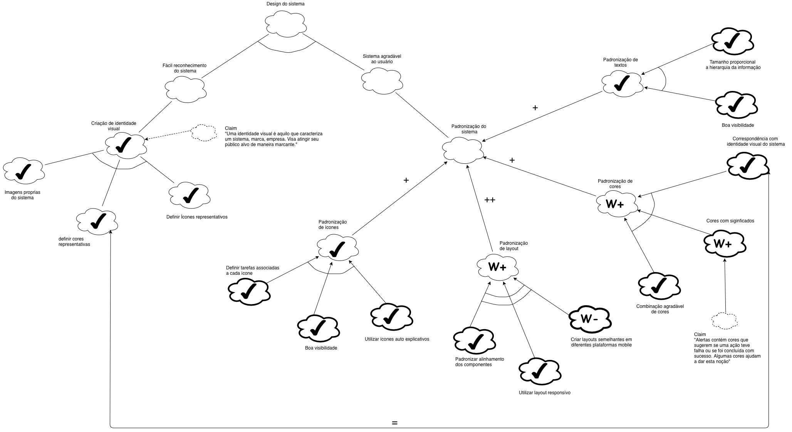](./../img/nfr/nfr_design_v2.png)

| **NFR04** | **Atores**|
|--|--|
| **Versão**| Atual: 2.0 (28/05)   Anterior: 1.0|
| **Rastreabilidade** | [Especificação Suplementar](../especificacao) |

## NFR05 - confiabilidade

[ 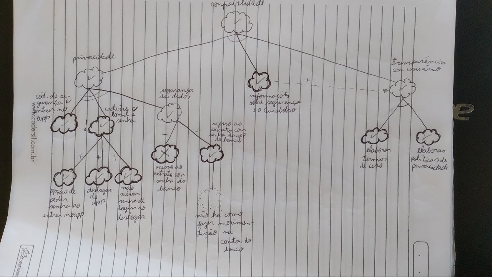](./../img/nfr/nfr_confiabilidade_v1.jpg)

| **NFR04** | **Atores**|
|--|--|
| **Versão**| Atual: 1.0 (25/05)   Anterior: --|
| **Rastreabilidade** | [Especificação Suplementar](../especificacao) |

| **NFR05** | **Atores**|
|--|--|
| **Versão**| 1.1 (27/05)   Anterior: 1.0|
| **Rastreabilidade** | [Especificação Suplementar](../especificacao) |

### Análise do NFR de confiabilidade

| **NFR05** | **Atores**|
|--|--|
| **Versão**| Atual: 1.1 (27/05)   Anterior: |
| **Rastreabilidade** | [Especificação Suplementar](../especificacao) |

## NFR06 - Usabilidade

[ 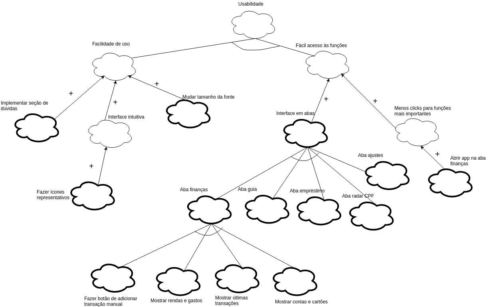](./../img/nfr/nrf_usabilidade.png)

| **NFR06** | **Atores**|
|--|--|
| **Versão**| 1.0 (27/05)   Anterior: --|
| **Rastreabilidade** | [Especificação Suplementar](../especificacao) |

### Análise do NFR de usabilidade

| **NFR06** | **Atores**|
|--|--|
| **Versão**| Atual: 1.0 (27/05)   Anterior: --|
| **Rastreabilidade** | [Especificação Suplementar](../especificacao) |

## NFR07 - Segurança

[ 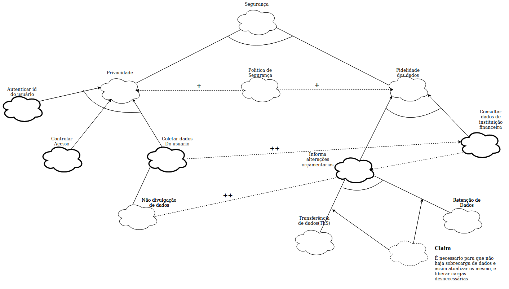](./../img/nfr/nfr_seguranca.png)

| **NFR07** | **Atores**|
|--|--|
| **Versão**| 1.0 (29/05)   Anterior: --|
| **Rastreabilidade** | [Especificação Suplementar](../especificacao) |

### Análise do NFR de seguranca
[ 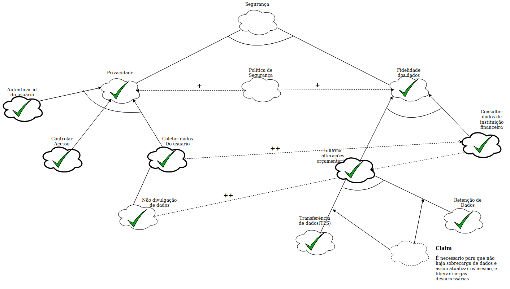](./../img/nfr/nfr_seguranca_analise.png)

| **NFR07** | **Atores**|
|--|--|
| **Versão**| Atual: 1.0 (29/05)   Anterior: --|
| **Rastreabilidade** | [Especificação Suplementar](../especificacao) |

