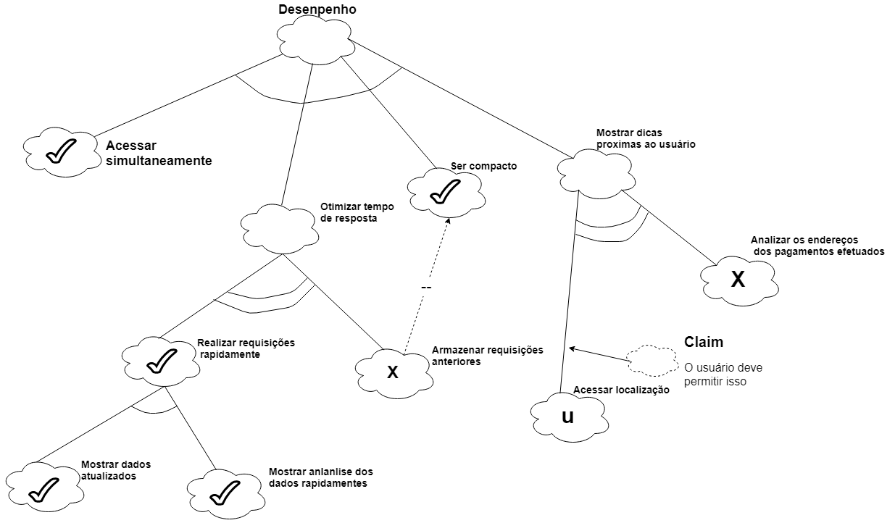
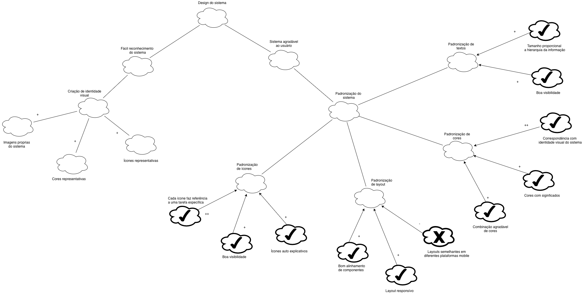

## Introdução 

O NFR Framework trata-se de um framework conceitual orientado a requisitos não funcionais, ele decompõe os requisitos facilitando assim a compreensão e a priorização destes requisitos alem de possíveis comflitos, por consequência pode vir a ter um grande impacto no sistema.

## NFR01 - Suportabilidade

| **NFR01** | **Atores**|
|--|--|
| **Versão**| Atual: 1.0 (27/05)   Anterior: --|
| **Rastreabilidade** | [Especificação Suplementar](../especificacao) |

## NFR02 - Desempenho

| **NFR01** | **Atores**|
|--|--|
| **Versão**| Atual: 1.0 (27/05)   Anterior: --|
| **Rastreabilidade** | [Especificação Suplementar](../especificacao) |

## NFR03 - Design

| **NFR03** | **Atores**|
|--|--|
| **Versão**| Atual: 1.0 (27/05)   Anterior: --|
| **Rastreabilidade** | [Especificação Suplementar](../especificacao) |
