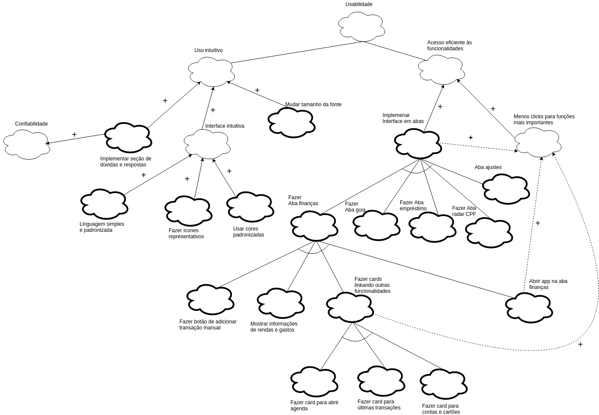
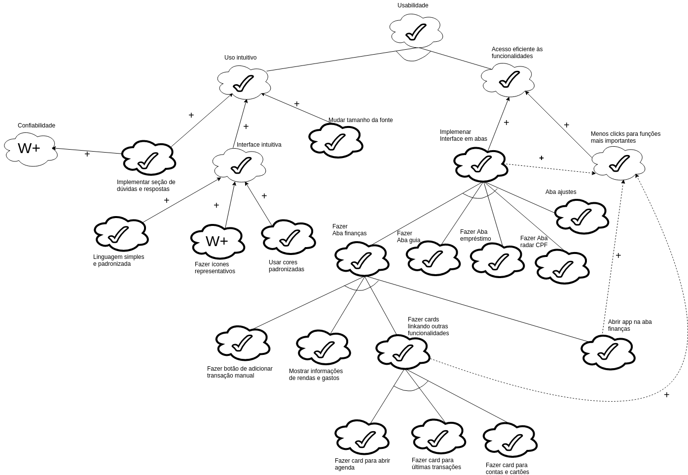

## Introdução

O NFR Framework trata-se de um framework conceitual orientado a requisitos não funcionais, ele decompõe os requisitos facilitando assim a compreensão e a priorização destes requisitos alem de possíveis comflitos, por consequência pode vir a ter um grande impacto no sistema.

## NFR00 - Geral

| **NFR00** | **Atores**|
|--|--|
| **Versão**| Atual: 1.0 (27/05)   Anterior: --|
| **Rastreabilidade** | [Especificação Suplementar](../especificacao) |

## NFR01 - Suportabilidade

| **NFR01** | **Atores**|
|--|--|
| **Versão**| Atual: 1.0 (28/05)   Anterior: --|
| **Autores** | [Marcelo Araújo](https://github.com/santosm46) e [Lucas Machado](https://github.com/lmmLucasMachado) |
| **Rastreabilidade** | [Especificação Suplementar](../especificacao) |

### Análise do NFR de suportabilidade

| **AN-NFR01** | **Atores**|
|--|--|
| **Versão**| Atual: 2.0 (28/05)   Anterior: 1.0|
| **Rastreabilidade** | [Especificação Suplementar](../especificacao) |

## NFR02 - Portabilidade

| **NFR02** | **Atores**|
|--|--|
| **Versão**| 1.0 (29/05)   Anterior: --|
| **Autores** | [Leo Santos](https://github.com/leossb36) e [Alan Lima](https://github.com/alanrslima) |
| **Rastreabilidade** | [Especificação Suplementar](../especificacao) |

### Análise do NFR de portabilidade

| **AN-NFR02** | **Atores**|
|--|--|
| **Versão**| Atual: 1.0 (29/05)   Anterior: --|
| **Rastreabilidade** | [Especificação Suplementar](../especificacao) |

## NFR03 - Desempenho

| **NFR03** | **Atores**|
|--|--|
| **Versão**| Atual: 2.0 (28/05)   Anterior: 1.0|
| **Autores** | [Marcelo Araújo](https://github.com/santosm46) e [Lucas Machado](https://github.com/lmmLucasMachado) |
| **Rastreabilidade** | [Especificação Suplementar](../especificacao) |

### Análise do NFR de desempenho

| **AN-NFR03** | **Atores**|
|--|--|
| **Versão**| Atual: 2.0 (28/05)   Anterior: 1.0|
| **Rastreabilidade** | [Especificação Suplementar](../especificacao) |

## NFR04 - Design

| **NFR04** | **Atores**|
|--|--|
| **Versão**| 1.0 (27/05)   Anterior: --|
| **Autores** | [Leo Santos](https://github.com/leossb36) e [Alan Lima](https://github.com/alanrslima) |
| **Rastreabilidade** | [Especificação Suplementar](../especificacao) |

### Análise do NFR de Design

| **AN-NFR04** | **Atores**|
|--|--|
| **Versão**| Atual: 2.0 (28/05)   Anterior: 1.0|
| **Rastreabilidade** | [Especificação Suplementar](../especificacao) |

## NFR05 - confiabilidade

| **NFR05** | **Atores**|
|--|--|
| **Versão**| 1.1 (27/05)   Anterior: 1.0|
| **Autores** | [Marcelo Araújo](https://github.com/santosm46) e [Lucas Machado](https://github.com/lmmLucasMachado) |
| **Rastreabilidade** | [Especificação Suplementar EPS03](../especificacao/#eps03-confiabilidade) |

### Análise do NFR de confiabilidade

| **AN-NFR05** | **Atores**|
|--|--|
| **Versão**| Atual: 1.1 (27/05)   Anterior: |
| **Rastreabilidade** | [Especificação Suplementar](../especificacao) |

## NFR06 - Usabilidade

| **NFR06** | **Atores**|
|--|--|
| **Versão**| 1.1 (23/06)   Anterior: [1.0](#nfr06-usabilidade_1) |
| **Autores** | [Marcelo Araújo](https://github.com/santosm46) e [Lucas Machado](https://github.com/lmmLucasMachado) |
| **Rastreabilidade** | [Especificação Suplementar EPS02](../especificacao/#eps02-usabilidade) |

### Análise do NFR de usabilidade

| **AN-NFR06** | **Atores**|
|--|--|
| **Versão**| Atual: 1.1 (23/06)   Anterior: [1.0](#analise-do-nfr-de-usabilidade_1) |

## NFR07 - Segurança

| **NFR07** | **Atores**|
|--|--|
| **Versão**| 1.0 (29/05)   Anterior: --|
| **Autores** | [Leo Santos](https://github.com/leossb36) e [Alan Lima](https://github.com/alanrslima) |
| **Rastreabilidade** | [Especificação Suplementar](../especificacao) |

### Análise do NFR de seguranca

| **AN-NFR07** | **Atores**|
|--|--|
| **Versão**| Atual: 1.0 (29/05)   Anterior: --|
| **Rastreabilidade** | [Especificação Suplementar](../especificacao) |

## Versões anteriores

### NFR01 - Suportabilidade

| **NFR01** | **Atores**|
|--|--|
| **Versão**| Atual: 1.0 (27/05)   Anterior: --|
| **Rastreabilidade** | [Especificação Suplementar](../especificacao) |

### NFR03 - Desempenho

| **NFR03** | **Atores**|
|--|--|
| **Versão**| Atual: 1.0 (27/05)   Anterior: 1.0|
| **Rastreabilidade** | [Especificação Suplementar](../especificacao) | 

### NFR05 - confiabilidade

| **NFR04** | **Atores**|
|--|--|
| **Versão**| Atual: 1.0 (25/05)   Anterior: --|
| **Rastreabilidade** | [Especificação Suplementar](../especificacao) |

### NFR06 - Usabilidade

| **NFR06** | **Atores**|
|--|--|
| **Versão**| 1.0 (27/05)   Anterior: --|
| **Rastreabilidade** | [Especificação Suplementar](../especificacao) |

#### Análise do NFR de usabilidade

| **AN-NFR06** | **Atores**|
|--|--|
| **Versão**| Atual: 1.0 (27/05)   Anterior: --|