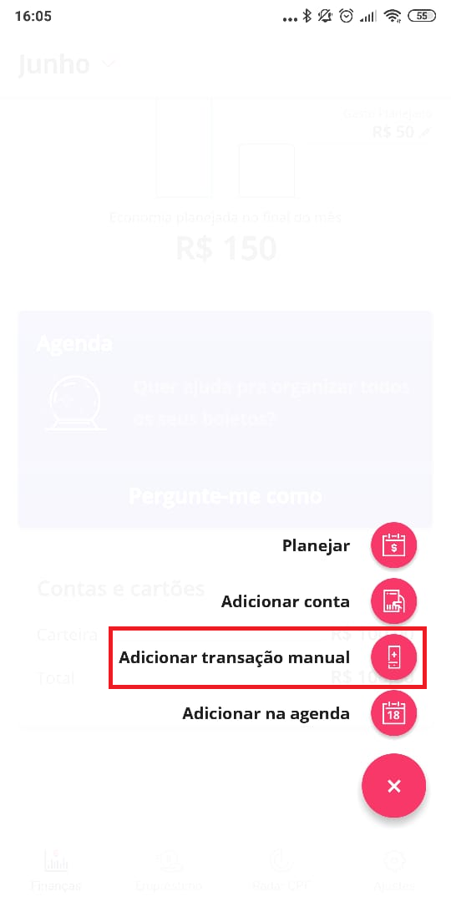
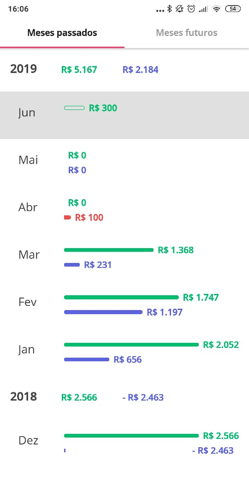
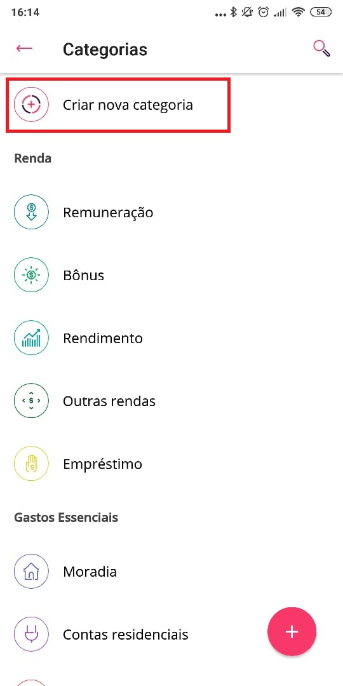
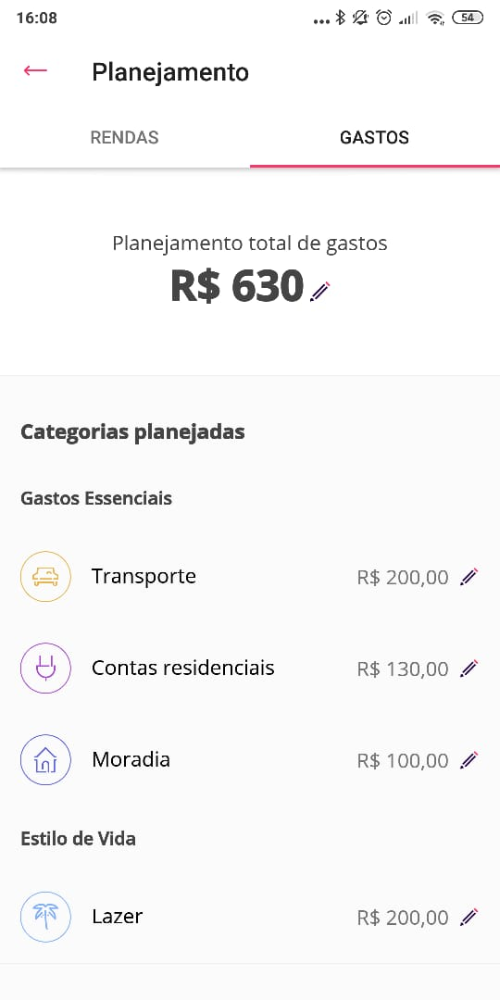
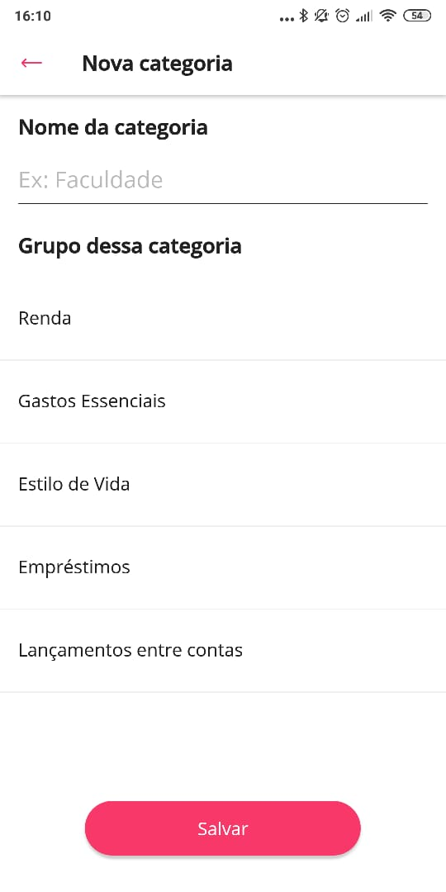
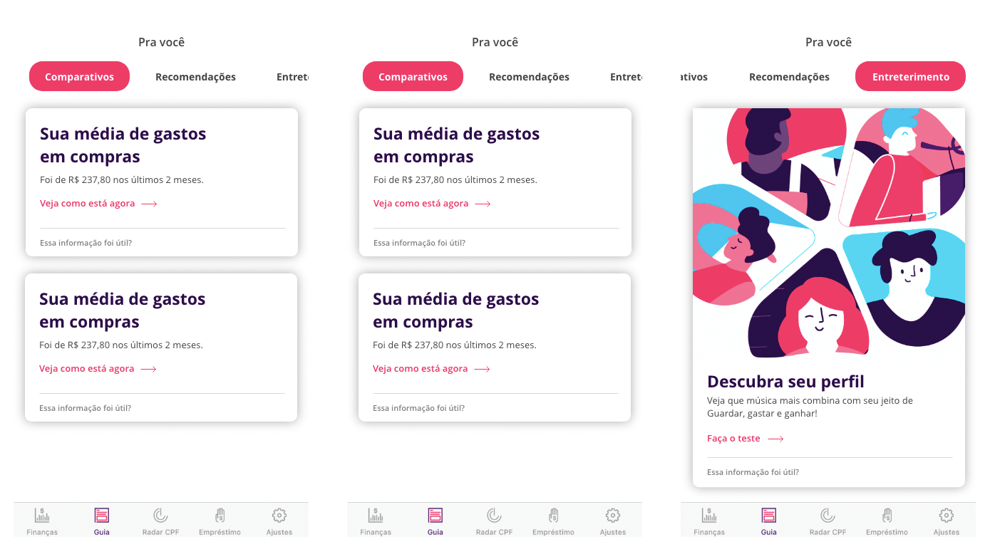
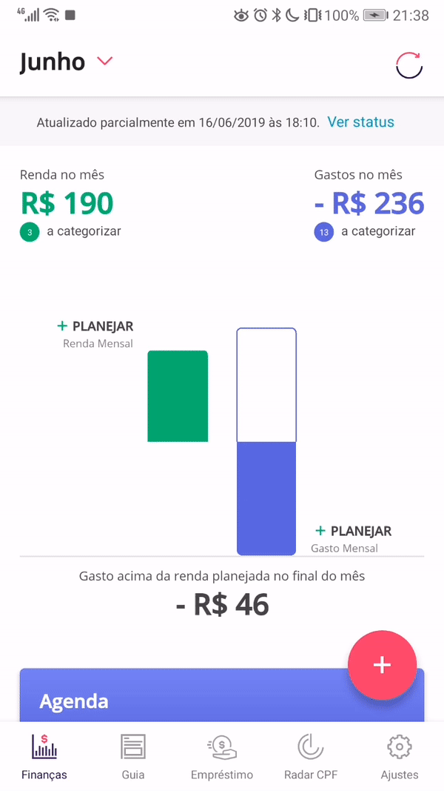
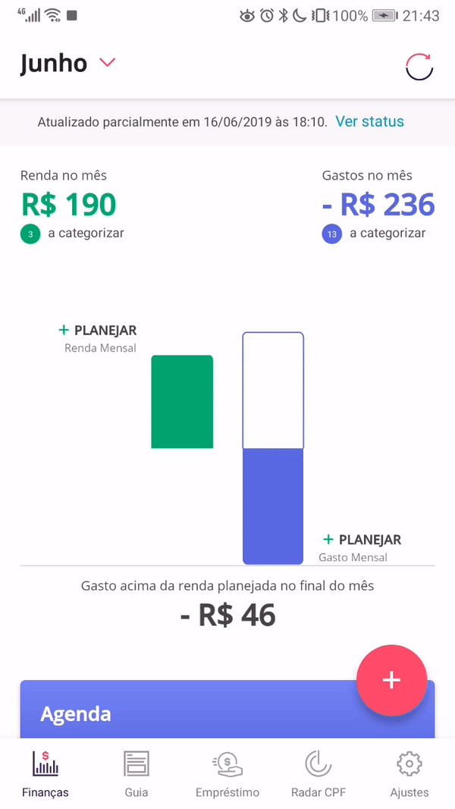

## Introdução

Este artefato busca ligar cada funcionalidade do guiaBolso, mostradas aqui por meio de print screens do aplicativo, ligadas aos seus respectivos requisitos.  

## Tabelas

### Legendas

| Tipo | Código | Significado | Tipo | Código | Significado | 
|--|--|--|--|--|--|
|Modelagem | US | User history (backlog)|Elicitação | AP | Análise de protocolo | | | 
|Modelagem | UC | Caso de uso |Elicitação | AD | Análise de discurso (brainstorm) |
|Modelagem | C | Cenário |Elicitação | ENT | Entrevista |
|Modelagem | R* | Requisito de (...)|Elicitação | INS | Instrospecção |
|Modelagem | IS | I star |Elicitação | Q | Questionário |
|Modelagem | L | Léxicos |Elicitação | ST | Storytelling |
|Modelagem | NFR | NFR Framework |--- | --- | --- |

Obs.: No caso dos R*, o requisito varia de acordo com o que está definido na especificação suplementar.

### Requisitos funcionais

| ID | Descrição |
|--|--|
| [RF01](#rf01) | Adicionar um "tutorial de primeiro uso", ensinando a usar a aplicação|
| [RF02](#rf02) | O Guiabolso deve ter a opção de adicionar tanto o banco de escolha do usuário localizado na lista, quanto o de optar por adicionar conta manualmente.|
| [RF03](#rf03) | O aplicativo deve permitir a adição de mais de uma conta bancária. | 
| RF04 | O Guiabolso deve permitir adicionar uma conta mediante a inserção de dados válidos, como nome, cpf, agência, conta e senha do banco para transações na internet.| 
| RF05 | O app deve dar possibilidade de alterar as contas manualmente| 
| RF06 | Permitir a criação de novas contas a partir das redes sociais do usuário | 
| RF07 | O Guiabolso deve permitir adicionar a renda do mês.| 
| RF08 | O Guiabolso deve disponibilizar um planejamento de escolha do usuário para seus gastos.| 
| RF09 | O Guiabolso deve permitir a consulta da situação do CPF do usuário, mediante um cadastro com dados comprobatórios, como CPF, nome, nome da mãe e data de nascimento.| 
| RF10 | Disponibilização do score numérico do Serasa na aba _Radar CPF_ | 
| RF11 | O Guiabolso pode permitir a integração com o sistema "Nota Legal" para o usuário visualizar saldo em conta e prazos.| 
| RF12 | A aba _Radar CPF_ deve exibir o score e as dicas referentes ao serasa, complementando as informações já disponíveis na aba | 
| RF13 | Mostrar quais empresas consultaram o CPF do usuário | 
| RF14 | Permitir adição manual de transações | 
| RF15 | Ao adicionar transações manuais, deve haver uma forma explícita do tipo de transação que possa indicar se é de entrada ou saída.| 
| RF16 | O Guiabolso deve permitir a visualização dos meses anteriores e futuros para eventuais simulações de economia.| 
| RF17 | Ao adicionar planejamento de gastos, o usuário poderá categorizá-los por meio de categorias pré-estabelecidas.|
| RF18 | O Guiabolso deve permitir que caso o usuário sinta necessidade, possa criar novas categorias.| 
| RF19 | Ao escolher a categoria que não existe, ser mostrado categorias parecidas | 
| RF20 | Ter uma sugestão de gastos para o dia por categorias criadas previamente pelo usuário | 
| RF21 | O Guiabolso deve permitir adicionar renda na "Carteira".| 
| RF22 | Colocar dicas na aba _Empréstimos_ no caso de não haver empréstimos disponíveis para o usuário | 
| RF23 | Categorizar as opções dentro das configurações do Guiabolso |
| RF24 | O app sugerir formas para melhor gerir o seu dinheiro | 
| RF25 | Criação de uma aba _Investimentos_ com dicas, informações, e disponibilização de investimentos para o usuário |
| RF26 | Adicionar uma opção _"Arredondar gastos para cima"_ para dar a falsa impressão de que os gastos são superiores à realidade (desativada por padrão) | 
| RF27 | Categorizar os artigos da aba _Guia_ e aplicar maior ênfase na opção _"essa informação foi útil?"_ |
| RF28 | O app deve possibilitar outras formas graficas de visualizar os dados além do grafico de tabelas| 
| RF29 | O app pode diminuir as propagandas na aba guia| 
| RF30 | Possibilidade de remover os cards da aba _Guia_. | 
| RF31 | Adição de guias de categorização na aba _Guia_. |
| RF32 | Permitir a alteração da ordem de exibição dos cards na aba _Guia_. |
| RF33 | Sistema de login que funcione com o leitor de digitais dos mais diversos dispositivos |
| RF34 | Sistema de conquistas para incentivar o usuário a usar aplicativo e poupar dinheiro |
| RF35 | Permitir ao usuário escoher quais abas ele quer ver | 
| RF36 | Oferecer uma consultoria financeira através de dicas e avisos | 
| RF37 | Ter uma aba para simulação e contratação de empréstimos |
| RF38 | Visualização gráfica de gastos por categoria |
| RF39 | Exibir diferença entre renda e gastos | 
| RF40 | Ter alertas importantes, como negativação, protesto ou crédito concedido | 
| RF41 | Ter alcance de metas, como carro, casa, roupa, celular |
| RF42 | Ter perfis de usuário, por exemplo, bom administrador, bom investidor | 
| RF43 | Inserir limites de gastos por categoria | 
| RF44 | Notificar quando o gasto for excedido |
| RF45 | O app deve mostrar notificações de quando se ultrapassa uma meta estabelecida pelo usuario | 
| RF46 | O app deve oferecer cupons baseado na geolocalização do usuario | 
| RF47 | Os cupons para bares e restaurantes com uma localização superior a x km não deveriam ser mostrados | 
| RF48 | Para as cidades que não possuem cupons de descontos esta opção não deveria ser mostrada a menos que sejam cupons online  | 
| RF49 | O app deve oferecer a possibilidade de alterar as informações de sinal do valor, e data da transação manual |

#### Detalhes

##### RF01 

| **RF01** | ** Adicionar um "tutorial de primeiro uso" **|
|--|--|
|**Tema** | [T1](../../modelagem/backlog/#temas) |
|**Épico** | [EP01](../../modelagem/backlog/#ep01-documentos) |
|**Sprint** | [Sprint 13](../../modelagem/backlog/#sprint-13) |
|**US** | [US02](../../modelagem/backlog/#us02-documentar-e-agrupar-duvidas-dos-usuarios) |
| **Obs.:** | O tutorial de uso completo está disponível apenas no [site](https://www.guiabolso.com.br/como-funciona). O app, seja de android ou IOS disponibiliza algumas dicas que só aparecem no primeiro uso, conforme a imagem. Dessa forma pode-se dizer que o requisito foi **parcialmente** implementado. |
| **Funcionalidade** | |

##### RF02 

| **RF02** | ** Adicionar conta listada previamente ou manual **|
|--|--|
|**Tema** | [T3](../../modelagem/backlog/#temas) |
|**Épico** | [EP07](../../modelagem/backlog/#ep07-contas-e-cartoes) |
|**Sprint** | [Sprint 3](../../modelagem/backlog/#sprint-3) |
|**US** | [US25](../../modelagem/backlog/#us25-cadastrar-uma-nova-conta-ou-cartao) |
| **Obs.:** | Requisito **totalmente** implementado. |
| **Funcionalidade** | |

##### RF03

| **RF03** | ** O aplicativo deve permitir a adição de mais de uma conta bancária. **|
|--|--|
|**Tema** | [T3](../../modelagem/backlog/#temas) |
|**Épico** | [EP07](../../modelagem/backlog/#ep07-contas-e-cartoes) |
|**Sprint** | [Sprint 3](../../modelagem/backlog/#sprint-3) |
|**US** | [US25](../../modelagem/backlog/#us25-cadastrar-uma-nova-conta-ou-cartao) & [US26](../../modelagem/backlog/#us26-visualizar-contas-e-cartoes-cadastrados) |
| **Obs.:** | Requisito **totalmente** implementado. É perfeitamente possível combinar contas bancárias, cartões e contas manuais. |
| **Funcionalidade** | |

##### RF04

| **RF04** | ** O Guiabolso deve permitir adicionar uma conta mediante a inserção de dados válidos pelo site. **|
|--|--|
|**Tema** | [T3](../../modelagem/backlog/#temas) |
|**Épico** | [EP07](../../modelagem/backlog/#ep07-contas-e-cartoes) |
|**Sprint** | [Sprint 3](../../modelagem/backlog/#sprint-3) |
|**US** | [US25](../../modelagem/backlog/#us25-cadastrar-uma-nova-conta-ou-cartao) |
| **Obs.:** | Requisito **não** implementado. Conforme vê-se pela imagem, não é possível adicionar uma conta pelo site do Guiabolso. |
| **Funcionalidade** | |

##### RF05

| **RF05** | ** O app deve dar possibilidade de alterar as contas manualmente **|
|--|--|
|**Tema** | [T3](../../modelagem/backlog/#temas) |
|**Épico** | [EP07](../../modelagem/backlog/#ep07-contas-e-cartoes) |
|**Sprint** | [Sprint 3](../../modelagem/backlog/#sprint-3) |
|**US** | [US27](../../modelagem/backlog/#us27-remover-conta-ou-cartao) |
| **Obs.:** | Requisito **parcialmente** implementado. Conforme vê-se pelo gif, é possível alterar uma conta, mas somente quando há algum problema nela. Caso o usuário queria editar os dados de uma conta que está funcionando corretamente, a única saída é removê-la e adicionar novamente com os novos dados. |
| **Funcionalidade** | |

##### RF06

| **RF06** | ** Permitir a criação de novas contas a partir das redes sociais do usuário **|
|--|--|
|**Tema** | [T2](../../modelagem/backlog/#temas) |
|**Épico** | [EP03](../../modelagem/backlog/#ep03-cadastro) |
|**Sprint** | [Sprint 1](../../modelagem/backlog/#sprint-1) |
|**US** | [US11](../../modelagem/backlog/#us11-elaborar-formulario) |
| **Obs.:** | Requisito **não** implementado. Além disso, percebe-se que houveram poucas modelagem e elicitações sobre o tema, indicando que o grupo praticamente não abordou esse tópico. |
| **Funcionalidade** | Não há imagem, pois não foi implementado.|

##### RF07

| **RF07** | ** O Guiabolso deve permitir adicionar a renda do mês. **|
|--|--|
|**Tema** | [T2](../../modelagem/backlog/#temas) |
|**Épico** | [EP03](../../modelagem/backlog/#ep03-cadastro) |
|**Sprint** | [Sprint 1](../../modelagem/backlog/#sprint-1) |
|**US** | [US46](../../modelagem/backlog/#us46-planejar-renda) |
| **Obs.:** | Requisito **totalmente** implementado. |
| **Funcionalidade** |    |

##### RF08

| **RF08** | ** O Guiabolso deve disponibilizar um planejamento de escolha do usuário para seus gastos. **|
|--|--|
|**Tema** | [T4](../../modelagem/backlog/#temas) |
|**Épico** | [EP11](../../modelagem/backlog/#ep11-planejamento) |
|**Sprint** | [Sprint 9](../../modelagem/backlog/#sprint-9) |
|**US** | [US45](../../modelagem/backlog/#us45-planejar-gastos) |
| **Obs.:** | Requisito **totalmente** implementado. |
| **Funcionalidade** |    |

##### RF09

| **RF09** | ** O Guiabolso deve permitir a consulta da situação do CPF do usuário.  **|
|--|--|
|**Tema** | [T5](../../modelagem/backlog/#temas) |
|**Épico** | [EP14](../../modelagem/backlog/#ep14-Serasa) |
|**Sprint** | [Sprint 11](../../modelagem/backlog/#sprint-11) |
|**US** | [US60](../../modelagem/backlog/#us60-visualizar-status-de-avaliacao-de-credito) & [US63](../../modelagem/backlog/#us63-visualizar-empresas-que-consultaram-meu-cpf) |
| **Obs.:** | Requisito **totalmente** implementado. |
| **Funcionalidade** |    |

##### RF10

| **RF10** | ** Disponibilização do score numérico do Serasa na aba _Radar CPF_  **|
|--|--|
|**Tema** | [T5](../../modelagem/backlog/#temas) |
|**Épico** | [EP14](../../modelagem/backlog/#ep14-Serasa) |
|**Sprint** | [Sprint 11](../../modelagem/backlog/#sprint-11) |
|**US** | [US61](../../modelagem/backlog/#us61-informar-score) |
| **Obs.:** | Requisito **não** implementado. Apesar de o Guiabolso exibir o score do serasa, ele não exibe o valor numérico. A imagem é referente ao [protótipo](../../elicitacao-de-requisitos/prototipacao/#radar-cpf) elaborado pelos membros do grupo. |
| **Funcionalidade** |    |

##### RF11

| **RF11** | ** O Guiabolso pode permitir a integração com o sistema "Nota Legal" para o usuário visualizar saldo em conta e prazos.  **|
|--|--|
|**Tema** | [T5](../../modelagem/backlog/#temas) |
|**Épico** | [EP13](../../modelagem/backlog/#ep13-Dicas) |
|**Sprint** | [Sprint 10](../../modelagem/backlog/#sprint-10) |
|**US** | [US58](../../modelagem/backlog/#us58-buscar-dados-de-fontes-externas) |
| **Obs.:** | Requisito **não** implementado. Além disso, percebe-se que, assim como no RF06,  houveram poucas modelagem e elicitações sobre o tema, indicando que o grupo praticamente não abordou esse tópico. |
| **Funcionalidade** |  Não há imagem, pois não foi implementado. |

##### RF12

| **RF12** | ** A aba _Radar CPF_ deve exibir o score e as dicas referentes ao serasa, complementando as informações já disponíveis na aba" **|
|--|--|
|**Tema** | [T5](../../modelagem/backlog/#temas) |
|**Épico** | [EP13](../../modelagem/backlog/#ep13-Dicas) |
|**Sprint** | [Sprint 10](../../modelagem/backlog/#sprint-10) |
|**US** | [US57](../../modelagem/backlog/#us57-visualizar-dicas-de-controle-financeiro) & [US62](../../modelagem/backlog/#us62-realizar-integracao-com-terceiros)|
| **Obs.:** | Apesar de ambas as funções descritas estarem presentes no app, elas não estão presentes exatamente como descritas nesse requisito. Logo o requisito está **parcialmente** implementado. A imagem é referente ao [protótipo](../../elicitacao-de-requisitos/prototipacao/#radar-cpf) elaborado pelos membros do grupo. |
| **Funcionalidade** |  |

##### RF13

| **RF13** | ** Mostrar quais empresas consultaram o CPF do usuário **|
|--|--|
|**Tema** | [T5](../../modelagem/backlog/#temas) |
|**Épico** | [EP14](../../modelagem/backlog/#ep14-Serasa) |
|**Sprint** | [Sprint 11](../../modelagem/backlog/#sprint-11) |
|**US** | [US62](../../modelagem/backlog/#us62-realizar-integracao-com-terceiros)|
| **Obs.:** | Requisito **totalmente** implementado. |
| **Funcionalidade** |   |

##### RF14

| **RF14** | ** Permitir adição manual de transações **|
|--|--|
|**Tema** | [T4](../../modelagem/backlog/#temas) |
|**Épico** | [EP09](../../modelagem/backlog/#ep09-extrato) |
|**Sprint** | [Sprint 6](../../modelagem/backlog/#sprint-6) |
|**US** | [US39](../../modelagem/backlog/#us39-editar-dados-da-transacao) |

| **Funcionalidade** |   |
| **Caso de uso** |[UC6](../../modelagem/casos_de_uso/#uc6-adicionar-transacao-manual) |
| **Léxico** | [L40](../../modelagem/lexicos/#l40-transacao) |
| **Cenários** | [C2](../../modelagem/cenarios/#c2-adicionar-transacao-com-conta-manual) |
| **I\*** | [IS08](../../modelagem/istar/#is08-transacoes)|
| **Obs.:** | Requisito **totalmente** implementado. |

##### RF15

| **RF15** | **Adicionar transações manuais**|
|--|--|
| **Imagem** |  |
|**US** | US41 |
| **Caso de uso** | [UC06](../../pos-rastreabilidade/casos_de_uso/#UC06) |
| **Léxico** |  L30 & L40 & |
| **Especificação** | RU05 |
| **Cenários** | C2 |
| **I\*** | IS08 |
| **Obs.:** | Requisito **totalmente** implementado. |

##### RF16

| **RF16** | **O Guiabolso deve permitir a visualização dos meses anteriores e futuros**|
|--|--|
| **Imagem** |  |
|**US** | US49 & US51 |
| **Caso de uso** | -- |
| **Léxico** |  L18 |
| **Especificação** | -- |
| **Cenários** | C3 |
| **I\*** | > Não há |
| **Obs.:** | Requisito **totalmente** implementado. |

##### RF17

| **RF17** | **Ao adicionar planejamento de gastos, o usuário poderá categorizá-los por meio de categorias pré-estabelecidas.**|
|--|--|
| **Imagem** |  |
|**US** | US45 & US46 |
| **Caso de uso** | [UC10](../../pos-rastreabilidade/casos_de_uso/#UC10-Adicionar-planejamento) |
| **Léxico** |  L13 |
| **Especificação** | RU05 |
| **Cenários** | -- |
| **I\*** | IS06 |
| **Obs.:** | Requisito **ainda não** implementado. |

##### RF18

| **RF18** | **O Guiabolso deve permitir que caso o usuário sinta necessidade, possa criar novas categorias.**|
|--|--|
| **Imagem** |  |
|**US** | -- |
| **Caso de uso** | UC7 |
| **Léxico** |  L13 |
| **Especificação** | -- |
| **Cenários** | C9 |
| **I\*** | > Não há |
| **Obs.:** | Requisito **totalmente** implementado. |

##### RF19

| **RF19** | **Ao escolher a categoria que não existe, ser mostrado categorias parecidas**|
|--|--|
| **Imagem** | -- |
|**US** | -- |
| **Caso de uso** | -- |
| **Léxico** |  L13 |
| **Especificação** | -- |
| **Cenários** | C9 |
| **I\*** | > Não há |
| **Obs.:** | Requisito **ainda não** implementado, ainda assim foi visto que não aparece em algumas modelagens. |

##### RF20

| **RF20** | **Ter uma sugestão de gastos para o dia por categorias criadas previamente pelo usuário**|
|--|--|
| **Imagem** | |
|**US** | -- |
| **Caso de uso** | -- |
| **Léxico** |  L13 |
| **Especificação** | RU05 |
| **Cenários** | -- |
| **I\*** | IS06 |
| **Obs.:** | Requisito **totalmente** implementado, ainda assim foi visto que não aparece em algumas modelagens. |

##### RF21

| **RF21** | **O Guiabolso deve permitir adicionar renda na "Carteira**|
|--|--|
| **Imagem** |  |
|**US** | -- |
| **Caso de uso** | UC9 |
| **Léxico** | -- |
| **Especificação** | RU05 |
| **Cenários** | C24 |
| **I\*** | IS06 |
| **Obs.:** | Requisito **totalmente** implementado. |

##### RF22

| **RF22** | **Colocar dicas na aba _Empréstimos_ no caso de não haver empréstimos disponíveis para o usuário**|
|--|--|
| **Imagem** | |
|**US** | US71 & US70 |
| **Caso de uso** | -- |
| **Léxico** |  L32 & L13 |
| **Especificação** | -- |
| **Cenários** | C14 |
| **I\*** | IS07 & IS03 |
| **Obs.:** | Requisito **ainda não** implementado. |

##### RF23

| **RF23** | **Categorizar as opções dentro das configurações do Guiabolso**|
|--|--|
| **Imagem** | |
|**US** | -- |
| **Caso de uso** | -- |
| **Léxico** |  -- |
| **Especificação** | RCC03 |
| **Cenários** | -- |
| **I\*** | > Não há |
| **Obs.:** | Requisito **ainda não** implementado. |

##### RF24

| **RF24** | **O app sugerir formas para melhor gerir o seu dinheiro**|
|--|--|
| **Imagem** |  |
|**US** | US57  |
| **Caso de uso** | UC12 & UC20|
| **Léxico** |  -- |
| **Especificação** | RU05 |
| **Cenários** | C14 |
| **I\*** | IS07 |
| **Obs.:** | Requisito **parcialmente** implementado. |

##### RF25

| **RF25** | **Criação de uma aba _Investimentos_ com dicas, informações, e disponibilização de investimentos para o usuário**|
|--|--|
| **Imagem** | |
|**US** | -- |
| **Caso de uso** | -- |
| **Léxico** |  L32 & L13 |
| **Especificação** | RU02 |
| **Cenários** | C14 |
| **I\*** | IS07 |
| **Obs.:** | Requisito **ainda não** implementado. |

##### RF26

| **RF26** | **Adicionar uma opção _"Arredondar gastos para cima"_ para dar a falsa impressão de que os gastos são superiores à realidade (desativada por padrão)**|
|--|--|
| **Imagem** | |
|**US** | -- |
| **Caso de uso** | -- |
| **Léxico** |  -- |
| **Especificação** | -- |
| **Cenários** | -- |
| **I\*** | > Não há |
| **Obs.:** | Requisito **ainda não** implementado. |

##### RF27

| **RF27** | **Categorizar os artigos da aba _Guia_ e aplicar maior ênfase na opção _"essa informação foi útil?"**|
|--|--|
| **Imagem** | -- |
|**US** | -- |
| **Caso de uso** | -- |
| **Léxico** |  L32 |
| **Especificação** | RU05 |
| **Cenários** | C15 |
| **I\*** | > Não há|
| **Obs.:** | Requisito **parcialmente** implementado. |

##### RF28

| **RF28** | **O app deve possibilitar outras formas graficas de visualizar os dados além do grafico de tabelas**|
|--|--|
| **Imagem** | -- |
|**US** | -- |
| **Caso de uso** | -- |
| **Léxico** |  -- |
| **Especificação** | RU01|
| **Cenários** |-- |
| **I\*** | > Não há |
| **Obs.:** | Requisito **ainda não** implementado. |

##### RF29

| **RF29** | **O app pode diminuir as propagandas na aba guia**|
|--|--|
| **Imagem** | -- |
|**US** | -- |
| **Caso de uso** | -- |
| **Léxico** |  L32 |
| **Especificação** | -- |
| **Cenários** |-- |
| **I\*** | > Não há |
| **Obs.:** | Requisito **ainda não** implementado. |

##### RF30

| **RF30** | **Possibilidade de remover os cards da aba _Guia_**|
|--|--|
| **Imagem** | -- |
|**US** | -- |
| **Caso de uso** | -- |
| **Léxico** |  L32 |
| **Especificação** | -- |
| **Cenários** | -- |
| **I\*** | > Não há |
| **Obs.:** | Requisito **ainda não** implementado. |

##### RF31

| **RF31** | **Adição de guias de categorização na aba _Guia_**|
|--|--|
| **Imagem** | -- |
|**US** | -- |
| **Caso de uso** | -- |
| **Léxico** |  L32 |
| **Especificação** | RU05 |
| **Cenários** | -- |
| **I\*** | > Não há |
| **Obs.:** | Requisito **ainda não** implementado. |

##### RF32

| **RF32** | ** Permitir a alteração da ordem de exibição dos cards na aba _Guia_. **|
|--|--|
|**Tema** | [T5](../../modelagem/backlog/#temas) |
|**Épico** | [EP13](../../modelagem/backlog/#ep13-Dicas) |
|**Sprint** | [Sprint 10](../../modelagem/backlog/#sprint-10) |
|**US** | [US57](../../modelagem/backlog/#us57-visualizar-dicas-de-controle-financeiro)|
| **Obs.:** | Requisito **não** implementado. Porém ele foi [prototipado](../../elicitacao-de-requisitos/prototipacao/#guias), conforme imagem abaixo. |
| **Funcionalidade** |   |

##### RF33

| **RF33** | ** Sistema de login que funcione com o leitor de digitais dos mais diversos dispositivos. **|
|--|--|
|**Tema** | [T2](../../modelagem/backlog/#temas) |
|**Épico** | [EP4](../../modelagem/backlog/#ep04-login-logout) |
|**Sprint** | [Sprint 1](../../modelagem/backlog/#sprint-1) |
|**US** | [US16 ](../../modelagem/backlog/#us16-fazer-login)|
| **Obs.:** | Requisito **não** implementado. |
| **Funcionalidade** | Não há imagem.  |

##### RF34

| **RF34** | ** Sistema de conquistas para incentivar o usuário a usar aplicativo e poupar dinheiro. **|
|--|--|
|**Tema** | -- |
|**Épico** | -- |
|**Sprint** | -- |
|**US** | -- |
| **Obs.:** | Requisito **não** implementado. Além disso não foi feito uma US para o requisito dentro do backlog, o que indica uma falha. |
| **Funcionalidade** | Não há imagem.  |

##### RF35

| **RF35** | ** Permitir ao usuário escoher quais abas ele quer ver. **|
|--|--|
|**Tema** | -- |
|**Épico** | -- |
|**Sprint** | -- |
|**US** | -- |
| **Obs.:** | Requisito **não** implementado. Além disso não foi feito uma US para o requisito dentro do backlog, o que indica uma falha. |
| **Funcionalidade** | Não há imagem.  |

##### RF36

| **RF36** | ** Oferecer uma consultoria financeira através de dicas e avisos.   **|
|--|--|
|**Tema** | [T5](../../modelagem/backlog/#temas) |
|**Épico** | [EP13](../../modelagem/backlog/#ep13-Dicas) |
|**Sprint** | [Sprint 10](../../modelagem/backlog/#sprint-10) |
|**US** | [US57](../../modelagem/backlog/#us57-visualizar-dicas-de-controle-financeiro)|
| **Obs.:** | Requisito **totalmente** implementado. |
| **Funcionalidade** |    |

##### RF37

| **RF37** | ** Ter uma aba para simulação e contratação de empréstimos. **|
|--|--|
|**Tema** | [T6](../../modelagem/backlog/#temas) |
|**Épico** | [EP16](../../modelagem/backlog/#ep16-emprestimos) |
|**Sprint** | [Sprint 15](../../modelagem/backlog/#sprint-15) |
|**US** | [US70](../../modelagem/backlog/#us70-simular-um-emprestimo), [US71](../../modelagem/backlog/#us71-contratar-emprestimo) & [US72](../../modelagem/backlog/#us72-disponibilizar-ofertas-de-emprestimos) |
| **Obs.:** | Requisito **totalmente** implementado. |
| **Funcionalidade** |    |

##### RF38

| **RF38** | ** Visualização gráfica de gastos por categoria. **|
|--|--|
|**Tema** | [T4](../../modelagem/backlog/#temas) |
|**Épico** | [EP12](../../modelagem/backlog/#ep12-estatisticas) |
|**Sprint** | [Sprint 8](../../modelagem/backlog/#sprint-8) |
|**US** | [US50](../../modelagem/backlog/#us50-gastos-do-usuario) |
| **Obs.:** | Requisito **totalmente** implementado. |
| **Funcionalidade** |    |

##### RF39

| **RF39** | ** Exibir diferença entre renda e gastos. **|
|--|--|
|**Tema** | [T4](../../modelagem/backlog/#temas) |
|**Épico** | [EP12](../../modelagem/backlog/#ep12-estatisticas) |
|**Sprint** | [Sprint 8](../../modelagem/backlog/#sprint-8) |
|**US** | [US52](../../modelagem/backlog/#us52-gastos-e-rendas-dos-ultimos-meses) |
| **Obs.:** | Requisito **totalmente** implementado. |
| **Funcionalidade** |    |

##### RF40

| **RF40** | ** Ter alertas importantes, como negativação, protesto ou crédito concedido. **|
|--|--|
|**Tema** | -- |
|**Épico** | -- |
|**Sprint** | -- |
|**US** | -- |
| **Obs.:** | Requisito **não** implementado. Além disso não foi feito uma US para o requisito dentro do backlog, o que indica uma falha. Porém o grupo [prototipou](../../elicitacao-de-requisitos/prototipacao/#notificacoes) a funcionalidade, conforme imagem abaixo. |
| **Funcionalidade** |    |

##### RF41

| **RF41** | ** Ter alcance de metas, como carro, casa, roupa, celular. **|
|--|--|
|**Tema** | [T4](../../modelagem/backlog/#temas) |
|**Épico** | [EP11](../../modelagem/backlog/#ep11-planejamento) |
|**Sprint** | [Sprint 9](../../modelagem/backlog/#sprint-9) |
|**US** | [US45](../../modelagem/backlog/#us45-planejar-gastos) & [US46](../../modelagem/backlog/#us46-planejar-renda) |
| **Obs.:** | Requisito **parcialmente** implementado. É possivel estabelecer metas, mas não individuais por tema. |
| **Funcionalidade** |  Não há como descrita no requisito.  |

##### RF42

| **RF42** | ** Ter perfis de usuário, por exemplo, bom administrador, bom investidor. **|
|--|--|
|**Tema** | [T4](../../modelagem/backlog/#temas) |
|**Épico** | [EP12](../../modelagem/backlog/#ep12-estatisticas) |
|**Sprint** | [Sprint 10](../../modelagem/backlog/#sprint-10) |
|**US** | [US54](../../modelagem/backlog/#us54-estatisticas-para-os-parceiros) |
| **Obs.:** | Requisito **não** implementado. |
| **Funcionalidade** | Não há imagem.  |

##### RF43

| **RF43** | ** Inserir limites de gastos por categoria. **|
|--|--|
|**Tema** | [T4](../../modelagem/backlog/#temas) |
|**Épico** | [EP11](../../modelagem/backlog/#ep11-planejamento) |
|**Sprint** | [Sprint 9](../../modelagem/backlog/#sprint-9) |
|**US** | [US45](../../modelagem/backlog/#us45-planejar-gastos) |
| **Obs.:** | Requisito **totalmente** implementado. |
| **Funcionalidade** |    |

##### RF44

| **RF44** | ** Notificar quando o gasto for excedido **|
|--|--|
|**Tema** | -- |
|**Épico** | -- |
|**Sprint** | -- |
|**US** | -- |
| **Obs.:** | Requisito **não** implementado. Além disso não foi feito uma US para o requisito dentro do backlog, o que indica uma falha. |
| **Funcionalidade** | Não há imagem.  |

##### RF45

| **RF45** | ** O app deve mostrar notificações de quando se ultrapassa uma meta estabelecida pelo usuario **|
|--|--|
|**Tema** | -- |
|**Épico** | -- |
|**Sprint** | -- |
|**US** | -- |
| **Obs.:** | Requisito **não** implementado. Além disso não foi feito uma US para o requisito dentro do backlog, o que indica uma falha. |
| **Funcionalidade** | Não há imagem.  |

##### RF46

| **RF46** | ** O app deve oferecer cupons baseado na geolocalização do usuario. **|
|--|--|
|**Tema** | [T6](../../modelagem/backlog/#temas) |
|**Épico** | [EP15](../../modelagem/backlog/#ep15-propagandas) |
|**Sprint** | [Sprint 12](../../modelagem/backlog/#sprint-12) |
|**US** | [US66](../../modelagem/backlog/#us66-visualizar-cupons-de-desconto) |
| **Obs.:** | Requisito **parcialmente** implementado. O app disponiliza links para sites de cupons, mas não os cupons em si. |
| **Funcionalidade** |    |

##### RF47

| **RF47** | ** Os cupons para bares e restaurantes com uma localização superior a x km não deveriam ser mostrados. **|
|--|--|
|**Tema** | [T6](../../modelagem/backlog/#temas) |
|**Épico** | [EP15](../../modelagem/backlog/#ep15-propagandas) |
|**Sprint** | [Sprint 12](../../modelagem/backlog/#sprint-12) |
|**US** | [US66](../../modelagem/backlog/#us66-visualizar-cupons-de-desconto) |
| **Obs.:** | Requisito **não** implementado.  |
| **Funcionalidade** | Não há   |

##### RF48

| **RF48** | ** Para as cidades que não possuem cupons de descontos esta opção não deveria ser mostrada a menos que sejam cupons online. **|
|--|--|
|**Tema** | [T6](../../modelagem/backlog/#temas) |
|**Épico** | [EP15](../../modelagem/backlog/#ep15-propagandas) |
|**Sprint** | [Sprint 12](../../modelagem/backlog/#sprint-12) |
|**US** | [US66](../../modelagem/backlog/#us66-visualizar-cupons-de-desconto) |
| **Obs.:** | Requisito **totalmente** implementado, visto que o app só disponibiliza cupons online. |
| **Funcionalidade** |    |

### Requisitos Não funcionais

| ID | Descrição | Fonte | Elicitação | Modelagem | Elo |
|--|--|--|--|--|--|
| NF01 |O Guiabolso deve permitir o cadastro de usuários com poucos dados, como e-mail, telefone e senha.|--|--|--|--|
| NF02 |O Guiabolso deve oferecer confiabilidade para o usuário ao inserir dados sensíveis na plataforma.| --|--|--|--|
| NF03 |O Guiabolso deve ter um design elegante e intuitivo. | --|--|--|--|
| NF04 |A lista de bancos deve ser constantemente atualizada para cobrir o máximo de bancos disponíveis no mercado financeiro.|--|--|--|--|
| NF05 |A visualização do extrato das movimentações do usuário poderá ser por meio de gráficos intuitivos.| --|--|--|--|
| NF06 | O aplicativo deve permitir a gerência financeira das contas/cartões de forma individual |--|--|--|--|
| NF07 | Padronizar a identidade visual do aplicativo entre as diversas plataformas | --|--|--|--|
| NF08 | Disponibilizar de forma mais eficiente as informações comparativas entre o mês atual e meses anteriores (gastos e rendas) | --|--|--|--|
| NF09 | O app deve automatizar a conexão com o banco e não depender da chave de segurança (Bradesco) | --|--|--|--|
| NF10 | O deve padronizar a utilização nos dispositivos android e no IOS| --|--|--|--|
| NF11 | O app deve ser mais intuitivo| --|--|--|--|
| NF12 | O app deve reduzir as propagandas na aba guia| --|--|--|--|
| NF13 |  Mais opções de visualização nos gráficos de rendas e gastos |--|--|--|--|
| NF14 | Ter uma versão web | --|--|--|--|
| NF15 | Rapidez e facilidade no uso | --|--|--|--|
| NF16 | Ter um extrato bem organizado e categorizado | --|--|--|--|
| NF17 | O app na parte de guia deve exibir os cards pela ordem de relevância  |--|--|--|--|