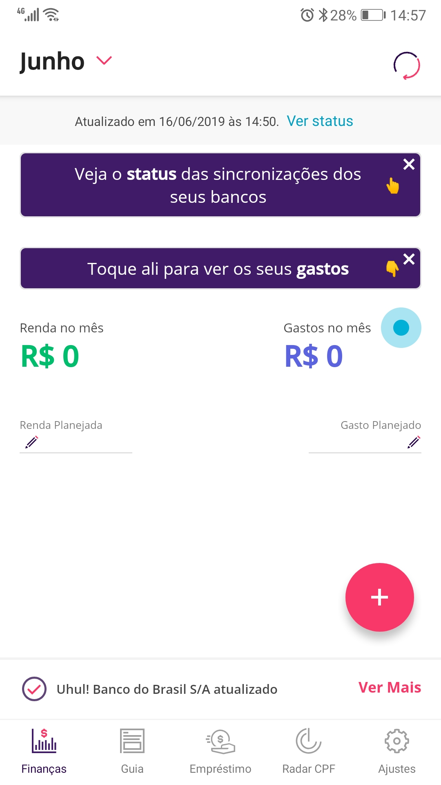
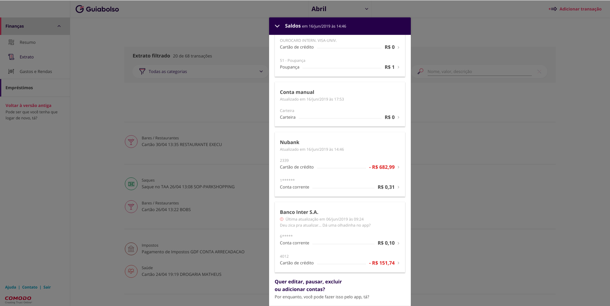
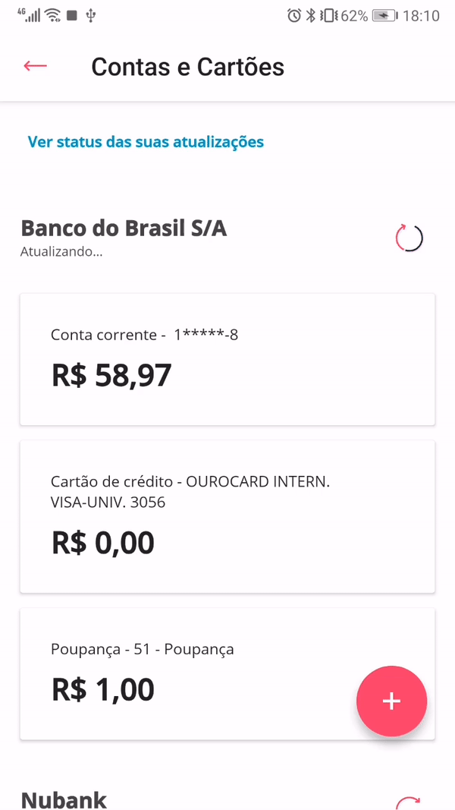
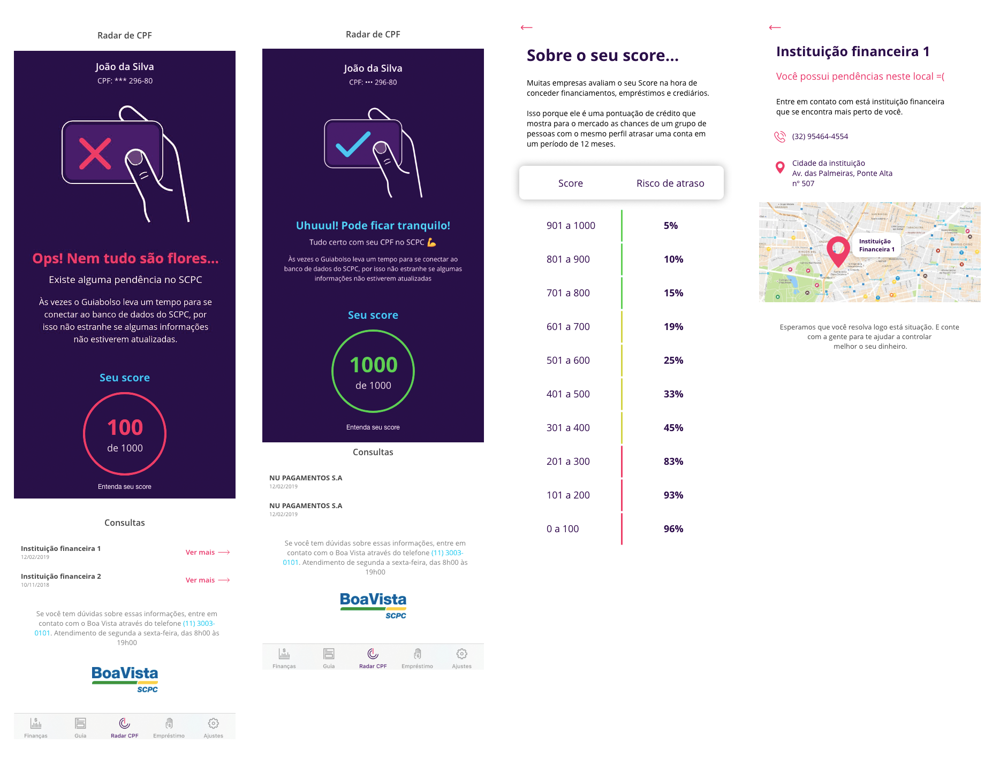

## Introdução

Este artefato busca ligar cada funcionalidade do guiaBolso, mostradas aqui por meio de print screens do aplicativo, ligadas aos seus respectivos requisitos.  

## Tabelas

### Legendas

| Tipo | Código | Significado | Tipo | Código | Significado | 
|--|--|--|--|--|--|
|Modelagem | US | User history (backlog)|Elicitação | AP | Análise de protocolo | | | 
|Modelagem | UC | Caso de uso |Elicitação | AD | Análise de discurso (brainstorm) |
|Modelagem | C | Cenário |Elicitação | ENT | Entrevista |
|Modelagem | R* | Requisito de (...)|Elicitação | IS | Instrospecção |
|Modelagem | IS | I star |Elicitação | Q | Questionário |
|Modelagem | L | Léxicos |Elicitação | ST | Storytelling |
|Modelagem | NFR | NFR Framework |--- | --- | --- |

Obs.: No caso dos R*, o requisito varia de acordo com o que está definido na especificação suplementar.

### Requisitos funcionais

| ID | Descrição |
|--|--|
| [RF01](#rf01) | Adicionar um "tutorial de primeiro uso", ensinando a usar a aplicação|
| [RF02](#rf02) | O Guiabolso deve ter a opção de adicionar tanto o banco de escolha do usuário localizado na lista, quanto o de optar por adicionar conta manualmente.|
| [RF03](#rf03) | O aplicativo deve permitir a adição de mais de uma conta bancária. | 
| RF04 | O Guiabolso deve permitir adicionar uma conta mediante a inserção de dados válidos, como nome, cpf, agência, conta e senha do banco para transações na internet.| 
| RF05 | O app deve dar possibilidade de alterar as contas manualmente| 
| RF06 | Permitir a criação de novas contas a partir das redes sociais do usuário | 
| RF07 | O Guiabolso deve permitir adicionar a renda do mês.| 
| RF08 | O Guiabolso deve disponibilizar um planejamento de escolha do usuário para seus gastos.| 
| RF09 | O Guiabolso deve permitir a consulta da situação do CPF do usuário, mediante um cadastro com dados comprobatórios, como CPF, nome, nome da mãe e data de nascimento.| 
| RF10 | Disponibilização do score numérico do Serasa na aba _Radar CPF_ | 
| RF11 | O Guiabolso pode permitir a integração com o sistema "Nota Legal" para o usuário visualizar saldo em conta e prazos.| 
| RF12 | O aplicativo deve disponibilizar o score numérico do Serasa (e não somente em classificação de __A__ a __E__) |
| RF13 | A aba _Radar CPF_ deve exibir o score e as dicas referentes ao serasa, complementando as informações já disponíveis na aba | 
| RF14 | Mostrar quais empresas consultaram o CPF do usuário | 
| RF15 | Permitir adição manual de transações | 
| RF16 | Ao adicionar transações manuais, deve haver uma forma explícita do tipo de transação que possa indicar se é de entrada ou saída.| 
| RF17 | O Guiabolso deve permitir a visualização dos meses anteriores e futuros para eventuais simulações de economia.| 
| RF18 | Ao adicionar planejamento de gastos, o usuário poderá categorizá-los por meio de categorias pré-estabelecidas.|
| RF19 | O Guiabolso deve permitir que caso o usuário sinta necessidade, possa criar novas categorias.| 
| RF20 | Ao escolher a categoria que não existe, ser mostrado categorias parecidas | 
| RF21 | Ter uma sugestão de gastos para o dia por categorias criadas previamente pelo usuário | 
| RF22 | O Guiabolso deve permitir adicionar renda na "Carteira".| 
| RF23 | Colocar dicas na aba _Empréstimos_ no caso de não haver empréstimos disponíveis para o usuário | 
| RF24 | Categorizar as opções dentro das configurações do Guiabolso |
| RF25 | O app sugerir formas para melhor gerir o seu dinheiro | 
| RF26 | Criação de uma aba _Investimentos_ com dicas, informações, e disponibilização de investimentos para o usuário |
| RF27 | Adicionar uma opção _"Arredondar gastos para cima"_ para dar a falsa impressão de que os gastos são superiores à realidade (desativada por padrão) | 
| RF28 | Categorizar os artigos da aba _Guia_ e aplicar maior ênfase na opção _"essa informação foi útil?"_ |
| RF29 | O app deve possibilitar outras formas graficas de visualizar os dados além do grafico de tabelas| 
| RF30 | O app pode diminuir as propagandas na aba guia| 
| RF31 | Possibilidade de remover os cards da aba _Guia_. | 
| RF32 | Adição de guias de categorização na aba _Guia_. |
| RF33 | Permitir a alteração da ordem de exibição dos cards na aba _Guia_. | 
| RF34 | Sistema de login que funcione com o leitor de digitais dos mais diversos dispositivos |
| RF35 | Sistema de conquistas para incentivar o usuário a usar aplicativo e poupar dinheiro |
| RF36 | Permitir ao usuário escoher quais abas ele quer ver | 
| RF37 | Oferecer uma consultoria financeira através de dicas e avisos | 
| RF38 | Ter uma aba para simulação e contratação de empréstimos |
| RF39 | Visualização gráfica de gastos por categoria |
| RF40 | Exibir diferença entre renda e gastos | 
| RF41 | Ter alertas importantes, como negativação, protesto ou crédito concedido| 
| RF42 | Ter alcance de metas, como carro, casa, roupa, celular |
| RF43 | Ter perfis de usuário, por exemplo, bom administrador, bom investidor | 
| RF44 | Inserir limites de gastos por categoria | 
| RF45 | Notificar quando o gasto for excedido |
| RF46 | O app deve mostrar notificações de quando se ultrapassa uma meta estabelecida pelo usuario | 
| RF47 | O app deve oferecer cupons baseado na geolocalização do usuario | 
| RF48 | Os cupons para bares e restaurantes com uma localização superior a x km não deveriam ser mostrados | 
| RF49 | Para as cidades que não possuem cupons de descontos esta opção não deveria ser mostrada a menos que sejam cupons online  | 
| RF50 | O app deve oferecer a possibilidade de alterar as informações de sinal do valor, e data da transação manual |

#### Detalhes

##### RF01 

| **RF01** | ** Adicionar um "tutorial de primeiro uso" **|
|--|--|
| **Funcionalidade** | |
|**US** | [US02](../../modelagem/backlog/#us02-documentar-e-agrupar-duvidas-dos-usuarios) |
| **Caso de uso** | -- |
| **Léxico** |  -- |
| **Especificação** | [RTD05](../../modelagem/especificacao/#rtd05-suporte-ao-usuario) |
| **Cenários** |-- |
| **I\*** | --|
| **NRF** | [NRF07](../../modelagem/nfr/#analise-do-nfr-de-usabilidade)|
| **Obs.:** | O tutorial de uso completo está disponível apenas no [site](https://www.guiabolso.com.br/como-funciona). O app, seja de android ou IOS disponibiliza algumas dicas que só aparecem no primeiro uso, conforme a imagem. Dessa forma pode-se dizer que o requisito foi **parcialmente** implementado. |

##### RF02 

| **RF02** | ** Adicionar conta listada previamente ou manual **|
|--|--|
| **Funcionalidade** | |
|**US** | [US25](../../modelagem/backlog/#us25-cadastrar-uma-nova-conta-ou-cartao) |
| **Caso de uso** | [UC09](../../modelagem/casos_de_uso/#uc9-adicionar-conta-bancaria-e-manual) |
| **Léxico** | [L11](../../modelagem/lexicos/#l11-conta-manual) & [L12](../../modelagem/lexicos/#l12-conta-automatica) |
| **Especificação** | -- |
| **Cenários** |[C24](../../modelagem/cenarios/#c24-adicionar-conta-manual) & [C19](../../modelagem/cenarios/#c19-cadastrar-banco)  |
| **I\*** | [IS02](../../modelagem/istar/#is02-adicionar-contas-e-cartoes) |
| **NRF** | -- |
| **Obs.:** | Requisito **totalmente** implementado. |

##### RF03

| **RF03** | ** O aplicativo deve permitir a adição de mais de uma conta bancária. **|
|--|--|
| **Funcionalidade** | |
|**US** | [US25](../../modelagem/backlog/#us25-cadastrar-uma-nova-conta-ou-cartao) & [US26](../../modelagem/backlog/#us26-visualizar-contas-e-cartoes-cadastrados) |
| **Caso de uso** | [UC09](../../modelagem/casos_de_uso/#uc9-adicionar-conta-bancaria-e-manual) |
| **Léxico** |  [L11](../../modelagem/lexicos/#l11-conta-manual) & [L12](../../modelagem/lexicos/#l12-conta-automatica) |
| **Especificação** | -- |
| **Cenários** |  [C24](../../modelagem/cenarios/#c24-adicionar-conta-manual) & [C19](../../modelagem/cenarios/#c19-cadastrar-banco) |
| **I\*** | [IS02](../../modelagem/istar/#is02-adicionar-contas-e-cartoes) |
| **NRF** | -- |
| **Obs.:** | Requisito **totalmente** implementado. É perfeitamente possível combinar contas bancárias, cartões e contas manuais. |

##### RF04

| **RF04** | ** O Guiabolso deve permitir adicionar uma conta mediante a inserção de dados válidos pelo site. **|
|--|--|
| **Funcionalidade** | |
|**US** | [US25](../../modelagem/backlog/#us25-cadastrar-uma-nova-conta-ou-cartao) |
| **Caso de uso** | [UC09](../../modelagem/casos_de_uso/#uc9-adicionar-conta-bancaria-e-manual) |
| **Léxico** |  [L11](../../modelagem/lexicos/#l11-conta-manual) & [L12](../../modelagem/lexicos/#l12-conta-automatica) |
| **Especificação** | [RS04](../../modelagem/especificacao/#rs04-permanencia-de-dados)|
| **Cenários** |  [C24](../../modelagem/cenarios/#c24-adicionar-conta-manual) & [C19](../../modelagem/cenarios/#c19-cadastrar-banco) |
| **I\*** | [IS02](../../modelagem/istar/#is02-adicionar-contas-e-cartoes) |
| **NRF** | [NFR02](../../modelagem/nfr/#nfr02-portabilidade) |
| **Obs.:** | Requisito **não** implementado. Conforme vê-se pela imagem, não é possível adicionar uma conta pelo site do Guiabolso. |

##### RF05

| **RF05** | ** O app deve dar possibilidade de alterar as contas manualmente **|
|--|--|
| **Funcionalidade** | |
|**US** | -- (??) |
| **Caso de uso** | [UC05](../../modelagem/casos_de_uso/#uc5-atualizar-contas-e-cartoes) |
| **Léxico** |  [L11](../../modelagem/lexicos/#l11-conta-manual) & [L12](../../modelagem/lexicos/#l12-conta-automatica) |
| **Especificação** | [RC02](../../modelagem/especificacao/#rc02-integridade-dos-dados) |
| **Cenários** |  [C21](../../modelagem/cenarios/#c21-atualizar-contas-e-cartoes) |
| **Obs.:** | Requisito **parcialmente** implementado. Conforme vê-se pelo gif, é possível alterar uma conta, mas somente quando há algum problema nela. Caso o usuário queria editar os dados de uma conta que está funcionando corretamente, a única saída é removê-la e adicionar novamente com os novos dados. |

##### RF06

| **RF06** | ** Permitir a criação de novas contas a partir das redes sociais do usuário **|
|--|--|
| **Funcionalidade** | Não há imagem, pois não foi implementado.|
|**US** | [US11](../../modelagem/backlog/#us11-elaborar-formulario) |
| **Obs.:** | Requisito **não** implementado. Além disso, percebe-se que houveram poucas modelagem e elicitações sobre o tema, indicando que o grupo praticamente não abordou esse tópico. |

##### RF07

| **RF07** | ** O Guiabolso deve permitir adicionar a renda do mês. **|
|--|--|
| **Funcionalidade** |    |
|**US** | [US46](../../modelagem/backlog/#us46-planejar-renda) |
| **Caso de uso** | [UC10](../../modelagem/casos_de_uso/#uc10-adicionar-planejamento) |
| **Léxico** | [L38](../../modelagem/lexicos/#l38-renda) |
| **I\*** | [IS06](../../modelagem/istar/#is06-planejamento-de-rendas-e-gastos) |
| **Obs.:** | Requisito **totalmente** implementado. Contudo algumas modelagens extras poderiam ter sido feitas. |

##### RF08

| **RF08** | ** O Guiabolso deve disponibilizar um planejamento de escolha do usuário para seus gastos. **|
|--|--|
| **Funcionalidade** |    |
|**US** | [US45](../../modelagem/backlog/#us45-planejar-gastos) |
| **Caso de uso** | [UC10](../../modelagem/casos_de_uso/#uc10-adicionar-planejamento) |
| **Cenários** | [C3](../../modelagem/cenarios/#c3-criar-planejamento) |
| **I\*** | [IS06](../../modelagem/istar/#is06-planejamento-de-rendas-e-gastos) |
| **Obs.:** | Requisito **totalmente** implementado. Contudo algumas modelagens extras poderiam ter sido feitas, como léxico por exemplo. |

##### RF09

| **RF09** | ** O Guiabolso deve permitir a consulta da situação do CPF do usuário.  **|
|--|--|
| **Funcionalidade** |    |
|**US** | [US60](../../modelagem/backlog/#us60-visualizar-status-de-avaliacao-de-credito) & [US63](../../modelagem/backlog/#us63-visualizar-empresas-que-consultaram-meu-cpf) |
| **Caso de uso** | [UC13](../../modelagem/casos_de_uso/#uc13-visualizar-status-do-nome-limpo-ou-sujo) |
| **Léxico** | [L3](../../modelagem/lexicos/#l3-consultar-cpf) & [L20](../../modelagem/lexicos/#l20-radar-cpf) |
| **Cenários** | [C6](../../modelagem/cenarios/#c6-consultar-cpf) |
| **I\*** | [IS05](../../modelagem/istar/#is05-consultar-situacao-do-cpf) |
| **Obs.:** | Requisito **totalmente** implementado. |

##### RF10

| **RF10** | ** Disponibilização do score numérico do Serasa na aba _Radar CPF_  **|
|--|--|
| **Funcionalidade** |    |
|**US** | [US61](../../modelagem/backlog/#us61-informar-score) |
| **Caso de uso** | [UC13](../../modelagem/casos_de_uso/#uc13-visualizar-status-do-nome-limpo-ou-sujo) |
| **Léxico** | [L4](../../modelagem/lexicos/#l4-score-do-serasa) |
| **Cenários** | [C6](../../modelagem/cenarios/#c6-consultar-cpf) |
| **I\*** | [IS05](../../modelagem/istar/#is05-consultar-situacao-do-cpf) |
| **Obs.:** | Requisito **não** implementado. Apesar de o Guiabolso exibir o score do serasa, ele não exibe o valor numérico. A imagem é referente ao [protótipo](../../elicitacao-de-requisitos/prototipacao/#radar-cpf) elaborado pelos membros do grupo. |

##### RF11

| **RF11** | ** O Guiabolso pode permitir a integração com o sistema "Nota Legal" para o usuário visualizar saldo em conta e prazos.  **|
|--|--|
| **Funcionalidade** |  Não há imagem, pois não foi implementado. |
|**US** | [US58](../../modelagem/backlog/#us58-buscar-dados-de-fontes-externas) |
| **Obs.:** | Requisito **não** implementado. Além disso, percebe-se que, assim como no RF06,  houveram poucas modelagem e elicitações sobre o tema, indicando que o grupo praticamente não abordou esse tópico. |

##### RF12

| **RF12** | ** O aplicativo deve disponibilizar o score numérico do Serasa (e não somente em classificação de __A__ a __E__) **|
|--|--|
| **Funcionalidade** |    |
|**US** | [US61](../../modelagem/backlog/#us61-informar-score) |
| **Caso de uso** | [UC13](../../modelagem/casos_de_uso/#uc13-visualizar-status-do-nome-limpo-ou-sujo) |
| **Léxico** | [L4](../../modelagem/lexicos/#l4-score-do-serasa) |
| **Cenários** | [C6](../../modelagem/cenarios/#c6-consultar-cpf) |
| **I\*** | [IS05](../../modelagem/istar/#is05-consultar-situacao-do-cpf) |
| **Obs.:** |  Idêntico ao RF10. Será corrigido. |

##### RF13

| **RF13** | ** A aba _Radar CPF_ deve exibir o score e as dicas referentes ao serasa, complementando as informações já disponíveis na aba" **|
|--|--|
| **Funcionalidade** |  |
|**US** | [US57](../../modelagem/backlog/#us57-visualizar-dicas-de-controle-financeiro) & [US62](../../modelagem/backlog/#us62-realizar-integracao-com-terceiros)|
| **Caso de uso** |[UC20](../../modelagem/casos_de_uso/#uc20-visualizar-dicas-externas) & [UC13](../../modelagem/casos_de_uso/#uc13-visualizar-status-do-nome-limpo-ou-sujo) |
| **Léxico** | [L4](../../modelagem/lexicos/#l4-score-do-serasa) & [L17](../../modelagem/lexicos/#l17-status) |
| **Cenários** | [C6](../../modelagem/cenarios/#c6-consultar-cpf) & [C14](../../modelagem/cenarios/#c14-verificar-dicas) |
| **I\*** | [IS05](../../modelagem/istar/#is05-consultar-situacao-do-cpf) & [IS07](../../modelagem/istar/#is07-dicas-financeiras) |
| **Obs.:** | Apesar de ambas as funções descritas estarem presentes no app, elas não estão presentes exatamente como descritas nesse requisito. Logo o requisito está **parcialmente** implementado. |

##### RF14

| **RF14** | ** Mostrar quais empresas consultaram o CPF do usuário **|
|--|--|
| **Funcionalidade** |   |
|**US** | [US57](../../modelagem/backlog/#us57-visualizar-dicas-de-controle-financeiro) & [US62](../../modelagem/backlog/#us62-realizar-integracao-com-terceiros)|
| **Caso de uso** |[UC20](../../modelagem/casos_de_uso/#uc20-visualizar-dicas-externas) & [UC13](../../modelagem/casos_de_uso/#uc13-visualizar-status-do-nome-limpo-ou-sujo) |
| **Léxico** | [L4](../../modelagem/lexicos/#l4-score-do-serasa) & [L17](../../modelagem/lexicos/#l17-status) |
| **Cenários** | [C6](../../modelagem/cenarios/#c6-consultar-cpf) & [C14](../../modelagem/cenarios/#c14-verificar-dicas) |
| **I\*** | [IS05](../../modelagem/istar/#is05-consultar-situacao-do-cpf) & [IS07](../../modelagem/istar/#is07-dicas-financeiras) |
| **Obs.:** | Apesar de ambas as funções descritas estarem presentes no app, elas não estão presentes exatamente como descritas nesse requisito. Logo o requisito está **parcialmente** implementado. |

##### RF15

| **RF15** | ** Permitir adição manual de transações **|
|--|--|
| **Funcionalidade** |   |
|**US** | [US39](../../modelagem/backlog/#us39-editar-dados-da-transacao) |
| **Caso de uso** |[UC6](../../modelagem/casos_de_uso/#uc6-adicionar-transacao-manual) |
| **Léxico** | [L40](../../modelagem/lexicos/#l40-transacao) |
| **Cenários** | [C2](../../modelagem/cenarios/#c2-adicionar-transacao-com-conta-manual) |
| **I\*** | [IS08](../../modelagem/istar/#is08-transacoes)|
| **Obs.:** | Requisito **totalmente** implementado. |

##### RF16

| **RF16** | **Adicionar transações manuais**|
|--|--|
| **Imagem** | |
|**US** | US41 |
| **Caso de uso** | [UC06](../../pos-rastreabilidade/casos_de_uso/#UC06) |
| **Léxico** |  L30 & L40 & |
| **Especificação** | RU05 |
| **Cenários** | C2 |
| **I\*** | IS08 |
| **Obs.:** | Requisito **totalmente** implementado. |

##### RF17

| **RF17** | **O Guiabolso deve permitir a visualização dos meses anteriores e futuros**|
|--|--|
| **Imagem** | |
|**US** | US49 & US51 |
| **Caso de uso** | -- |
| **Léxico** |  L18 |
| **Especificação** | -- |
| **Cenários** | C3 |
| **I\*** | > Não há |
| **Obs.:** | Requisito **totalmente** implementado. |

##### RF18

| **RF18** | **Ao adicionar planejamento de gastos, o usuário poderá categorizá-los por meio de categorias pré-estabelecidas.**|
|--|--|
| **Imagem** | |
|**US** | US45 & US46 |
| **Caso de uso** | [UC10](../../pos-rastreabilidade/casos_de_uso/#UC10-Adicionar-planejamento) |
| **Léxico** |  L13 |
| **Especificação** | RU05 |
| **Cenários** | -- |
| **I\*** | IS06 |
| **Obs.:** | Requisito **ainda não** implementado. |

##### RF19

| **RF19** | **O Guiabolso deve permitir que caso o usuário sinta necessidade, possa criar novas categorias.**|
|--|--|
| **Imagem** | |
|**US** | -- |
| **Caso de uso** | UC7|
| **Léxico** |  L13 |
| **Especificação** | -- |
| **Cenários** | C9 |
| **I\*** | > Não há |
| **Obs.:** | Requisito **totalmente** implementado. |

##### RF20

| **RF20** | **Ao escolher a categoria que não existe, ser mostrado categorias parecidas**|
|--|--|
| **Imagem** | |
|**US** | -- |
| **Caso de uso** | -- |
| **Léxico** |  L13 |
| **Especificação** | -- |
| **Cenários** | C9 |
| **I\*** | > Não há |
| **Obs.:** | Requisito **ainda não** implementado, ainda assim foi visto que não aparece em algumas modelagens. |

##### RF21

| **RF21** | **Ter uma sugestão de gastos para o dia por categorias criadas previamente pelo usuário**|
|--|--|
| **Imagem** | |
|**US** | -- |
| **Caso de uso** | -- |
| **Léxico** |  L13 |
| **Especificação** | RU05 |
| **Cenários** | -- |
| **I\*** | IS06 |
| **Obs.:** | Requisito **totalmente** implementado, ainda assim foi visto que não aparece em algumas modelagens. |

##### RF22

| **RF22** | **O Guiabolso deve permitir adicionar renda na "Carteira**|
|--|--|
| **Imagem** | |
|**US** | -- |
| **Caso de uso** | UC9 |
| **Léxico** | -- |
| **Especificação** | RU05 |
| **Cenários** | C24 |
| **I\*** | IS06 |
| **Obs.:** | Requisito **totalmente** implementado. |

##### RF23

| **RF23** | **Colocar dicas na aba _Empréstimos_ no caso de não haver empréstimos disponíveis para o usuário**|
|--|--|
| **Imagem** | |
|**US** | US71 & US70 |
| **Caso de uso** | -- |
| **Léxico** |  L32 & L13 |
| **Especificação** | -- |
| **Cenários** | C14 |
| **I\*** | IS07 & IS03 |
| **Obs.:** | Requisito **ainda não** implementado. |

##### RF24

| **RF24** | **Categorizar as opções dentro das configurações do Guiabolso**|
|--|--|
| **Imagem** | |
|**US** | -- |
| **Caso de uso** | -- |
| **Léxico** |  -- |
| **Especificação** | RCC03 |
| **Cenários** | -- |
| **I\*** | > Não há |
| **Obs.:** | Requisito **totalmente** implementado, ainda assim foi visto que não aparece em algumas modelagens. |

##### RF25

| **RF25** | **O app sugerir formas para melhor gerir o seu dinheiro**|
|--|--|
| **Imagem** | |
|**US** | US57  |
| **Caso de uso** | UC12 & UC20|
| **Léxico** |  -- |
| **Especificação** | RU05 |
| **Cenários** | C14 |
| **I\*** | IS07 |
| **Obs.:** | Requisito **parcialmente** implementado. |

##### RF26

| **RF26** | **Criação de uma aba _Investimentos_ com dicas, informações, e disponibilização de investimentos para o usuário**|
|--|--|
| **Imagem** | |
|**US** | -- |
| **Caso de uso** | -- |
| **Léxico** |  L32 & L13 |
| **Especificação** | RU02 |
| **Cenários** | C14 |
| **I\*** | IS07 |
| **Obs.:** | Requisito **ainda não** implementado. |

##### RF27

| **RF27** | **Adicionar uma opção _"Arredondar gastos para cima"_ para dar a falsa impressão de que os gastos são superiores à realidade (desativada por padrão)**|
|--|--|
| **Imagem** | |
|**US** | -- |
| **Caso de uso** | -- |
| **Léxico** |  -- |
| **Especificação** | -- |
| **Cenários** | -- |
| **I\*** | > Não há |
| **Obs.:** | Requisito **ainda não** implementado. |

##### RF28

| **RF28** | **Categorizar os artigos da aba _Guia_ e aplicar maior ênfase na opção _"essa informação foi útil?"**|
|--|--|
| **Imagem** | |
|**US** | -- |
| **Caso de uso** | -- |
| **Léxico** |  L32 |
| **Especificação** | RU05 |
| **Cenários** | C15 |
| **I\*** | > Não há|
| **Obs.:** | Requisito **parcialmente** implementado. |

##### RF29

| **RF29** | **O app deve possibilitar outras formas graficas de visualizar os dados além do grafico de tabelas**|
|--|--|
| **Imagem** | |
|**US** | -- |
| **Caso de uso** | -- |
| **Léxico** |  -- |
| **Especificação** | RU01|
| **Cenários** |-- |
| **I\*** | > Não há |
| **Obs.:** | Requisito **ainda não** implementado. |

##### RF30

| **RF30** | **O app pode diminuir as propagandas na aba guia**|
|--|--|
| **Imagem** | |
|**US** | -- |
| **Caso de uso** | -- |
| **Léxico** |  L32 |
| **Especificação** | -- |
| **Cenários** |-- |
| **I\*** | > Não há |
| **Obs.:** | Requisito **ainda não** implementado. |

##### RF31

| **RF31** | **Possibilidade de remover os cards da aba _Guia_**|
|--|--|
| **Imagem** | |
|**US** | -- |
| **Caso de uso** | -- |
| **Léxico** |  L32 |
| **Especificação** | -- |
| **Cenários** | -- |
| **I\*** | > Não há |
| **Obs.:** | Requisito **ainda não** implementado. |

##### RF32

| **RF32** | **Adição de guias de categorização na aba _Guia_**|
|--|--|
| **Imagem** | |
|**US** | -- |
| **Caso de uso** | -- |
| **Léxico** |  L32 |
| **Especificação** | RU05 |
| **Cenários** | -- |
| **I\*** | > Não há |
| **Obs.:** | Requisito **parcialmente** implementado. |

##### RF

| **RF** | ** O aplicativo deve permitir a adição de mais de uma conta bancária. **|
|--|--|
| **Funcionalidade** | |
|**US** |-- |
| **Caso de uso** | -- |
| **Léxico** |  -- |
| **Especificação** | -- |
| **Cenários** |-- |
| **I\*** | --|
| **NRF** | -- |
| **Obs.:** | -- |

### Requisitos Não funcionais

| ID | Descrição | Fonte | Elicitação | Modelagem | Elo |
|--|--|--|--|--|--|
| NF01 |O Guiabolso deve permitir o cadastro de usuários com poucos dados, como e-mail, telefone e senha.|--|--|--|--|
| NF02 |O Guiabolso deve oferecer confiabilidade para o usuário ao inserir dados sensíveis na plataforma.| --|--|--|--|
| NF03 |O Guiabolso deve ter um design elegante e intuitivo. | --|--|--|--|
| NF04 |A lista de bancos deve ser constantemente atualizada para cobrir o máximo de bancos disponíveis no mercado financeiro.|--|--|--|--|
| NF05 |A visualização do extrato das movimentações do usuário poderá ser por meio de gráficos intuitivos.| --|--|--|--|
| NF06 | O aplicativo deve permitir a gerência financeira das contas/cartões de forma individual |--|--|--|--|
| NF07 | Padronizar a identidade visual do aplicativo entre as diversas plataformas | --|--|--|--|
| NF08 | Disponibilizar de forma mais eficiente as informações comparativas entre o mês atual e meses anteriores (gastos e rendas) | --|--|--|--|
| NF09 | O app deve automatizar a conexão com o banco e não depender da chave de segurança (Bradesco) | --|--|--|--|
| NF10 | O deve padronizar a utilização nos dispositivos android e no IOS| --|--|--|--|
| NF11 | O app deve ser mais intuitivo| --|--|--|--|
| NF12 | O app deve reduzir as propagandas na aba guia| --|--|--|--|
| NF13 |  Mais opções de visualização nos gráficos de rendas e gastos |--|--|--|--|
| NF14 | Ter uma versão web | --|--|--|--|
| NF15 | Rapidez e facilidade no uso | --|--|--|--|
| NF16 | Ter um extrato bem organizado e categorizado | --|--|--|--|
| NF17 | O app na parte de guia deve exibir os cards pela ordem de relevância  |--|--|--|--|