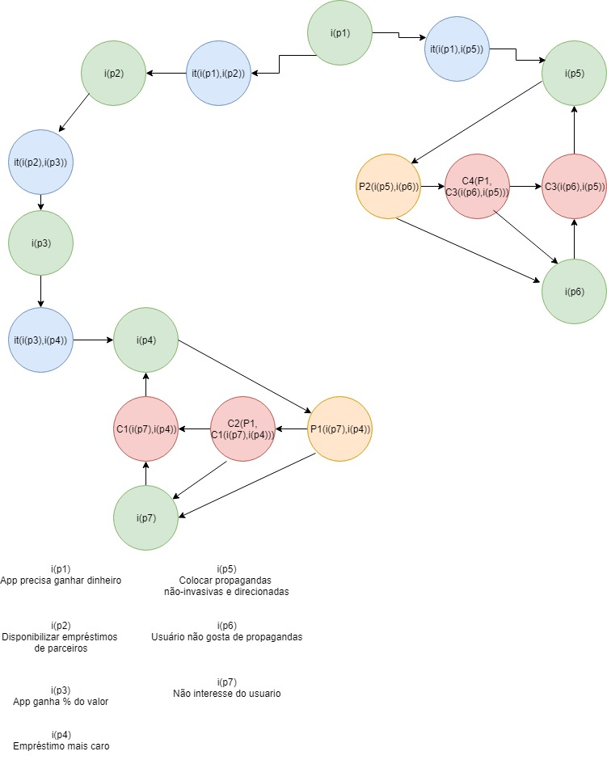

## Versionamento 

| Data | Versão | Descrição | Autor |
|--|--|--|--|
| 30/03/2019 | 1.0 | Adição da argumentação de privacidade do usuário - ARG01| [Sara Silva](https://github.com/silvasara) e [Shayane Alcântara](https://github.com/shayanealcantara) |
| 30/03/2019 | 1.0 | Adição da argumentação de Extrato - ARG02| [Sara Silva](https://github.com/silvasara) e [Shayane Alcântara](https://github.com/shayanealcantara) |
| 31/03/2019 | 1.1 | Adição das Argumentações - Instituições reguladoras e Leis (ARG03) & Fluxo de dinheiro do aplicativo (ARG04) | [Elias Bernardo](https://github.com/silvasara) e [Rafael Makaha](https://github.com/rafaelmakaha) |

## **Introdução**
A argumentação é uma técnica usada na pré-rastreabilidade de Requisitos de Software e tem como objetivo principal ajudar na resolução de conflitos entre vários argumentos. Neste trabalho, argumentações foram feitas para servirem de artefatos no levantamento de requisitos do aplicativo Guiabolso.

## **ARG01 - Privacidade do usuário**
Esta argumentação simula uma conversa entre usuários cujo assunto é a privacidade do dados usados pelo aplicativo.

Versão 1.0

## **ARG02 - Extrato** 
Esta argumentação simula uma conversa entre usuários cujo assunto são as funcionalidade da página de Extrato.

Versão 1.0

## **ARG03 - Instituições reguladoras e Leis** 
Esta argumentação simula as preocupações do aplicativo com as leis e normas de instituições reguladoras.

Versão 1.0

## **ARG04 - Fluxo de dinheiro do aplicativo** 
Esta argumentação simula o fluxo de dinheiro do aplicativo.

Versão 1.0
