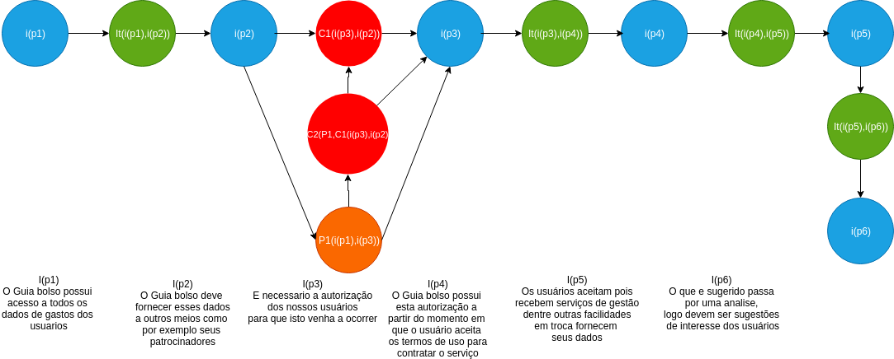
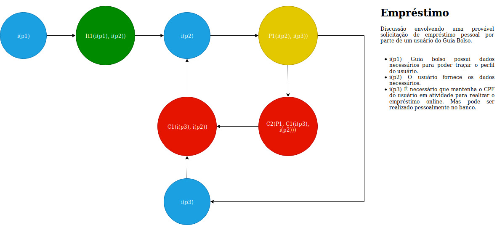

## Versionamento

| Data | Versão | Descrição | Autor |
|--|--|--|--|
| 30/03/2019 | 1.0 | Adição da argumentação de privacidade do usuário - ARG01| [Sara Silva](https://github.com/silvasara) e [Shayane Alcântara](https://github.com/shayanealcantara) |
| 30/03/2019 | 1.0 | Adição da argumentação de Extrato - ARG02| [Sara Silva](https://github.com/silvasara) e [Shayane Alcântara](https://github.com/shayanealcantara) |
| 31/03/2019 | 1.1 | Adição das Argumentações - Instituições reguladoras e Leis (ARG03) & Fluxo de dinheiro do aplicativo (ARG04) | [Elias Bernardo](https://github.com/silvasara) e [Rafael Makaha](https://github.com/rafaelmakaha) |
| 31/03/2019 | 1.2 | Adição do argumento Dicas para o usuario - ARG05| [Lucas Machado](https://github.com/lmmLucasMachado) e [Marcelo](https://github.com/santosm46) |
| 31/03/2019 | 1.3 | Adição das Argumentações de Anúncios no app - ARG06| [Marcelo Araújo](https://github.com/santosm46)|
| 31/03/2019 | 1.4 | Adição dos argumentos - Empréstimo (ARG07) & Serasa (ARG08)| [Leonardo dos Santos](https://github.com/leossb36) e [Alan Lima](https://github.com/alanrslima) |
| 01/04/2019 | 1.5 | Revisão de decumento| [Leonardo dos Santos](https://github.com/leossb36) |

## **Introdução**

A argumentação é uma técnica usada na pré-rastreabilidade de Requisitos de Software e tem como objetivo principal ajudar na resolução de conflitos entre vários argumentos. Neste trabalho, argumentações foram feitas para servirem de artefatos no levantamento de requisitos do aplicativo Guiabolso.

## **ARG01 - Privacidade do usuário**

Esta argumentação simula uma conversa entre usuários cujo assunto é a privacidade do dados usados pelo aplicativo.

Versão 1.0

## **ARG02 - Extrato**

Esta argumentação simula uma conversa entre usuários cujo assunto são as funcionalidade da página de Extrato.

Versão 1.0

## **ARG03 - Instituições reguladoras e Leis**

Esta argumentação simula as preocupações do aplicativo com as leis e normas de instituições reguladoras.

Versão 1.0

## **ARG04 - Fluxo de dinheiro do aplicativo**

Esta argumentação simula o fluxo de dinheiro do aplicativo.

Versão 1.0

## **ARG05 - Dicas para o usuário**

Esta argumentação simula o uma discução do usuário e o Guiabolso.

Versão 1.0

## **ARG06 - Anúncios no app** 

Esta argumentação simula uma conversa entre os desenvolvedores sobre anúncios no aplicativo.

Versão 1.0

## **ARG07 - Empréstimo** 

Esta argumentação simula uma solicitação de emprestimo pessoal por parte de um usuário da plataforma Guiabolso.

Versão 1.0

## **ARG08 - Serasa** 

Esta argumentação simula uma conversa entre um usuário com o agente Serasa.

Versão 1.0

