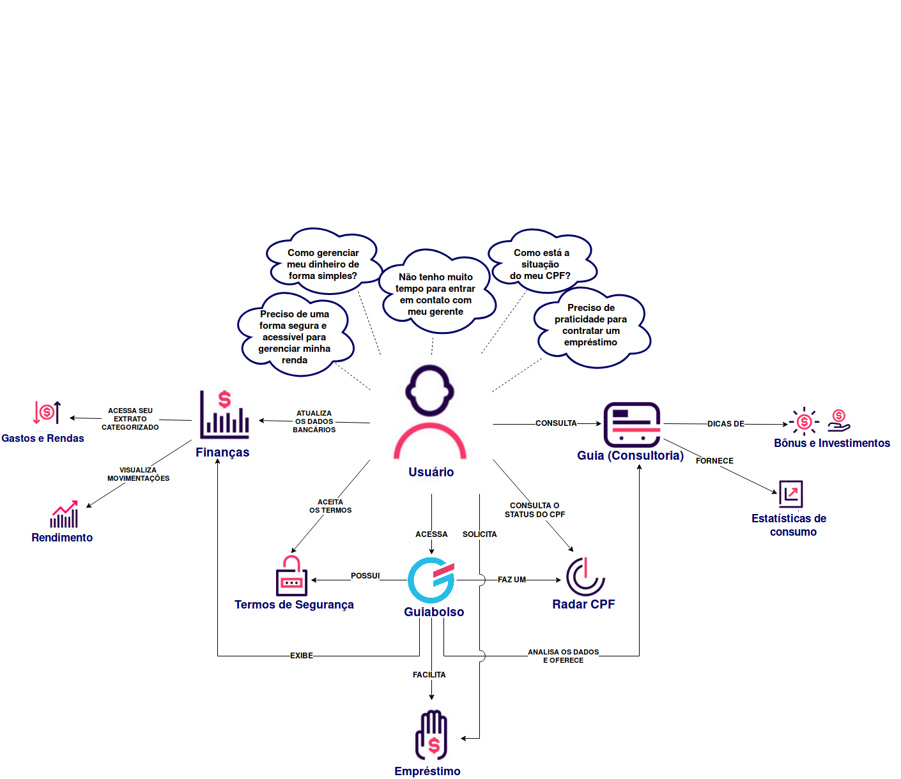
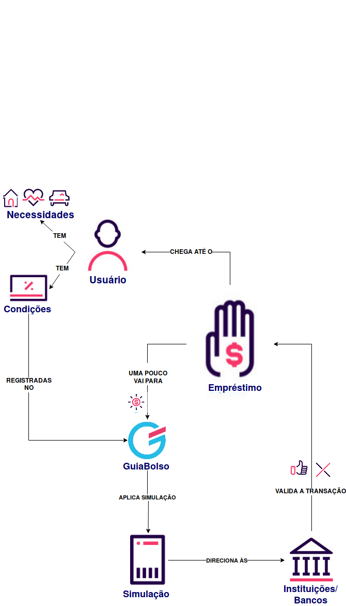

## Versionamento 

| Data | Versão | Descrição | Autor |
|--|--|--|--| 
| 30/03/2019 | 1.0 | Adição do RichPicture de preocupações do usuários - RP01| [Sara Silva](https://github.com/silvasara) e [Shayane Alcântara](https://github.com/shayanealcantara) |
| 30/03/2019 | 1.0 | Adição do RichPicture de Empréstimos - RP02| [Sara Silva](https://github.com/silvasara) e [Shayane Alcântara](https://github.com/shayanealcantara) |
| 31/03/2019 | 1.1 | Adição dos RichPictures - Macro - Atores (RP03) & Finanças (RP04)| [Elias Bernardo](https://github.com/silvasara) e [Rafael Makaha](https://github.com/rafaelmakaha) |
| 31/03/2019 | 1.0 | Adição do RichPicture da aba Guia - RP05| [Marcelo Araújo](https://github.com/santosm46) e [Lucas Machado](https://github.com/lmmLucasMachado) |

## **Introdução**
Os RichPictures são artefatos usados na fase de pré-rastreabilidade de Requisitos de Software, são desenhos que expressam ideias que ajudam na representação de subsistemas de um sistema maior. Neste trabalho, os RichPictures foram feitos em cima de pontos relevantes para o levantamento de requisitos do aplicativo Guiabolso.

## **RP01 - Preocupações do usuário**
Este RichPicture ilustra as principais preocupações do úsuario do Guiabolso, ou seja, os motivos pelos quais faz o uso do aplicativo.

Versão 1.0

## **RP02 - Empréstimo** 
Este RichPicture ilustra como é feito um empréstimo intermediado pelo Guiabolso, na aba do aplicativo chamada "Empréstimo".

Versão 1.0

## **RP03 - Macro - Atores**
Este RichPicture ilustra a interação entre os atores envolvidos em todo o universo de informações do aplicativo.

Versão 1.0

## **RP04 - Finanças**
Este RichPicture ilustra a aba de finanças do aplicativo e possíveis interações do usuário com ela.

Versão 1.0

## **RP05 - Aba Guia**
Este RichPicture ilustra a aba de guia do aplicativo e interações com usuário e outros agentes externos.

Versão 1.0
