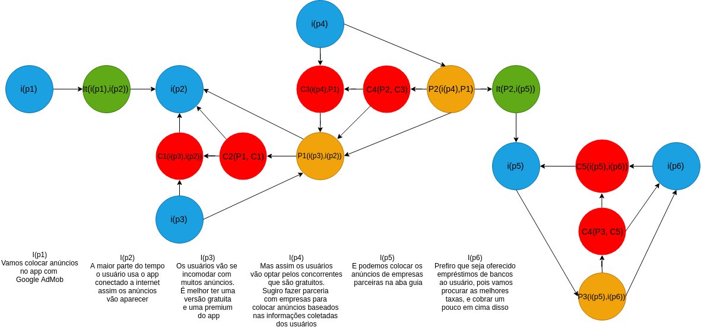

## **Introdução**

A argumentação é uma técnica usada na pré-rastreabilidade de Requisitos de Software e tem como objetivo principal ajudar na resolução de conflitos entre vários argumentos. Neste trabalho, argumentações foram feitas para servirem de artefatos no levantamento de requisitos do aplicativo Guiabolso.

## **Metodologia**

Para a confecção das argumentações o grupo utilizou a ferramenta [Draw IO](https://www.draw.io/). As cores foram padronizadas para que todos os artefatos desse documento ficassem uniformes, e utilizou-se também cards com o seguinte modelo base:

| **ARGXX** | **Título da argumentação**  |
|--|--|
| **Versão**| Atual: 1.0 (Data)   Anterior: - | 
| **Descrição** | Descrição da argumentação | 
|**Autor**| Autores com o link para o github | 

Além disso todas as argumentações devem ter a descrição na própria imagem, explicitando bem a discussão. 

## **ARG01 - Privacidade do usuário**

| **ARG01** | **Privacidade do usuário**  |
|--|--|
| **Versão**| Atual: 1.0 (30/03/2019)   Anterior: - | 
| **Descrição** | Esta argumentação simula uma conversa entre usuários cujo assunto é a privacidade do dados usados pelo aplicativo. | 
|**Autor**| [Sara Silva](https://github.com/silvasara) e [Shayane Alcântara](https://github.com/shayanealcantara) | 

## **ARG02 - Extrato**

| **ARG02** | **Extrato**  |
|--|--|
| **Versão**| Atual: 1.0 (30/03/2019)   Anterior: - | 
| **Descrição** | Esta argumentação simula uma conversa entre usuários cujo assunto são as funcionalidade da página de Extrato. | 
|**Autor**| [Sara Silva](https://github.com/silvasara) e [Shayane Alcântara](https://github.com/shayanealcantara) | 

## **ARG03 - Instituições reguladoras e Leis**

| **ARG03** | **Instituições reguladoras e Leis**  |
|--|--|
| **Versão**| Atual: 1.0 (31/03/2019)   Anterior: - | 
| **Descrição** | Esta argumentação simula as preocupações do aplicativo com as leis e normas de instituições reguladoras. | 
|**Autor**| [Elias Bernardo](https://github.com/silvasara) e [Rafael Makaha](https://github.com/rafaelmakaha) | 

## **ARG04 - Fluxo de dinheiro do aplicativo**

| **ARG04** | **Fluxo de dinheiro do aplicativo**  |
|--|--|
| **Versão**| Atual: 1.0 (31/03/2019)   Anterior: - | 
| **Descrição** | Esta argumentação simula o fluxo de dinheiro do aplicativo. | 
|**Autor**| [Elias Bernardo](https://github.com/silvasara) e [Rafael Makaha](https://github.com/rafaelmakaha) | 

## **ARG05 - Dicas para o usuário**

| **ARG05** | **Dicas para o usuário**  |
|--|--|
| **Versão**| Atual: 1.0 (31/03/2019)   Anterior: - | 
| **Descrição** | Esta argumentação simula o uma discução do usuário e o Guiabolso. | 
|**Autor**| [Lucas Machado](https://github.com/lmmLucasMachado) e [Marcelo](https://github.com/santosm46) | 

## **ARG06 - Anúncios no app** 

| **ARG06** | **Anúncios no app**  |
|--|--|
| **Versão**| Atual: 1.0 (31/03/2019)   Anterior: - | 
| **Descrição** | Esta argumentação simula uma conversa entre os desenvolvedores sobre anúncios no aplicativo. | 
|**Autor**| [Lucas Machado](https://github.com/lmmLucasMachado) e [Marcelo](https://github.com/santosm46) | 

## **ARG07 - Empréstimo** 

| **ARG07** | **Empréstimo**  |
|--|--|
| **Versão**| Atual: 1.0 (31/03/2019)   Anterior: - | 
| **Descrição** | Esta argumentação simula uma solicitação de emprestimo pessoal por parte de um usuário da plataforma Guiabolso. | 
|**Autor**| [Leonardo dos Santos](https://github.com/leossb36) e [Alan Lima](https://github.com/alanrslima) | 

## **ARG08 - Serasa** 

| **ARG08** | **Serasa**  |
|--|--|
| **Versão**| Atual: 1.0 (31/03/2019)   Anterior: - | 
| **Descrição** | Esta argumentação simula uma conversa entre um usuário com o agente Serasa. | 
|**Autor**| [Leonardo dos Santos](https://github.com/leossb36) e [Alan Lima](https://github.com/alanrslima) | 