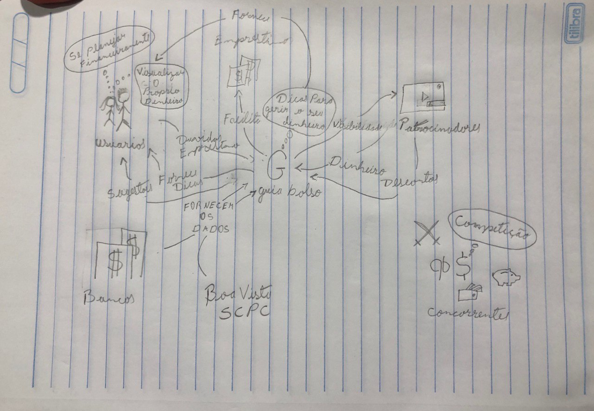
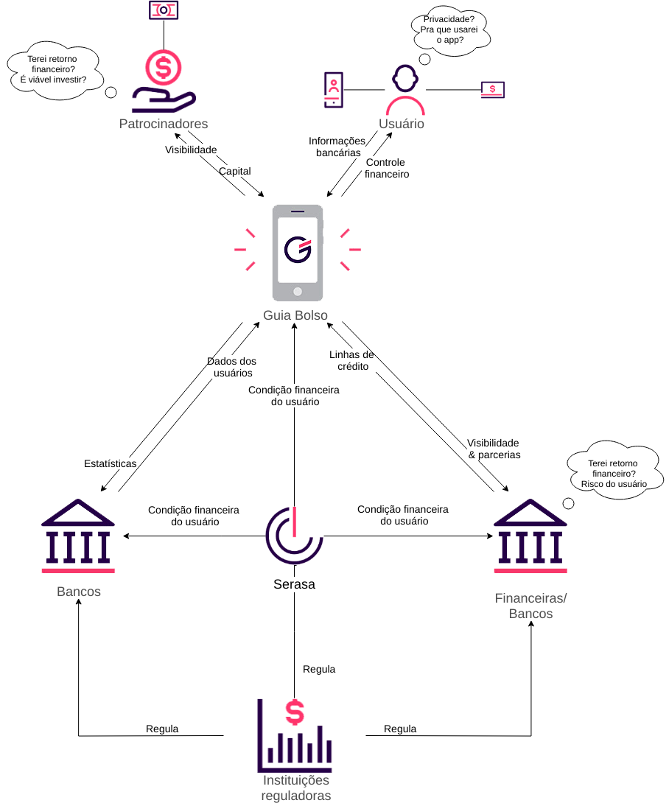
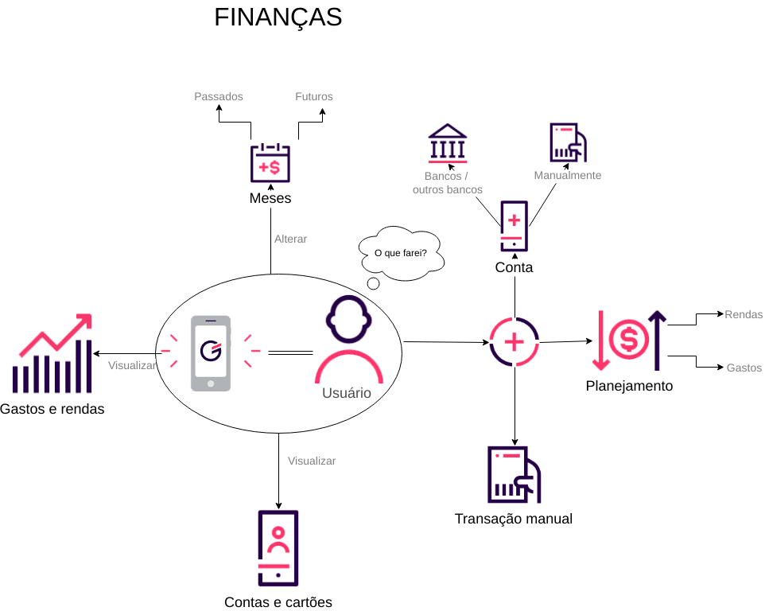
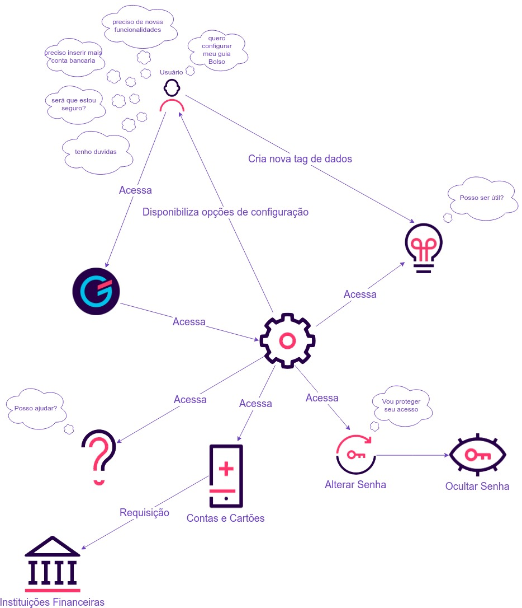
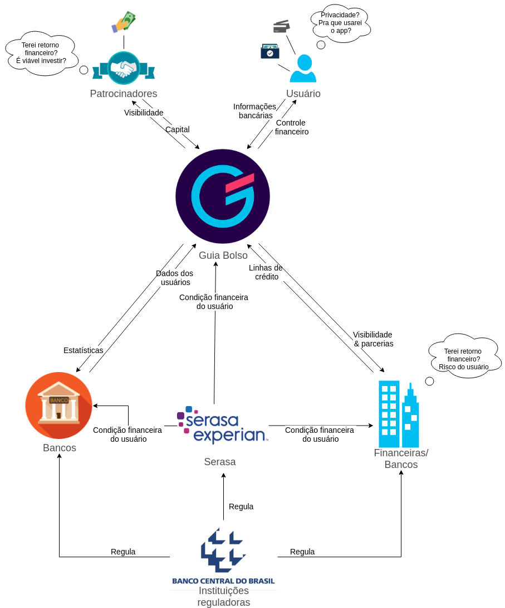

## **Introdução**

Os RichPictures são artefatos usados na fase de pré-rastreabilidade de Requisitos de Software, são desenhos que expressam ideias que ajudam na representação de subsistemas de um sistema maior. Neste trabalho, os RichPictures foram feitos em cima de pontos relevantes para o levantamento de requisitos do aplicativo Guiabolso.

## **Metodologia**

Para a confecção dos richpictures o grupo utilizou a ferramenta [Draw IO](https://www.draw.io/). Os ícones foram padronizadas para que todos os artefatos desse documento ficassem uniformes, e utilizou-se também cards com o seguinte modelo base:

| **RPXX** | **Título do richpicture**  |
|--|--|
| **Versão**| Atual: 1.0 (Data)   Anterior: - | 
| **Descrição** | Descrição do richpicture | 
|**Autor**| Autores com o link para o github | 

Além disso todos os richpicures devem ter seu tema principal no centro da imagem. 

## RP00 - Macros

| **RP00** | **Macros**  |
|--|--|
| **Versão**| Atual: 1.0 (31/03/2019)   Anterior: - | 
| **Descrição** | Este RichPicture ilustra a primeira tentativa de entender o funcionamento do aplicativo e as principais interações do usuário com o GuiaBolso. |
|**Autor**| [Lucas Machado](https://github.com/lmmLucasMachado) e [Marcelo Araújo](https://github.com/santosm46) | 

## RP01 - Macro - Atores

| **RP01** | **Macro - Atores**  |
|--|--|
| **Versão**| Atual: 2.0 (23/06/2019)   Anterior: [1.0](#rp01-macro-atores_1) (31/03/2019) | 
| **Descrição** | Este RichPicture ilustra a interação entre os atores envolvidos em todo o universo de informações do aplicativo. |
|**Autor**| [Elias Bernardo](https://github.com/silvasara) e [Rafael Makaha](https://github.com/rafaelmakaha) | 

## RP02 - Usabilidade

| **RP02** | **Usabilidade**  |
|--|--|
| **Versão**| Atual: 1.0 (31/03/2019)   Anterior: - | 
| **Descrição** | Este RichPicture ilustra a usabilidade da plataforma Guiabolso, a interações com usuário e interações com agentes externos. |
|**Autor**| [Leonardo dos Santos](https://github.com/leossb36) e [Alan Lima](https://github.com/alanrslima) | 

## RP03 - Preocupações do usuário

  

| **RP03** | **Preocupações do usuário**  |
|--|--|
| **Versão**| Atual: 1.0 (31/03/2019)   Anterior: - | 
| **Descrição** | Este RichPicture ilustra as principais preocupações do úsuario do Guiabolso, ou seja, os motivos pelos quais faz o uso do aplicativo. |
|**Autor**| [Sara Silva](https://github.com/silvasara) e [Shayane Alcântara](https://github.com/shayanealcantara)| 

## RP04 - Finanças do app

| **RP04** | **Finanças do app**  |
|--|--|
| **Versão**| Atual: 2.0 (16/04/2019)   Anterior: [1.0](#rp04-financas-do-app_1) (31/03/2019) | 
| **Descrição** | Este RichPicture ilustra as formas com que o Guiabolso obtem lucro. |
|**Autor**| [Lucas Machado](https://github.com/lmmLucasMachado)  e [Marcelo Araújo](https://github.com/santosm46) | 

## RP05 - Empréstimo

| **RP05** | **Empréstimo**  |
|--|--|
| **Versão**| Atual: 1.0 (30/03/2019)   Anterior: - | 
| **Descrição** | Este RichPicture ilustra como é feito um empréstimo intermediado pelo Guiabolso, na aba do aplicativo chamada "Empréstimo". |
|**Autor**| [Sara Silva](https://github.com/silvasara) e [Shayane Alcântara](https://github.com/shayanealcantara)| 

## RP06 - Financeiro (aba)

| **RP06** | **Financeiro (aba)**  |
|--|--|
| **Versão**| Atual: 2.0 (23/06/2019)   Anterior: [1.0](#rp06-financeiro-aba_1) (31/03/2019) | 
| **Descrição** | Este RichPicture ilustra a aba de finanças do aplicativo e possíveis interações do usuário com ela. |
|**Autor**| [Elias Bernardo](https://github.com/silvasara) e [Rafael Makaha](https://github.com/rafaelmakaha)| 

## RP07 - Aba Guia

| **RP07** | **Aba Guia**  |
|--|--|
| **Versão**| Atual: 1.0 (31/03/2019)   Anterior: - | 
| **Descrição** | Este RichPicture ilustra a aba de guia do aplicativo e interações com usuário e outros agentes externos. |
|**Autor**| [Marcelo Araújo](https://github.com/santosm46) e [Lucas Machado](https://github.com/lmmLucasMachado) | 

## RP08 - Configurações

| **RP08** | **Configurações**  |
|--|--|
| **Versão**| Atual: 1.0 (31/03/2019)   Anterior: - | 
| **Descrição** | Este RichPicture ilustra a aba de configurações e interações com usuário. |
|**Autor**| [Leonardo dos Santos](https://github.com/leossb36) e [Alan Lima](https://github.com/alanrslima)| 

## RP09 - Radar CPF

| **RP08** | **Configurações**  |
|--|--|
| **Versão**| Atual: 2.0 (23/06/2019)   Anterior: [1.0](#rp09-radar-cpf_1) (31/03/2019) | 
| **Descrição** | Este RichPicture ilustra a aba de Radar CPF, a interações com usuário, e principalmente interações com agente Serasa, sendo fundamental para a funcionalidade desta aba. |
|**Autor**| [Leonardo dos Santos](https://github.com/leossb36) e [Alan Lima](https://github.com/alanrslima)| 

## Versões anteriores

### RP01 - Macro - Atores

| **RP01** | **Macro - Atores**  |
|--|--|
| **Versão**| Atual: 1.0 (31/03/2019)   Anterior: - | 
| **Descrição** | Este RichPicture ilustra a interação entre os atores envolvidos em todo o universo de informações do aplicativo. |
|**Autor**| [Elias Bernardo](https://github.com/silvasara) e [Rafael Makaha](https://github.com/rafaelmakaha) | 

### RP04 - Finanças do app

| **RP04** | **Finanças do app**  |
|--|--|
| **Versão**| Atual: 1.0 (31/03/2019)    Anterior: --| 
| **Descrição** | Este RichPicture ilustra as formas com que o Guiabolso obtem lucro. |
|**Autor**| [Lucas Machado](https://github.com/lmmLucasMachado)  e [Marcelo Araújo](https://github.com/santosm46) | 

### RP06 - Financeiro (aba)

| **RP06** | **Financeiro (aba)**  |
|--|--|
| **Versão**| Atual: 1.0 (31/03/2019)   Anterior: - | 
| **Descrição** | Este RichPicture ilustra a aba de finanças do aplicativo e possíveis interações do usuário com ela. |
|**Autor**| [Elias Bernardo](https://github.com/silvasara) e [Rafael Makaha](https://github.com/rafaelmakaha)| 

### RP09 - Radar CPF

| **RP08** | **Configurações**  |
|--|--|
| **Versão**| Atual: 1.0 (31/03/2019)   Anterior: - | 
| **Descrição** | Este RichPicture ilustra a aba de Radar CPF, a interações com usuário, e principalmente interações com agente Serasa, sendo fundamental para a funcionalidade desta aba. |
|**Autor**| [Leonardo dos Santos](https://github.com/leossb36) e [Alan Lima](https://github.com/alanrslima)| 
